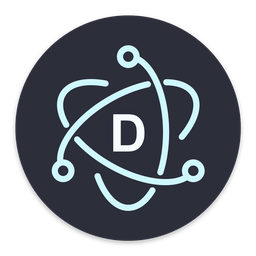
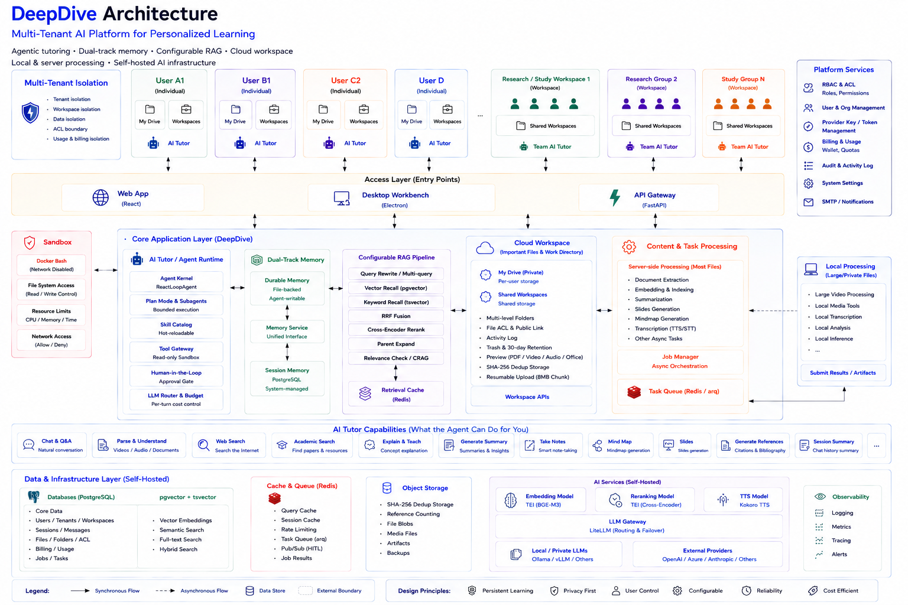

#  DeepDive

[English](README.md) · [中文](README.zh-CN.md)

[](https://www.python.org/downloads/)
[](https://fastapi.tiangolo.com/)
[](https://react.dev/)
[](https://www.postgresql.org/)
[](https://opensource.org/licenses/MIT)

**DeepDive** is a **multi-tenant AI learning and research platform** — a persistent AI tutor that learns from your materials, remembers how you learn, actively gathers sources and investigates topics for you, and helps you understand, research, and create.

It is a document and media workspace too: PDFs, Office documents, video, audio, and images open directly in DeepDive — select a passage or a frame and ask in context, no external viewer needed. One platform, one stack: files & cloud drive, chat & memory, RAG search, and a research workspace — all self-hosted, so your data stays on your own infrastructure.

Dive deeper: [**What you can do**](#what-you-can-do) explores the product, [**Engineering highlights**](#-engineering-highlights) breaks down the system, and [docs/architecture.md](docs/architecture.md) documents the full design.

## What is DeepDive?

DeepDive is a persistent AI tutor that helps you deeply understand your materials, investigate complex topics, and continuously build your own knowledge base — all within one self-hostable workspace.

**Why it's different:**

- **Learn with your material, not beside it.** Select and discuss passages while reading or watching, ask questions in context, and get grounded explanations and step-by-step breakdowns.

- **Your material is the starting point, not the boundary.** When your sources aren't enough, DeepDive's Research OS automatically helps you investigate further across your own materials and external sources, so research can build on what you already know.

- **Learning insights become persistent knowledge.** Important insights become durable memory, while discussions and research can become summaries, mind maps, and slides that flow back into your searchable workspace, so you can pick up where you left off.

- **Built for individuals and teams.** Keep your materials and knowledge in your own workspace, or collaborate in shared workspaces with controlled access.

> **The Learning Loop**  
> `Read / Watch → Ask & Discuss → Understand → Research → Remember → Create → Pick up later`  
>  
> **The Research Loop**  
> `Question → Plan → Retrieve → Investigate → Evaluate → Synthesize → Record → Revisit`  
>  
> **The Data Flywheel**  
> `Material → Index → Retrieve → Transform → Artifact → Search again`

## What you can do

| Capability | What it lets you do |
|---|---|
| **Learn** | • Ask questions while reading or watching — PDFs, Office docs, video, audio, images, and more (view and discuss directly in DeepDive)<br>• Get step-by-step explanations and concept breakdowns<br>• Discuss a specific moment — select a passage, page, or video moment as context |
| **Research** | • Search across your files, notes, conversations, and sources<br>• Go beyond your material — search the web and community discussions for newer research and supporting evidence<br>• Synthesize multiple sources into grounded, structured answers |
| **Remember** | • Save durable insights and recall them in later sessions<br>• Keep long-term memory separate from conversation history<br>• Revisit bookmarks, notes, and saved spots |
| **Create** | • Summarize sessions, notes, and documents<br>• Generate mind maps and slide decks<br>• Turn conversations into reusable knowledge that flows back into search |
| **Collaborate** | • Share files and knowledge in workspaces<br>• Study and discuss the same material as a team with role-based access control |

## Demo

> **Agent-tutor flow:** open a paper or video → ask while learning → retrieve relevant passages → search the web when needed → discuss and clarify → save an insight → summarize the session → recall it later. Recorded demo coming soon.

---

## 🏗️ Architecture at a glance



---

## 🔧 Engineering highlights

DeepDive implements a controllable agent runtime rather than delegating orchestration to a rigid framework. Core architectural decisions and their production-grade implementations:

- **Explicit agent orchestration.** A `ReactLoopAgent` step loop orchestrates model invocations and tool execution through a hot-reloadable, dependency-injected skill catalog and plugin runtime; a typed sandbox strictly gates every tool execution across `READ` / `WRITE` / `NETWORK` permissions, and a `SkillScopeEnforcer` guard hard-enforces each active skill's declared `allowed_tools` — a skill can never invoke a tool outside its scope, and unknown skill names fail closed.
- **Persistent dual-track memory.** Two independent tracks share a single prompt boundary: the agent writes durable long-term memory via file-backed storage, while the system manages episodic session memory in PostgreSQL (`tsvector` + `pgvector` fused via RRF with recency decay). Hierarchical history compaction (flat token window) keeps context bounded without losing it. Relevant past sessions are recalled proactively, and user directives supersede in place rather than being deleted.
- **Built-in reliability.** Hard timeouts and exponential-backoff retries absorb transient upstream LLM errors, bounded by a per-turn cost budget; concurrent streams keep their generators closure-local (never stored on the instance), so overlapping turns cannot cross-talk. Tool safety is enforced via a Redis pub/sub human-approval gate (deny on timeout), plan mode, bounded subagents, shadow-git checkpoints for state rollback, and a resource-capped, network-isolated Docker sandbox. Observability is built in: a trace context (`trace_id` / `turn_id` / `user_id` / `session_id`) flows through every agent turn, each turn emits a metric span (steps, tool latency, errors, cost), and a JSONL audit sink records decisions to disk.
- **Asynchronous job backbone.** Content enrichment, scheduled agent turns, and the toolkit's five-stage generation pipeline *(validate → ingest → generate → render → persist)* — producing summaries, mind maps, and slide decks — run on an arq worker, with a `jobs` table as the single source of truth and clients polling for progress. Contention is serialized by a per-asset ingest lock (auto-queue, manual import, and admin reindex race over each other's parent chunks), chunks are deleted then re-embedded in batches so a worker timeout loses only the uncommitted tail and re-runs are idempotent, job states stay honest — cancellation and non-terminal failures are recorded as such — and terminal failures land in a JSONL dead-letter.
- **Configurable retrieval.** A modular node RAG pipeline *(query rewrite → vector + keyword recall → RRF fusion → cross-encoder rerank → parent expansion → CRAG relevance checks)* can be reconfigured, reordered, or toggled live via the admin console without service restarts. Chunking is configured from the same RAG module — split strategy (`fixed` sliding window with configurable size + overlap, `paragraph`, `sentence`), plus the `contextual` (LLM-written context prefix per chunk), `parent_child` (small-to-big: index leaf chunks plus larger parent windows; recall searches leaves and a hit can surface its parent's fuller text), and `cjk` (jieba keyword segmentation) switches. A live chunking preview shows exactly how a strategy splits pasted text before you commit, and re-indexing applies the config. It also adds golden-set evaluation (`Recall@k`, `Precision@k`, `MRR`), Redis query caching (keyed by query + config + corpus version, auto-invalidated on re-index), and vision-LLM transcription for PDF tables. A single node failing degrades to the surviving channels instead of breaking the chat, and user feedback is logged to a golden evaluation dataset. Whole-session chat imports are incremental: an LLM segments a conversation into Q&A blocks and a per-message imported flag makes re-imports no-ops while re-importing a changed source replaces just its blocks. Every pipeline node records a per-node trace (status / timing / output) surfaced stage-by-stage in the admin Test tab, and the tenant-bound gRPC retrieval service enforces tenant scoping at the gate — token auth, token-bucket rate limiting, and an explicit guest flag — so no un-scoped call reads across tenants. Recall spans a unified multi-source corpus — drive files, learning sentences, and chat history — served in-process or via that gRPC service.
- **Cache-friendly prompts and tools.** A byte-stable prompt head (system identity + one-line tool index) paired with a dynamic per-step tail maximizes LLM prefix caching to slash latency and token costs, with a measurable cache identity. Tools use deferred loading: lightweight stubs are mounted first, and full parameter schemas are fetched only upon invocation.
- **Unified knowledge substrate.** Private My Drive and shared workspaces (featuring `Owner` / `Admin` / `Editor` / `Viewer` RBAC, member management, and append-only activity logs) sit atop a SHA-256 content-addressed object store with reference-counted deduplication, 8 MB resumable chunked uploads, multi-level folders, 30-day trash retention, per-file ACLs, workspace sharing, and integrated multi-format previews. Logical file trees map to content-addressed blobs — files sharing a digest share one physical copy — and object lifetime is managed by atomic reference counting with CAS-guarded physical deletion. The drive doubles as the shared data and working directory for content processing, retrieval, and agent workflows.
- **Resource-bound authorization.** Roles, tenant boundaries, upstream LLM provider credentials, model catalogs, and routing weights are managed from a unified admin console. It features a per-user key-grant matrix with masked credentials (`sk-***`), SMTP for email verification / password reset, and stateless signed admin sessions. Per-role LLM channels bind at login with automatic failover — users without a usable key degrade to the anonymous tier instead of losing login. Usage is metered by a free-first quota that overflows to a wallet; deductions are atomic (`UPDATE ... WHERE balance >= cost` prevents overdraft), snapshot `balance_after`, and are idempotent, returning HTTP 402 when funds run out.
- **Tenant-safe data isolation.** Request identity rides a ContextVar because the RAG and memory recallers are process-wide singletons that cannot take per-request constructor arguments; the same visibility predicate is written twice — once as a SQLAlchemy expression, once as a raw-SQL fragment — so the tsvector/pgvector recall path enforces the identical three channels (ownership, workspace membership, per-asset ACL with public links). Chunk-level predicates filter on `chunks.user_id` directly, so learning/chat chunks without an asset_id cannot leak past their owner. The vocabulary corpus uses partial unique indexes: public rows stay globally unique while each user's private rows are unique per user, so two users can each own a same-named term without colliding.
- **Local-first client, self-hostable infrastructure.** The Electron workbench supports offline file workflows (file tree, multi-format viewer, video frame capture); large media is processed on the client and the resulting artifacts submitted back to the server, while most content-processing workloads run server-side. Videos become PPT/PDF study booklets: subtitle timestamps drive keyframe extraction, one frame plus its caption per page, with CJK-safe fonts so Chinese renders correctly; TTS auto-switches Chinese/English voices, synthesizes sentence-by-sentence so the first sentence plays back immediately, and caches waveforms by content hash for zero-latency replays. The complete backend stack — PostgreSQL/pgvector, Redis, TEI embeddings, Kokoro TTS, and LiteLLM gateway — deploys seamlessly via `docker-compose`, keeping your data fully within your infrastructure.
- **Governed research workflows (Research OS).** A ten-phase research DAG runs under hard gates, human review, and an evidence-trace graph. A chat turn atomically creates a task — the cloud-drive task folder (materials/outputs/spec/session-history) mirrors a scratch authority, rolled back on failure. Runs are server-owned and **auto-driven to PUBLISH by a background worker chain**: after the chat handoff, arq jobs chain agent turns (25 steps each vs the interactive 5, bounded by turn / no-progress / attempts / cost caps) to a terminal state, so one prompt completes a governed investigation with no client attached — a RUNNING badge and `research_continuing` track the whole chain. Task state is mutated through a **single-writer cross-process compare-and-swap** (portalocker lock over a monotonic `project_revision`, `tmp → fsync → replace` persistence), and runs survive crashes: a stalled heartbeat is **re-run idempotently on the same turn** and stale run slots are adopted, so a crash never double-runs or wedges a task. Runs stay controllable: a **cooperative Stop** (cancel flag, never a mid-write kill) and **human gate approvals** — a run the agent can't advance parks BLOCKED behind a durable PENDING override until a human approves (gate flips to OVERRIDE and the run resumes) or rejects (the agent proposes another approach). A live SSE monitor streams revision-change hints (each triggers one coalesced task refetch) rather than payloads, and server processes log to per-role rotating files stamped with request/user/session/task/run context. Deleting a task is cascade-safe: blocked with 409 while running or indexed into the Knowledge Base, the cloud folder goes to Trash, and restoring it never revives task state.
- **Authority / projection / index separation.** Three layers are explicitly decoupled: the server scratch directory is the single authority for task state and artifacts, the cloud-drive task folder is the user-visible projection (spec and session history update in place — no asset explosion), and promotion flips an `outputs/` artifact to RAG-pending to trigger indexing — the original upload path is no longer used.

Full design: [docs/architecture.md](docs/architecture.md).

## ✅ Implementation status

| Area | Status |
|---|---|
| Agent Runtime | ✅ Implemented |
| Dual-track Memory | ✅ Implemented |
| Configurable Retrieval | ✅ Implemented |
| Async Job System | ✅ Implemented |
| Cloud Drive & Workspaces | ✅ Implemented |
| Auth / RBAC / ACL | ✅ Implemented |
| Usage & Model Routing | ✅ Implemented |
| Research OS | ✅ Implemented |
| Self-hosted AI Services | ✅ Supported |

See [docs/architecture.md §Implementation Status](docs/architecture.md#implementation-status) for the full matrix and planned capabilities.

---

## 🧩 Architecture & Flows

Per-module architecture and flow logic (agent kernel · memory · prompt · RAG): [docs/architecture-diagrams.md](docs/architecture-diagrams.md).

---

## 🧰 Tech Stack

Which technologies DeepDive uses and why each was chosen — see [docs/architecture.md §2 Tech Stack](docs/architecture.md#2-tech-stack).

## 📂 Repository Structure

How the monorepo is laid out and what each module owns — see [docs/architecture.md §3](docs/architecture.md#3-repository-structure-monorepo).

## 📚 Documentation

- [docs/architecture.md](docs/architecture.md) — full system design (single source of truth): tech stack, repository layout, agent-kernel internals, tool runtime, data model, deployment, and the implemented-vs-designed matrix.
- [docs/architecture-diagrams.md](docs/architecture-diagrams.md) — per-module architecture diagrams and mermaid source.
- [docs/research/](docs/research/) — Research OS contract suite (design-frozen): entities, state machine, four hard gates, three-layer storage, and the 6 research tool contracts.
- [docs/getting-started.md](docs/getting-started.md) — full manual setup, one-click launchers, and the desktop/web/admin walkthrough.
- [docs/configuration.md](docs/configuration.md) — environment-variable reference.
- [docs/features.md](docs/features.md) — full feature walk-through (desktop workbench, chat assistant, RAG & query repository, study mode, cloud drive, roles & billing).

---

## 🚀 Quick Start

### Option A — One-click launcher (recommended)

| Environment | Script |
|---|---|
| Windows desktop | `bash scripts/start_desktop.sh` |
| Linux server | `bash scripts/start_server.sh` |

Each script installs Docker if missing, starts the data + model services, ensures the Python environment, seeds the default `admin` / `admin` account, and launches the workbench (desktop) or web UI (server).

### Option B — Manual local development

```bash
git clone https://github.com/Eric-LLMs/DeepDive.git
cd DeepDive
conda create -n deepdive python=3.11 -y && conda activate deepdive
cp .env.example .env            # fill in LLM_UPSTREAM_KEY
pip install -e ".[dev]"         # + pip install -e ".[rag]" for semantic search
docker compose up -d postgres redis embedding tts llm-gateway worker
python scripts/init_db.py
uvicorn apps.api.main:app --reload     # http://localhost:8300/docs
```

### Option C — Self-hosted LLM

The LiteLLM gateway routes the virtual model `deepdive-chat` to any OpenAI-compatible upstream (`LLM_UPSTREAM_BASE`). Point it at a self-hosted server (vLLM / Ollama / …) to run the whole AI stack on your own hardware, or at an external provider — no code change.

Full manual steps, environment variables, and the desktop/web/admin walkthrough: [docs/getting-started.md](docs/getting-started.md) · [docs/configuration.md](docs/configuration.md).

---

## 📝 License

This project is licensed under the MIT License. See the [LICENSE](LICENSE) file for details.
