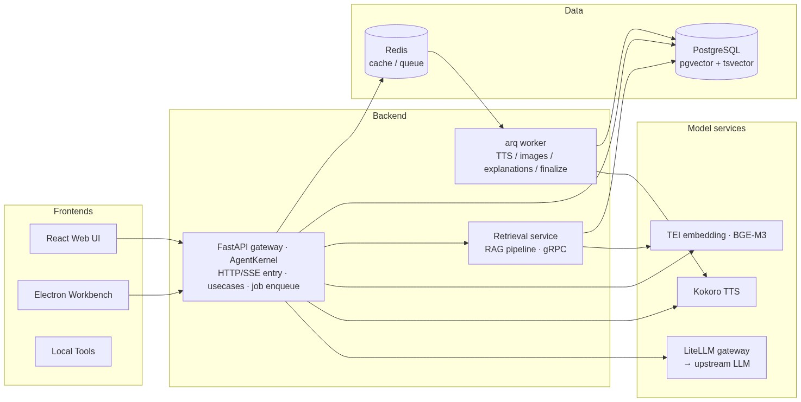
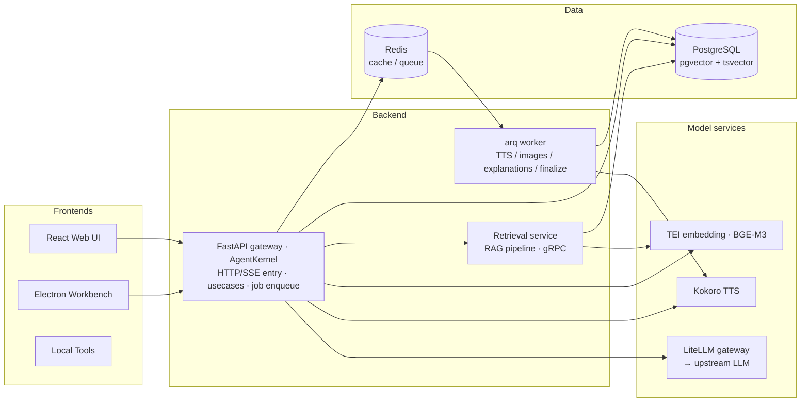
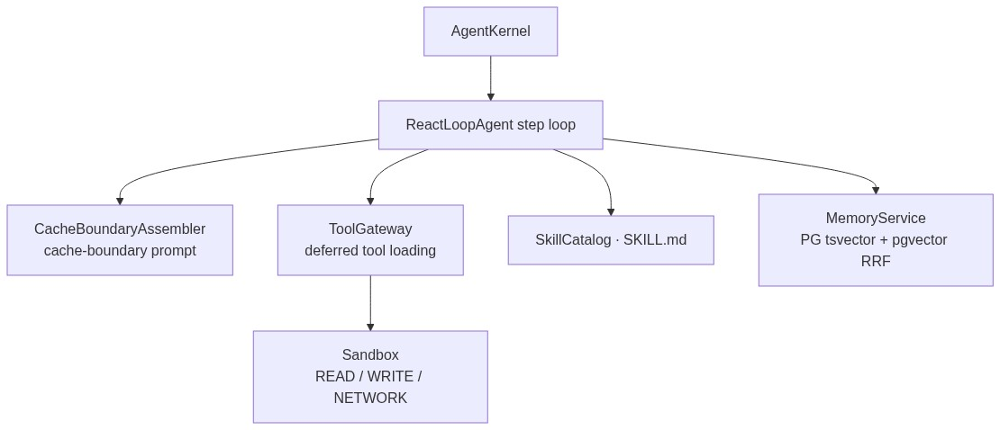
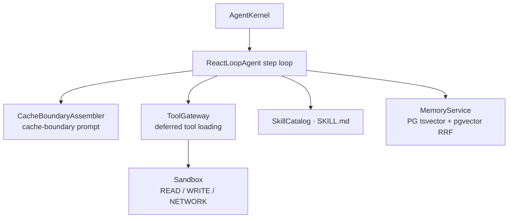
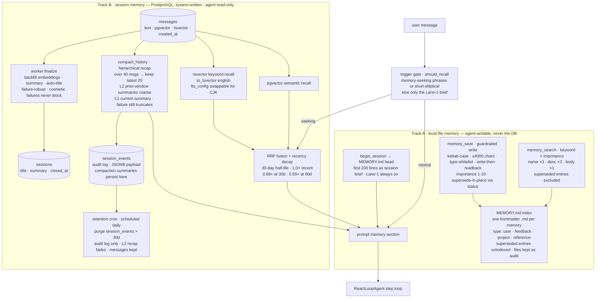
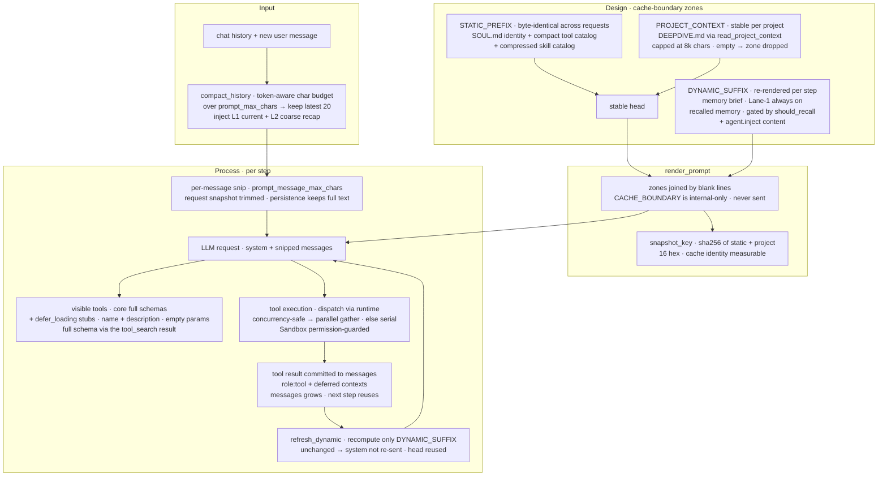
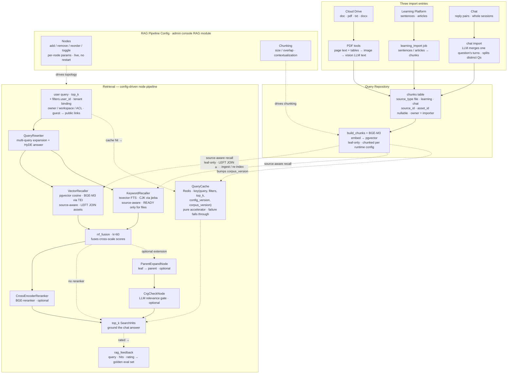

# Architecture Diagrams

Per-module architecture diagrams and their mermaid source (for editing / regeneration via mermaid.ink).

Mermaid source (for editing — regenerate via mermaid.ink)

**Agent kernel** — the core, composed in and running inside the FastAPI gateway process:

Mermaid source (for editing — regenerate via mermaid.ink)

> Agent kernel — design: [architecture.md §5 Agent Module](architecture.md#5-agent-module).

**Answering flow** — each turn runs the `ReactLoopAgent` step loop, which decides what to retrieve and
composes the reply. It calls the **`rag_search` tool** (runs the RAG node pipeline and returns `top_k`
chunks — the retrieval layer described in the RAG section) and, only when local material is
insufficient, the **`web_search` tool** (duckduckgo / tavily / bing / google) for up-to-date external
results; it then composes the answer from both.

**Memory — two independent tracks, orchestrated by `MemoryService`** (writes go to the local
memdir, recall reads the database; the tracks never cross):

Mermaid source (for editing — regenerate via mermaid.ink)

> **Memory invariants** — thinking is never persisted; `messages` are never deleted by compaction
> or retention; `memory_save` writes the memdir only (never the DB); a vector-channel failure
> degrades to tsvector-only (never a silent empty); superseding marks a memory `superseded` and
> keeps the file as an audit trail — it is never deleted; the recall gate skips only the deep
> recall on non-memory-seeking turns (the Lane-1 brief always injects); cosmetic failures
> (summary / title / compaction) never block the main flow.
> Design: [architecture.md §5.4 — Memory, skills, sessions](architecture.md#54-memory-skills-sessions).

**Prompt — cache-boundary assembly, compression, and deferred tool stubs** (architecture, design
features, and per-step process logic):

Mermaid source (for editing — regenerate via mermaid.ink)

> **Prompt invariants** — the `CACHE_BOUNDARY` separator is internal-only and never rendered to the
> model; the stable head (STATIC_PREFIX + PROJECT_CONTEXT) is byte-identical across requests so the
> provider prefix cache is reused; only the DYNAMIC_SUFFIX re-renders per step and is skipped when
> unchanged; the per-message snip trims the request snapshot only, keeping the persistence copy raw;
> mounted tools appear as stable defer_loading stubs, with the full schema riding in the tool_search
> result.
> Design: [architecture.md §16 — Prompt Module](architecture.md#16-prompt-module).

**RAG & Query Repository — a config-driven, plug-and-play retrieval pipeline** over one unified search
corpus. A single query searches your cloud-drive files, Learning-Platform material, and chat Q&A
together. The pipeline's node list *is* the retrieval topology: compose, reorder, toggle, and tune every
stage from the admin console — live, no code, no restart. Feature walk-through in
[**Key Features**](docs/features.md); the design detail lives in
[§10 RAG Module (architecture.md)](architecture.md#10-rag-module-config-node-pipeline).

Mermaid source (for editing — regenerate via mermaid.ink)

> [architecture.md](architecture.md) is the single source of truth for the full design —
> tech stack, repository layout, agent-kernel internals, tool runtime, data model, and deployment
> topology (including what is implemented today vs. designed-only).

