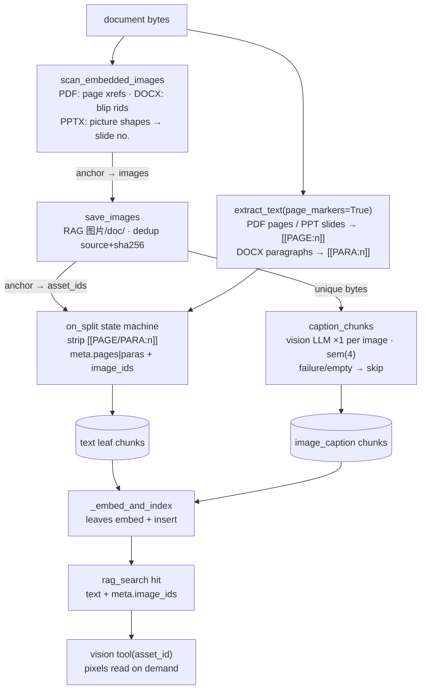

# DeepDive Architecture Design

> This document is the single source of truth (SSOT) for DeepDive. Every technical decision,
> module boundary, and deployment topology is governed here.

## Table of Contents

- [Implementation Status](#implementation-status)
  - [Implemented (runs today)](#implemented-runs-today)
  - [Not implemented](#not-implemented)
- [1. Product Positioning](#1-product-positioning)
- [2. Tech Stack](#2-tech-stack)
- [3. Repository Structure (Monorepo)](#3-repository-structure-monorepo)
- [4. Layered Architecture (Hexagonal + Capability Seam)](#4-layered-architecture-hexagonal--capability-seam)
- [5. Agent Module](#5-agent-module)
  - [5.1 DI state machine — `Context` / `Fiber`](#51-di-state-machine--context--fiber)
  - [5.2 Agent loop — `ReactLoopAgent`](#52-agent-loop--reactloopagent)
  - [5.3 System prompt — `CacheBoundaryAssembler` (three-zone, cache-boundary)](#53-system-prompt--cacheboundaryassembler-three-zone-cache-boundary)
  - [5.4 Memory, skills, sessions](#54-memory-skills-sessions)
- [6. Tool Runtime](#6-tool-runtime)
  - [6.1 Typed tool definition — `define_tool`](#61-typed-tool-definition--define_tool)
  - [6.2 Lifecycle — `ToolRuntime.execute`](#62-lifecycle--toolruntimeexecute)
  - [6.3 Plugins](#63-plugins)
  - [6.4 What is deliberately *not* implemented](#64-what-is-deliberately-not-implemented)
  - [6.5 Deferred loading, permissions & sandbox](#65-deferred-loading-permissions--sandbox)
- [7. Capability Seam (Definition / Provider / Consumer)](#7-capability-seam-definition--provider--consumer)
- [8. Distributed Topology](#8-distributed-topology)
  - [8.1 Async enrichment (job model)](#81-async-enrichment-job-model)
- [9. Retrieval Service (gRPC)](#9-retrieval-service-grpc)
- [10. RAG Module (Config-Node Pipeline)](#10-rag-module-config-node-pipeline)
  - [10.1 Node contract](#101-node-contract)
  - [10.2 Context blackboard](#102-context-blackboard)
  - [10.3 Registry](#103-registry)
  - [10.4 Configuration](#104-configuration)
  - [10.5 Executor](#105-executor)
  - [10.6 Nodes](#106-nodes)
  - [10.7 Ingest side (runtime-configured chunking)](#107-ingest-side-runtime-configured-chunking)
  - [10.8 Query Repository — multi-source import](#108-query-repository--multi-source-import)
  - [10.9 Quality regression (P0)](#109-quality-regression-p0)
  - [10.10 Admin console](#1010-admin-console)
  - [10.11 Schema](#1011-schema)
- [11. Feature → Mechanism Map](#11-feature--mechanism-map)
- [12. Data Model](#12-data-model)
  - [12.1 Indexes and Retrieval](#121-indexes-and-retrieval)
  - [12.2 Billing and Logs](#122-billing-and-logs)
  - [12.3 Implemented auth, RBAC & billing schema](#123-implemented-auth-rbac--billing-schema)
  - [12.4 Business logic — per-user LLM-key assignment & the disable (Tokens module)](#124-business-logic--per-user-llm-key-assignment--the-disable-tokens-module)
  - [12.5 Session & message deletion](#125-session--message-deletion)
  - [12.6 LLM Dispatch Gateway — one funnel, shell workers, Job-level fail-fast](#126-llm-dispatch-gateway--one-funnel-shell-workers-job-level-fail-fast)
- [13. Multi-Tenancy and Deployment Strategy](#13-multi-tenancy-and-deployment-strategy)
- [14. Cloud Drive Module](#14-cloud-drive-module)
  - [14.1 Database](#141-database)
  - [14.2 Core logic](#142-core-logic)
  - [14.3 Permission management](#143-permission-management)
  - [14.4 REST surface](#144-rest-surface)
  - [14.5 Frontend](#145-frontend)
  - [14.6 Configuration](#146-configuration)
- [15. Desktop Workbench (Electron)](#15-desktop-workbench-electron)
- [16. Prompt Module](#16-prompt-module)
  - [16.1 Goals](#161-goals)
  - [16.2 Three-zone cache-boundary assembly](#162-three-zone-cache-boundary-assembly)
  - [16.3 Rendering and cache identity](#163-rendering-and-cache-identity)
  - [16.4 Project context loader](#164-project-context-loader)
  - [16.5 Compression pipeline](#165-compression-pipeline)
  - [16.6 Deferred tool loading (defer_loading stubs)](#166-deferred-tool-loading-defer_loading-stubs)
  - [16.7 Per-step process](#167-per-step-process)
  - [16.8 Configuration](#168-configuration)
- [17. Research OS Module](#17-research-os-module)
- [18. Image Handling (screenshots & document images)](#18-image-handling-screenshots--document-images)
- [19. Workflow Core (packages/workflow)](#19-workflow-core-packagesworkflow)
  - [19.1 Layering and hard rules](#191-layering-and-hard-rules)
  - [19.2 Run states and transition legality](#192-run-states-and-transition-legality)
  - [19.3 Leases — one live runner per run](#193-leases--one-live-runner-per-run)
  - [19.4 Ledger — idempotent tool-execution record](#194-ledger--idempotent-tool-execution-record)
  - [19.5 Retry — transient classification and backoff](#195-retry--transient-classification-and-backoff)
  - [19.6 Policy — loop-cap grading](#196-policy--loop-cap-grading)
  - [19.7 Ports — the adapter's surface](#197-ports--the-adapters-surface)
  - [19.8 drive_iteration — per-job choreography](#198-drive_iteration--per-job-choreography)
  - [19.9 Definition and fingerprint — drift detection](#199-definition-and-fingerprint--drift-detection)
  - [19.10 The research adapter](#1910-the-research-adapter)
- [20. Research Execution: From Agent-Driven Control Flow to a Deterministic Pipeline](#20-research-execution-from-agent-driven-control-flow-to-a-deterministic-pipeline)
- [21. Research Artifact Compiler (Publication PDF)](#21-research-artifact-compiler-publication-pdf)
  - [20.1 Context & Motivation](#201-context--motivation)
  - [20.2 Architectural Decisions](#202-architectural-decisions)
  - [20.3 Architectural Benefits](#203-architectural-benefits)
  - [20.4 Summary](#204-summary)
- [22. Chat Session Memory v2 — Client Live State Authority + Zero-Read Turns](#22-chat-session-memory-v2--client-live-state-authority--zero-read-turns)
  - [22.1 Model & invariants](#221-model--invariants)
  - [22.2 Wire contract](#222-wire-contract)
  - [22.3 Turn assembly & the dual persistence barrier](#223-turn-assembly--the-dual-persistence-barrier)
  - [22.4 Compaction: one full re-fold; failure never trims](#224-compaction-one-full-re-fold-failure-never-trims)
  - [22.5 Checkpoint CAS & the per-session write queue](#225-checkpoint-cas--the-per-session-write-queue)
  - [22.6 Recovery, reconcile & the worker path](#226-recovery-reconcile--the-worker-path)
  - [22.7 Trade-off & configuration](#227-trade-off--configuration)

[↑ Back to top](#table-of-contents)

## Implementation Status

> The tables mark what runs today versus designed-only. The 3–5 year scaling path
> (modular → service extraction, multi-tenancy hardening, async HA, observability/evals)
> is its own document: [Evolution Roadmap](evolution-roadmap.md).

### Implemented (runs today)

| Area | What exists |
|----|------|
| Vocabulary subdomain | domains / terms / sentences / matches / materials / chunks (6 tables) |
| Hybrid search | pgvector (semantic) + tsvector (keyword) + RRF fusion |
| Agent runtime | `AgentKernel` composition root: cache-boundary `CacheBoundaryAssembler` (3 zones + `snapshot_key`) + deferred-tool `ToolGateway` + dual-track `MemoryService` (PG tsvector/pgvector RRF) + skill catalog + READ-only `Sandbox`, over `ReactLoopAgent` step loop + plugin `ToolRuntime`; `ReliableLLM` timeout/retry (error taxonomy + cancellation) + per-turn cost budget; HITL approvals (memory / Redis pub-sub broker); `run_subagent` (bounded child turns); `plan` meta-tool; shadow-git checkpoints (`revert_to_checkpoint`); Docker `BashSandbox` backend |
| Retrieval | config-driven node pipeline (query rewrite → recall → RRF → rerank, plus optional parent-expand / CRAG nodes; CJK + contextual + parent-child indexing); `in_process` default, gRPC service available (`AuthGuard` token gate / per-peer rate limit / tenant binding); admin RAG console + golden-set eval (Recall@k / Precision@k / MRR); Redis **query cache** (keyed by query/filters/top_k + config + corpus version); **retrieval-feedback loop** — grounded answers get a persistent per-message 👍/👎 source rating: the turn's `rag_search` hits are extracted server-side from the tool trace and snapshotted into `messages.meta.retrieval` (JSONB in the canonical schema; rides the done frame + `GET /sessions/{id}`), the chat bubble's rate panel posts the `POST /rag/feedback` golden-set recorder — [§10.12](#1012-query-cache--retrieval-feedback) |
| RAG node pipeline config | the whole retrieval chain is runtime-configured from admin **RAG → Nodes**: add / remove / reorder / enable / disable stages and edit params, persisted in `app_settings.rag`, applied live — no code, no restart; ingest side likewise (chunk strategy `fixed` / `paragraph` / `sentence` / `semantic` + contextual / parent-child / CJK-jieba toggles, with a Chunking preview) — [§10.6](#106-nodes), [§10.7](#107-ingest-side-runtime-configured-chunking), [§10.10](#1010-admin-console) |
| Query repository | unified multi-source corpus: cloud-drive files (`source_type='file'`) + Learning-Platform sentences/articles (`'learning'`) + chat Q&A pairs / LLM-grouped whole-session imports (`'chat'`); `chunks.asset_id` nullable + `source_type`/`source_id`, source-aware recall (both recallers `LEFT JOIN assets`); PDF tool chain (body text + tables rendered to PNG → vision LLM, per-table skip on failure); admin RAG → **Repository** tab lists non-file chunks with delete |
| Model services | TEI embedding (BGE-M3), Kokoro TTS, FunASR SenseVoice STT, LiteLLM gateway (all Docker) |
| Edge gateway | **Traefik** as the single public entrypoint: `:80` strips `/api` onto the host-run FastAPI and also fronts the web console (`/admin` + `/audio` `/images` `/avatars` static mounts); retrieval gRPC rides its own entryPoint (`:15052` → `h2c://retrieval:50051`); the host API is reached by **explicit IPv4** (`192.168.65.254:8300` — `host.docker.internal` also yields a ULA IPv6 the host never answers, which hangs Go's dialer); file-provider config in `deploy/traefik/`, LAN-IP published — [§13](#13-multi-tenancy-and-deployment-strategy) |
| Async enrichment | gateway + arq worker split; `jobs` table is the source of truth; frontend polls `GET /jobs/{id}`; daily `session_events` retention cron in `WorkerSettings.cron_jobs`; `run_agent_turn` job reuses the shared `AgentKernel` composition (`apps/api/agent_factory.py`) for scheduled background turns; `toolkit_generate` runs the 5-stage toolkit pipeline (file mode → workspace output; session / cloud-file modes → caller's Cloud Drive, with a custom `prompt` + `name`) |
| Session memory | PG-backed `sessions` / `messages` / `session_events`; **client Live State (summary + tail) is the normal-turn context source — zero SQL reads on hot turns**; threshold compaction folds raw rows into one 5-section structured summary behind a dual persistence barrier (`sessions.compaction` JSONB = durable checkpoint, revision CAS); per-session async write queue (one batch INSERT/turn); deferred finalize = incremental embed + first-time-only sidebar summary/title; trigger-gated proactive recall (Lane-1 brief always on) + RRF recency weighting + importance-weighted file recall + supersede-in-place user directives + 30-day audit-event retention — see [§22](#22-chat-session-memory-v2--client-live-state-authority--zero-read-turns) |
| Migrations | single canonical init script `migrations/0001_init.sql` (final schema + reference seeds) applied once by the asyncpg runner (replaces Alembic); dev-time incremental migrations deliberately squashed |
| Chat | agent loop with tool use, SSE streaming |
| Research OS | tasks created atomically from the desktop chat (**＋ Research**): a cloud task folder under a picked My Drive parent — `materials/` / `outputs/` / `temp/` all guaranteed at creation — with live `task_spec.json` / `session_history.json` mirrors over authoritative scratch state; session isolation (research sessions bound 1:1 to a task, DB-marked `sessions.type=1`, hidden from the Sessions sidebar); 409-guarded cascade delete (RUNNING / RAG-INDEXED blocked, cloud folder → Trash, scratch hard-removed, bound type-1 sessions deleted); **server-owned runs** (`begin_run`/`end_run` mutex with stale-window crash recovery — a client disconnect no longer cancels a research turn) with `is_running` surfaced in every task view; `POST /research/tasks` + `GET/DELETE /research/tasks/{id}` + artifact read/promote API; **deterministic execution engine** — Python owns control flow through a 10-stage contract pipeline (`DISCOVER → FRAME → EVIDENCE → DESIGN → EXECUTE → EXPLAIN → WRITE → REVIEW → REPRODUCE → PUBLISH`) with repair-once bounded attempts, per-stage declared LLM call budgets + run-level turn/cost/no-progress caps, and guard gates at the transition fence: **strict** mode (default) parks a failed gate on a PENDING human override with zero rework on resume, lenient mode records it and continues; structural violations halt terminally (`BLOCKED`); lease-based crash recovery makes interrupted runs resumable; publication finality is the `PROMOTED` record (report + compiled PDF, optional slides via toolkit); desktop Research tab + two-layer chat header; web console read-only mirror — see [§17](#17-research-os-module), [§20](#20-research-execution-from-agent-driven-control-flow-to-a-deterministic-pipeline) |
| Workflow core (`packages/workflow`) | domain-free run engine behind Research OS: declarative `workflow_spec` (transitions / activities / cap dimensions / hooks) + state machine with lease contest, crash recovery, retry, loop-cap grading and definition-drift detection; adapter pattern (ports + ledger/lease persistence supplied by the plugin) — [§19](#19-workflow-core-packagesworkflow) |
| Image handling | two image classes: chat screenshots (📷 region-select capture → `chat/temp/` upload → `messages.attach_asset_id` owned link → inline bubble thumbnails → folder-agnostic cascade delete — the `chat/temp/` copy dies with its chat; RAG import **copies** it to `RAG/images/` keeping a separate stable copy that survives the delete) and RAG document images (PDF/DOCX embedded images → `RAG 图片/<doc>/` via `assets.source_asset_id` + content-hash dedup, page/para state machine → chunk `meta.image_ids`, cascade delete/purge/restore with the source); `vision` tool reads any attached asset by id — see [§18](#18-image-handling-screenshots--document-images) |
| Auth / RBAC | opaque `login_tokens` login credentials (hashed `dd_` user + Tokens-page API tokens; **admin console login is stateless** — signed `cc_` session token, never persisted) + `access_tokens` per-user LLM-key grants + `user_roles` (regular/pro/vip/admin/anonymous) + role quota + `/auth/*` login + **self-service accounts** (`/auth/register` with an email-verification gate, `/auth/forgot-password` + `/auth/reset-password`, editable `/auth/me` profile with avatar upload). Auth endpoints are Redis **rate-limited per client IP** (login/register/recovery, fixed window, fail-open); `enforce_secure_secrets` fails fast at startup when the legacy `JWT_SECRET` default is untouched |
| Per-role LLM channels | `role_credentials` (role ↔ `llm_credentials` N:M); login pins a random active channel to the token, chat routes through it with failover. The Tokens page disables a user's access to a key per (user, channel); a user with no usable key degrades to the anonymous tier (guest quota) instead of losing login. **Guest access**: anonymous chat rides the `anonymous` role's channels with a per-day Redis limit (`guest_daily_limit`), 429 → prompt login — [§12.4](#124-business-logic--per-user-llm-key-assignment--the-disable-tokens-module) |
| Admin console | single-file SPA at `/admin` with 5 modules (Providers / Roles / Users / Tokens / **Tools config**): credential/model/routing CRUD, role↔channel bindings, wallet topup, per-user usage + transactions. The Tokens module splits into *LLM Keys* (the per-user key-grant matrix, masked `sk-***` + copy) and *Login Credentials* (who can sign in, each shown as a masked sha256 fingerprint). The **Tools config** module edits the generic `tools` namespace (web-search provider, SMTP, free-form key/value params) with a one-click *Test email*; the Chat Test user picker is a fuzzy-autocomplete text box; a **RAG** module adds live pipeline testing (per-node trace), chunking preview, node-topology editing, and golden-set eval |
| Billing | `llm_models` (per-1k pricing) + `user_wallets` + `wallet_transactions` + `llm_credentials` + `credential_models`; cost calc + atomic wallet deduct |
| Settings in DB | `app_settings` key/value JSONB (admin credential + LLM provider config + tiers + the generic `tools` namespace for web search / SMTP + the `rag` pipeline config), written by the admin console |
| Cloud drive | per-user My Drive + shared workspaces: `global_objects` (SHA-256 dedup, ref-counted physical store) + logical `assets` + first-class `folders` (per scope) + `workspace_members` roles + `asset_acl` sharing + chunked `upload_sessions` + RAG `chunks` + no-FK `workspace_activity` audit; trash with 30-day lazy retention; roles owner > admin > editor > viewer; **text-note editing** (`GET/PUT /files/{id}/content` — read/in-place overwrite with re-dedup + RAG re-index), **collision-safe naming** (`name (1)` auto-suffix across files+folders), and **personal-scope `user_id` filtering** on every My Drive folder/asset operation; full file manager with an in-page Markdown note editor in the web console (see §14) that also previews Mermaid mind-map (`.mmd`) notes as an SVG tree |
| Voice I/O | **STT**: `POST /stt` → FunASR **SenseVoiceSmall** sidecar (OpenAI-compatible `/v1/audio/transcriptions`, CPU Docker, `funasr-cache` volume, host loopback `:18881`) via `STTClient` (AsyncOpenAI). **TTS**: **Kokoro-82M** (Kokoro-FastAPI, `:18880`) via `/tts` + `/tts/stream` (SSE) — the bubble **Read aloud** engine. **Desktop 🎤 push-to-talk**: `MediaRecorder` (`audio/webm;codecs=opus` with fallbacks) → upload → transcript fills the input box, never auto-sent. **Desktop 🌊 hands-free voice call**: WebAudio `AnalyserNode` RMS **energy-VAD** on a 250 ms `timeslice` recorder (start ≈210 ms of speech, end on 900 ms trailing silence) → auto-`/stt` → auto-send with `disable_thinking` (per-request `extra_body {"enable_thinking": false}` — reasoning suppressed only on call turns, typed chat untouched) → Kokoro reads the answer → talk-over **barge-in** interrupts playback → loop; ChatGPT-style full-screen **call overlay** with a live FFT spectrum (canvas `getByteFrequencyData`), phase captions, hang-up button, and a 30 s stuck-read watchdog that resumes listening when TTS is unreachable; mic grants pinned to the `app://bundle` origin in `main.js` — [§8.1](#81-async-enrichment-job-model), [§22.2](#222-wire-contract), features.md *Desktop Workbench* |
| Document & media tooling | **ingestion**: async worker chain — PDF (`pymupdf` body text + tables rendered to PNG → vision-LLM transcription, per-table skip on failure), DOCX / text → chunks, **subtitles (`.srt`/`.vtt`/`.lrc`) → timestamped cue-grouped chunks** (consecutive cues merged to `chunking.chunk_chars`, each carrying `meta {video, start_ms/end_ms, start_ts/end_ts}` with the video named by the subtitle file's stem — `meta` rides recall verbatim so retrieval cites `<video> @ H:MM:SS`), embedding on completion; **desktop viewer** renders video (with auto-detected sibling `.srt`/`.vtt`/`.lrc` subtitles), audio, images, PDF, and Office docs in-window via pure-JS **mammoth / SheetJS / JSZip**, Markdown + KaTeX math in chat; **video → book**: `POST /media/generate` → worker `generate_media` — stdlib SRT/VTT/LRC parser → `ffmpeg` keyframe extraction at cue timestamps → one slide per (frame, subtitle) → `python-pptx` PPTX + `reportlab` PDF (CJK via STSong-Light) — [§15](#15-desktop-workbench-electron), features.md *Desktop Workbench / Smart Data Ingestion* |
| Presentation & report artifacts | **content-to-slides deck engine** (`toolkit/deck/`) behind `toolkit_generate` (`summary` / `mindmap` / `slides`): generation default mode **direct** — one semantic LLM call over raw source text → canonical `PresentationBrief` (every fact carries doc/page/line **locators**; figures land as real figure slides) → deterministic wire-slip repair + jsonschema gates + bounded single-slide patch loop → **Typst** compiler renders the canonical 16:9 `<name>_slides.pdf`, with editable `.pptx` (python-pptx), `.md`, and `deck.json` exports; Pillow self-drawn visuals; loud E/render stats (`deck_stats`) survive even failed runs. `summary` → Markdown, `mindmap` → Mermaid `.mmd` (SVG-tree preview both clients). **Research Artifact Compiler**: PUBLISH also compiles a publication PDF with **zero LLM in the path** — manuscript projected into a Document AST → Typst typeset, committed-result replay by manuscript hash, `outputs/<name>_v{N}.pdf` + provenance.json — [§21](#21-research-artifact-compiler-publication-pdf), [docs/content-to-slides.md](content-to-slides.md), features.md *Desktop Workbench (Customize Slide Deck)* / *Research OS* |

### Not implemented

| Area | Status |
|----|------|
| GraphRAG node | **deferred** — graph-of-communities `graph_rag` node (LLM entity/relation extraction → community summaries → global/local search), designed in §10.6; revisit after the research claim-graph matures |
| Research OS (Phase 1) | **deferred, trigger-gated** — the file-backed spike is now a live user surface (chat-created tasks, §17); the PostgreSQL repositories (projects/sources/claims/artifacts) + a research admin console start when multi-instance concurrency or console-wide research reporting is real |

Dropped as non-goals (deliberate decisions, not gaps): recurring-billing **subscriptions** (no payment counterparty; pay-as-you-go wallet covers self-hosted quota needs), **unified PostgreSQL log tables** (the JSONL audit trail + relational usage surfaces already answer single-node forensics; revisit only if cross-node SQL log aggregation becomes a requirement), and the **TEI reranker container** (superseded — the in-process cross-encoder is the rerank implementation, live with `BAAI/bge-reranker-v2-m3`).

[↑ Back to top](#table-of-contents)

## 1. Product Positioning

DeepDive is a self-hosted AI workspace for learning and research, built around your own
knowledge.

Read, watch, understand, research, and create with AI — directly alongside your own documents,
media, and research materials. Select a passage, page, or moment and interact with AI in context,
explore beyond your materials, and turn your work into reusable outputs.

At the same time, DeepDive helps you build a persistent knowledge base from the materials you
work with, the insights you discover, the research you conduct, and the outputs you create. Your
knowledge stays with you instead of being trapped in individual files or conversations.

This creates a continuous loop: AI helps you learn and research → your work produces knowledge →
that knowledge becomes part of your personal knowledge base → the accumulated knowledge provides
richer context for future AI-assisted work.

DeepDive brings contextual AI interaction, RAG, persistent memory, agents, research workflows,
and artifact creation together to support this loop — while keeping your data, knowledge, and AI
workloads under your control.

[↑ Back to top](#table-of-contents)

## 2. Tech Stack

| Layer | Choice | Rationale |
|----|------|------|
| Frontend | Vite + React 18 + TypeScript | SPA; talks to the backend via REST/SSE only |
| Edge API | FastAPI | Async, native SSE/WebSocket, auto OpenAPI |
| Internal comms | gRPC (grpcio) + protobuf + buf | retrieval service boundary; HTTP/2, typed contracts |
| Gateway | Traefik v3 | edge HTTP + gRPC routing, one entrypoint |
| Database | PostgreSQL + pgvector + tsvector | one DB for relational + vector + full-text |
| ORM | SQLAlchemy 2.0 (async) | native async |
| Config | pydantic-settings | env vars + type validation |
| Cache / queue | Redis + arq | result caching, async enrichment |
| LLM gateway | LiteLLM Proxy | legacy default client; pinned channels call their provider directly (`llm_credentials.base_url` + `api_key`) |
| Embedding | BGE-M3 (dim 1024) via TEI | multilingual, moderate dim |
| Reranking | BGE-reranker cross-encoder | post-recall precision |
| Retrieval (RAG) | config-driven node pipeline: query rewrite → pgvector + tsvector recall → RRF fusion → rerank, plus optional parent-expand / CRAG nodes | hybrid keyword + semantic search; CJK queries segmented with jieba; topology + params editable live in the admin console |
| Agent | `AgentKernel` (cache-boundary prompt + deferred tool loading + dual-track memory + sandbox) over `ReactLoopAgent` + plugin `ToolRuntime` | controllable, testable, plugin-based |
| MCP | FastMCP | optional external exposure of the tool runtime (`core/infrastructure/mcp.py`) |
| Speech | STT: local FunASR SenseVoiceSmall sidecar (OpenAI-compatible `/v1/audio/transcriptions`, CPU, zh/en); TTS: local Kokoro-82M | both Docker sidecars reached over the host loopback (`:18881` / `:18880`) — the gateway itself runs on the host |

**Language boundary**: backend in Python (AI deps), frontend in TypeScript. The boundary is
API-only: REST/SSE at the edge, gRPC between internal services, HTTP to model services.

[↑ Back to top](#table-of-contents)

## 3. Repository Structure (Monorepo)

```
deepdive/
├── apps/
│   ├── api/                      # package `api` (FastAPI gateway: REST/SSE + job enqueue)
│   │   ├── main.py               # uvicorn apps.api.main:app (composition root: lifespan, app, CORS, static mounts)
│   │   ├── auth.py               # opaque-token auth (require_admin / require_user + stateless console session signing)
│   │   ├── account_email.py      # email / verification helpers shared by auth + config routes
│   │   ├── admin/                # admin console SPA (single-file index.html: Providers / Roles / Users / Tokens / Tools / RAG)
│   │   ├── agent_factory.py      # shared composition root: AgentKernel + capability singletons (used by api AND worker)
│   │   ├── deps.py               # FastAPI DI getters (vocab / task queue / agent accessor), re-exports from agent_factory
│   │   ├── routers/              # functional routers: drive (files/folders/trash/users/workspaces), auth, admin, rag_admin, config, vocab, chat, sessions, jobs
│   │   ├── tools/                # gateway tools, auto-discovered by `_tool.py` modules (rag_search / translate / web_search)
│   │   └── schemas.py            # Pydantic request/response models
│   ├── worker/                   # arq worker (executes async enrichment jobs)
│   │   ├── settings.py           # WorkerSettings (functions / redis / startup clients)
│   │   ├── tasks.py              # tts / image_fetch / explain / generate_media / toolkit_generate / ... job functions
│   │   └── main.py               # run_worker entrypoint
│   ├── retrieval/                # retrieval service (gRPC), run: python -m apps.retrieval.main
│   │   ├── server.py             # RetrievalService servicer (proto -> RAGPipeline)
│   │   └── main.py               # grpc.aio.server entrypoint
│   ├── web/                      # Vite + React frontend (TS)
│   └── desktop/                  # Electron workbench (file tree + media viewer + chat; proxies API to the backend)
├── packages/
│   ├── agent/                    # package `agent`: kernel + DI + loop + runtime + memory + skills + prompt
│   │   ├── engine/               # Agent Kernel: kernel.py (AgentKernel composition root) + loop.py (ReactLoopAgent step loop) + loop_guard.py + context.py (AgentTurn) + decisions.py + runtime.py (ToolRuntime lifecycle) + events.py + sessions.py + telemetry.py + llm_trace.py (opt-in request/response trace sink)
│   │   ├── prompt/               # system_prompt.py: PromptZone + CacheBoundaryAssembler (inject / snapshot_key / refresh_dynamic)
│   │   ├── tools/                # definition.py (ToolDefinition / define_tool) + tool_gateway.py (ToolCatalog + ToolGateway + tool_search) + tool_permissions.py (READ/WRITE/NETWORK) + fs_tools.py (read_file / edit_file / bash) + bash_sandbox.py + subagent.py + plan_tool.py + checkpoints.py + project_context.py
│   │   ├── skills/               # registry.py: Skill + SkillRegistry + SkillCatalog + skill meta-tool (lazy load)
│   │   ├── security/             # sandbox.py (permission gate: default READ-only; ASK w/o approver → deny) + approvals.py (HITL approval broker)
│   │   ├── llm/                  # llm_guard.py (ReliableLLM timeout/retry) + llm_errors.py (error taxonomy)
│   │   ├── memory/               # base/file (memdir store) + retrieval (RRF fusion) + service (memory tools)
│   │   ├── di.py                 # Cordis-style DI (Context / Fiber / Service)
│   │   ├── harness.py            # FakeLLM / assistant / tool_call test harness
│   │   ├── frontmatter.py        # SKILL.md frontmatter parser
│   │   └── plugins/              # plugin manager + built-in tool_audit
│   ├── rag/                      # package `rag`: config-driven retrieval pipeline
│   │   ├── pipeline/             # executor.py (enabled-node list = topology; degrade, never stop) + factory.py + pipeline_config.py (RagPipelineConfig / NodeConfig / ChunkingConfig) + context.py (PipelineContext blackboard + NodeTrace) + registry.py (node registry, name → class)
│   │   ├── query/                # query_rewrite.py (QueryRewriter) + cjk.py (jieba segmentation for the CJK keyword channel)
│   │   ├── nodes/                # pluggable pipeline nodes (one file per stage)
│   │   ├── recall/               # VectorRecaller (pgvector) + KeywordRecaller (tsvector / CJK)
│   │   ├── rank/                 # rrf_fusion + CrossEncoderReranker
│   │   ├── types.py              # shared pipeline types (SearchHit / ...)
│   │   ├── config_store.py       # app_settings["rag"] persistence + validation + cache
│   │   ├── eval.py               # golden-set regression (Recall@k / Precision@k / MRR)
│   │   └── query_cache.py        # retrieval response cache
│   ├── core/                     # package `core`: config + domain/application/ports/infrastructure
│   │   ├── infrastructure/mailer.py            # stdlib smtplib emailer (verification / reset / test)
│   │   └── infrastructure/memory_retrieval.py  # PG tsvector + pgvector session-recall channels
│   ├── workflow/                 # package `workflow`: generic workflow core (definition / runner / runtime / ports / leases / ledger / policy / retry / states) — domain-free control plane driven by adapters
│   └── shared/proto/retrieval/   # generated protobuf/gRPC stubs (import name `retrieval.v1`)
├── data/
│   └── soul.md                   # agent identity persona (STATIC_PREFIX source)
├── skills/                       # version-controlled `*.skill.md` (skill catalog, lazy-loaded via the `skill` tool)
├── plugins/                      # version-controlled `*/plugin.py` (auto-discovered at startup; e.g. `social_search`)
├── migrations/                   # single canonical DB init script (applied by init_db.py; replaces Alembic)
├── proto/retrieval/v1/retrieval.proto   # RetrievalService contract
├── buf.yaml / buf.gen.yaml             # proto lint / breaking / codegen
├── scripts/gen_proto.sh                # grpc_tools.protoc (or buf) codegen
├── scripts/init_db.py                  # apply migrations/0001_init.sql (same runner as the app lifespan)
├── scripts/setup.sh                    # host setup (venv / deps / proto)
├── scripts/start_desktop.sh            # one-click launch: infra + uvicorn (port 8300) + Electron workbench
├── deploy/
│   ├── traefik/                  # gateway static + dynamic config
│   ├── retrieval/Dockerfile      # retrieval service image
│   ├── worker/Dockerfile         # arq worker image
│   └── litellm/config.yaml
├── tests/                        # pytest (di / jobs / loop / memory / memory_rrf / prompt_engine / rrf / system_prompt / tool_gateway / tool_runtime)
├── .github/workflows/ci.yml      # buf lint + pytest
└── docker-compose.yml            # data + model services + worker + retrieval + traefik
```

> The tree is illustrative, not an exhaustive inventory: each directory shows a few
> representative files and the rest are collapsed — `apps/desktop`, `apps/web/src`,
> `packages/core/{domain,ports,infrastructure}`, `migrations/` and `tests/` account for
> most of the omitted files. `git ls-files` is the authoritative list.

> `packages/agent`, `packages/rag`, `packages/core`, `packages/workflow`, and `apps/api` are
> independent top-level packages (import names `agent` / `rag` / `core` / `workflow` / `api`);
> no nested `deepdive` package layer.
> Generated proto stubs live under `packages/shared/proto` and are imported as
> `retrieval.v1.retrieval_pb2` (a real package on the editable-install path, no `sys.path` hack).
> The worker image follows the same rule: `pip install -e .` with the generated `.pth` rewritten to
> pin the search order `/app/packages/shared/proto → /app/apps → /app/packages`, so `/app` source is
> the *single* import source inside the container — no frozen site-packages copies to double-write
> against, and top-level `retrieval` always resolves to the proto stub, not the same-named app.

[↑ Back to top](#table-of-contents)

## 4. Layered Architecture (Hexagonal + Capability Seam)

```
apps/api  (FastAPI)             → translation: HTTP/SSE ↔ usecases; injects providers via deps.py
     │
     ▼
packages/core/application       → usecase orchestration (business rules)
     │
     ▼
packages/core/ports             → interfaces (Repository / LLMPort / TTSPort / VectorPort / Retriever)
     │
     ▼
packages/core/infrastructure    → concrete implementations (postgres / openai / tts / pgvector / grpc)
```

- **Technical capability** (horizontal): `agent/`, `rag/`, `infrastructure/{llm,tts,vector,images,mcp,retrieval_grpc}`
- **Business subdomain** (vertical): `vocabulary`, `materials`, `assistant`
- **Dependencies point inward**: `domain`/`application` depend on no framework; `ports` define
  interfaces; `infrastructure` implements them; `apps/api` injects them in `deps.py`.
- **Capability seam**: cross-cutting capabilities (retrieval) are provided by *name* and required
  by *name*; the provider (in-process vs gRPC) is chosen at assembly time, invisible to consumers.

[↑ Back to top](#table-of-contents)

## 5. Agent Module

The `agent` package is the pluggable agent runtime, composed by an **`AgentKernel`** root. The
kernel wires five pieces around a **`ReactLoopAgent`** step loop:

- a **cache-boundary prompt** (`CacheBoundaryAssembler`) — three zones whose stable head is
  byte-identical across requests so the provider reuses its prefix cache;
- **deferred tool loading** (`ToolGateway`) — the prompt carries a compact catalog + the
  `tool_search` meta-tool; matched tools mount into the visible array as stable `name +
  description` stubs (defer_loading style), full schemas riding in the search result;
- **dual-track memory** (`MemoryService`) — PG tsvector + pgvector recall fused by RRF, exposed
  as `memory_search` / `memory_save` tools (guardrailed, READ-classified);
- a **skill catalog** — SKILL.md skills advertised as a one-line index, body lazy-loaded via the
  `skill` meta-tool;
- a **read-only sandbox** (`Sandbox`) — a monotonic permission gate (READ / WRITE / NETWORK) that
  denies anything the session lacks permission for.

Beneath the kernel, a Cordis-style **DI state machine** wires plugins into a shared `Context`,
and the append-only session log is an optional collaborator. `AgentKernel.run(...)` and
`AgentKernel.run_stream(...)` mirror the `ReactLoopAgent` signatures, so the API's `/chat` and
`/chat/stream` handlers stay thin.

### 5.1 DI state machine — `Context` / `Fiber`

- A `Context` resolves named capabilities lazily via attribute access (`ctx.retrieval` →
  `ctx.resolve("retrieval")`).
- Each plugin is a `Fiber` declaring `inject` (capabilities it needs) and `provides` (what it
  exports). States: `PENDING → LOADING → ACTIVE`; a mount error moves it to `FAILED` rather than
  silently stalling. `DISPOSED` / `UNLOADING` cover teardown.
- `Context.provide(name, value)` registers an external capability (immediately resolvable);
  `Context.plugin(...)` / `Context.service(...)` register fibers.
- `_settle()` is a topological fixpoint: it activates any `PENDING` fiber whose deps are all
  `ACTIVE`, so dependency order falls out of the state machine (replacing the old
  `_drain_pending` loop).
- `Service` is an optional base for class-based providers (`provide`/`inject` + `start`/`stop`).

### 5.2 Agent loop — `ReactLoopAgent`

`run(user_msg, history, …)` fires `agent/session-start`, assembles the prompt, then steps until a
final answer or `max_steps`, closing with `agent/session-end`. Each step is one LLM call
(`AgentLLMPort.chat`) plus execution of any returned tool calls. Concurrency-safe tools are
batched in parallel (`asyncio.gather`, capped by `max_parallel_tool_calls`); the rest run as
serial barriers. Two generic termination paths stop the loop early besides the final answer: a
tool whose execution `concludes_turn` (a static, tool-declared flag), and a **cooperative
runtime stop** — a tool may call `AgentTurn.request_stop(reason)` mid-step, and the loop honours
`stop_requested` only at the step boundary, after this step's tool results are committed and
recorded, so in-flight work is never dropped; the `reason` is opaque audit metadata and the loop
interprets no domain concept. The request is **first-wins idempotent** (a repeated call keeps the
original reason; the default is `generic_stop`), the same stop is honoured on the streaming path,
and the loop records a `turn-stop-requested` event carrying the reason before breaking. In both
cases the `finally` block still runs (session-end hooks, span finish, audit line). Returns
`AgentResult {messages, final_answer, usage, error, cost_usd}`.

`run_stream(...)` is the streaming twin: the same pipeline (prompt assembly, tool dispatch,
session-start/session-end hooks, persistent session memory) with the LLM call streamed. It yields
per-step events so a client renders the model's reasoning and answer incrementally —
`{"type": "thinking", "data"}` reasoning fragments and `{"type": "content", "data"}` answer
fragments as they arrive, `{"type": "tool", "data"}` before each tool dispatch, a
`step-answer` boundary after a step's final answer, and a terminal
`{"type": "done", "data": {answer, messages, usage}}`. If the generator is abandoned (client
disconnect) the `finally` block still closes the session memory, so nothing leaks.

The API's `POST /chat/stream` (SSE, `EventSourceResponse`) consumes `run_stream` through the
**same auth / quota / session / history path as `/chat`** — anonymous guest fallback and quota
checks, session creation (`create_session`), zero-read v2 history assembly with threshold
compaction (`_assemble_turn_history` → `apply_compaction`, §22), deferred `session_finalize`
enqueue, and usage logging. It also resolves the turn's `user_message_id` / `assistant_message_id`
(from the write queue's batch-INSERT `RETURNING` ids, not a text scan)
so the client can act on a single message, and it emits a `notice` event when a user with no
usable LLM key is degraded to the anonymous tier. Reasoning (`thinking`) is streamed but **never
persisted**, keeping the recall corpus clean.

When built through `AgentKernel`, each step's model-visible tool array comes from
`ToolGateway.visible_schemas(context)` (core resident tools + whatever `tool_search` has mounted +
any scope allowlist, minus the denylist). Stable tools (core + allowlisted) carry full schemas;
mounted tools appear as **deferred-loading stubs** (name + rich description, empty parameter
shape) so the cached array stays small and byte-stable across steps — the full parameter schema
reaches the model through the `tool_search` result instead. Each LLM call also applies a
**per-message snip** (`settings.prompt_message_max_chars`) to the request snapshot only; the
persistence copy keeps full content. The prompt's dynamic suffix is re-rendered per step via
`CacheBoundaryAssembler.refresh_dynamic(context)`; if it is unchanged from the previous step the
system message is not resent, and the byte-stable static head is reused as-is.

The API's `POST /chat/stream` forwards the agent's events **verbatim** as SSE `data:` lines, so the
wire protocol is exactly the stream above (`thinking` / `content` / `tool` fragments, a final
`done`) plus a verbatim **approval frame** when the agent blocks on human-in-the-loop approval.
The approval frame can never deadlock the stream: a sibling *pump* task consumes `run_stream` into an
unbounded `asyncio.Queue`, and the `ApprovalStore` sink pushes approval frames into the **same queue**,
so the generator only ever reads from the queue (a plain `async for` would stall awaiting
`POST /approvals/{id}`). On client disconnect the pump is cancelled and the loop's `except
CancelledError` logs `turn-cancelled`; a `done` sentinel guarantees the generator terminates even on
cancellation.

### 5.3 System prompt — `CacheBoundaryAssembler` (three-zone, cache-boundary)

Sections register with an `order` plus a `zone` and merge ascending within it. The zones are the
**cache-boundary contract**:

| zone | content | stability |
|---|---|---|
| `PromptZone.STATIC_PREFIX` | SOUL.md identity (`data/soul.md`) + complete tool catalog + full skill catalog (never truncated) | byte-identical across requests → the provider reuses its prefix cache |
| `PromptZone.PROJECT_CONTEXT` | the first existing `DEEPDIVE.md` under `settings.workspace_dir` (read by `read_project_context`, capped at `settings.project_context_max_chars`) | stable per project; empty when absent |
| `PromptZone.DYNAMIC_SUFFIX` | per-step session memory brief + any `inject()` content | re-rendered every step |

`assemble()` returns a `PromptAssembly {static_prefix, project_context, dynamic_suffix, tools,
variables}`; the static/project render is cached, and only the dynamic suffix is recomputed.
`refresh_dynamic(context)` recomputes just that zone for each loop step.

- `inject(text, *, name)` — session-scoped persistent content that survives across steps
  (aligned with `agent.inject()`); cleared on the next `begin_session()`.
- `snapshot_key()` — `sha256(static + project)[:16]`; the observable identity of the stable head,
  making prefix-cache hit rate measurable.
- `render_prompt(assembly)` — joins the stable head and the dynamic suffix with plain newlines.
  The `CACHE_BOUNDARY` marker (`"\n\n<CACHE_BOUNDARY/>\n\n"`) is an **internal-only separator**:
  it marks the token-position split for the prefix cache but is deliberately **never rendered**
  into the prompt, so the model never sees the literal.

A section's text may be static or an async callable over the assemble context (used for on-demand
memory/skill retrieval). `{{name}}` placeholders interpolate from registered variables. The legacy
flat `SystemPrompt` (no zones, no boundary) still renders for backward compatibility.

The **project context loader** (`agent/tools/project_context.py::read_project_context`) reads the first
existing convention file (`DEEPDIVE.md`) under the agent's workspace and
caps it at `settings.project_context_max_chars`; the kernel registers it into
`PromptZone.PROJECT_CONTEXT`, so project rules become part of `snapshot_key`'s cache identity and
reach the model on every turn. When no convention file exists the zone renders nothing, keeping the
prompt byte-identical to the no-context case.

The **compression pipeline** bounds the prompt at two levels: per-message **snip** — the loop caps
each message's content to `settings.prompt_message_max_chars` when building the LLM request (the
persistence copy stays raw); and **session compaction at the `/chat` boundary** — `apply_compaction`
fires on a message-count threshold (`settings.history_max_messages`) or a total-window character
budget (`settings.prompt_max_chars`) above `history_keep_messages`, folding the overflow into one
structured summary behind a dual persistence barrier (§22).

The README's *Prompt* diagram ([mermaid source](../README.md)) visualizes the same contract end to
end — input compaction, the three cache-boundary zones feeding a stable head, `render_prompt`
producing the snapshot key, and the per-step process (snip → LLM request → `refresh_dynamic` /
visible-tool stubs).

### 5.4 Memory, skills, sessions

- **Memory** — dual-track, orchestrated by `MemoryService`:
  - **Long-term file memory** — `MemoryStore` protocol (`load`/`save`/`list`/`search`) +
    `FileMemoryStore` (claude-code memdir style: `MEMORY.md` index + one frontmatter `.md` per
    memory). `Memory` records carry a `type` in {`user`,`feedback`,`project`,`reference`},
    a **staleness caveat** via `age_days`, an **`importance`** score (1–10, default 5), and a
    **`status`** (`active` | `superseded`) with **`supersedes`** linking a replacement to its
    predecessor. Keyword recall is **importance-weighted** (`points × importance`), so curated
    high-salience notes surface ahead of incidental ones. `user`-type memories are the directive
    user model (write imperative `Always …` / `Never …` / `Prefer …` lines); saving with
    `supersedes` marks the old memory `status: superseded`, drops it from the index and recall,
    and keeps the file on disk as an audit trail — new values **supersede in place**, so a stale
    preference never resurface alongside its replacement. Files written before these fields
    existed parse with defaults.
  - **Session memory** — PostgreSQL-backed recall (`core/infrastructure/memory_retrieval.py`):
    `PgKeywordRecaller` (tsvector `to_tsvector('english', text)`, deterministic, no vectors —
    `fts_config` is a constructor param so zhparser/jieba can be swapped in for CJK) +
    `PgVectorRecaller` (pgvector cosine over `messages.embedding`). `RRFMemoryRetriever` fuses the
    two via `rag.rank.rrf.rrf_fusion`; a vector-channel failure degrades to tsvector-only —
    **never a silent empty**. The fused result is **recency-weighted**: an exponential decay over
    `messages.created_at` (recent ≈ 1.0×, 30 days ≈ 0.68×, 90 days ≈ 0.55×) re-sorts near-ties
    toward newer messages, so RRF structures the base ranking and recency breaks ties.
  - **Memory as tools** — `memory_search` (RRF-fused recall) and `memory_save` (guardrailed
    note-writing: kebab-case key, non-empty content capped at `MEMORY_NOTE_MAX_CHARS`, `type`
    restricted to the closed taxonomy, `importance` clamped to 1–10, optional `supersedes`;
    READ-classified so it writes only the local memdir without weakening the session's READ-only
    posture). At `begin_session()` the `MEMORY.md` head is loaded as the dynamic-suffix session
    brief (Lane-1, always on), and **proactive recall** (Lane-2) injects the top
    `MEMORY_RECALL_TOP_K` hits for the user's message into the suffix (computed once per run).
    Lane-2 is **gate-controlled**: `MemoryService.should_recall` is a cheap lexical prefilter
    (memory-seeking trigger words in `MEMORY_RECALL_TRIGGER_WORDS`, or queries at/below
    `MEMORY_RECALL_MIN_LEN` chars that are elliptical) — the expensive RRF query only runs on
    memory-seeking turns; every turn still gets the always-on Lane-1 brief.
- **Skills** — `Skill` (Markdown instructions + frontmatter + keywords) registered in a
  `SkillRegistry` (`register` / `relevant(query)` keyword scoring / `from_dir` for `*.skill.md`).
  `SkillCatalog.render()` emits the complete one-line directory — **every** skill, name + full
  XML-escaped description, never dropped — into the STATIC_PREFIX; the `skill` meta-tool
  lazy-loads the full SKILL.md body on demand and reports `allowed_tools`. The directory is never
  truncated: when the full tool + skill index would overflow the hard capacity ceiling (16 KB),
  agent-runtime startup is **refused** (see §6.5) instead of silently hiding a skill.
  `SkillScopeEnforcer`
  (a `ToolRuntime` guard) hard-enforces those `allowed_tools` as a scoped allowlist for the
  rest of the turn: tools outside the union of the active skills' allowlists (plus a small core
  meta-tool set) are denied, with the reason fed back to the model.
- **Sessions** — `SessionLog` is an append-only event stream
  (`session-start` / `session-end` / `llm-call` / `tool-call` / `tool-result`), serializable to
  JSONL for audit. Conversation context runs on **client Live State** (§22): a normal turn
  assembles its prompt from the client-uploaded `context_state.summary` + `tail` with zero SQL
  reads; when the window crosses the threshold, `apply_compaction` folds the range's raw SQL rows
  into **one** 5-section structured summary (never a summary-of-summary), advances the
  `sessions.compaction` watermark under revision CAS, and ships the new summary in the done frame;
  any failure **defers without trimming** (`compaction_deferred` reason on the done frame), and
  each successful fold is audited as a `compaction` session event. A fresh session is also
  **auto-titled** at creation from the first user message
  (`create_session`, `sessions.title`, 40-char cap). `GET /sessions?q=` filters a user's sessions
  by **content** — a case-insensitive `ILIKE` over title, summary, and message text
  (`list_sessions` outer-joins `messages` and de-dups) — and each result carries a `snippet`
  (the earliest matching message, truncated to 500 chars) so the client can show exactly where the
  match landed even when it is not in the title.

### 5.5 Reliability & per-turn budget

Every agent LLM call goes through :class:`~agent.llm.llm_guard.ReliableLLM` (wired once on the
kernel, wrapping any ``AgentLLMPort``):

- **hard timeout** — ``asyncio.wait_for`` (``settings.llm_timeout_seconds``, default 90 s); a hung
  provider stalls the turn no longer. For streams the timeout bounds only the *first token*; once
  deltas are flowing they forward untouched, so mid-stream failures surface to the loop as a step error.
- **retry with exponential backoff** — tenacity retries only *temporary* errors
  (``LLMTemporaryError``: timeout, 429, 5xx, connection hiccups) up to ``max_retries`` with
  exponential backoff capped at 15 s; fatal errors surface immediately.
- **error taxonomy** (:mod:`~agent.llm.llm_errors`) — ``classify`` maps any exception to
  ``LLMTemporaryError`` (retryable) or ``LLMFatalError`` (auth, bad request, unknown) without
  hard-coding an SDK; base-exception control flow (``CancelledError`` / ``KeyboardInterrupt`` /
  ``SystemExit``) is passed through unchanged and **never caught by a retry loop**.
- **cancellation** — an SSE disconnect aborts the underlying request at once; the loop logs
  ``turn-cancelled``, closes session memory, and re-raises, so a dropped client never leaks state.
- **cross-talk-safe streams** — the stream generator is returned through the retry wrapper and bound only to the coroutine's local frame (never a ``self._gen`` slot), so two overlapping turns each own their generator and concurrent SSE streams cannot overwrite each other's deltas. Regression test: ``test_reliable_llm_concurrent_streams_do_not_cross_talk`` (``tests/test_loop_stream.py``).

The loop also enforces a **hard per-turn budget** (:class:`AgentTurn.max_budget_usd`, default
``settings.max_budget_per_turn_usd``). The **pricing source of truth is the ``llm_models`` catalog**
(§12.3): whoever resolves the turn's LLM channel (the request path or the worker job) looks the
model's per-1k ``prompt/completion`` price pair up there and injects it as a plain numeric pair on
the turn (:func:`agent.engine.telemetry.set_current_pricing` → ``AgentTurn.pricing``), and
``estimate_cost_usd`` computes the turn cost with ``Decimal`` arithmetic in the same per-1k units as
wallet billing — the generic runtime carries no DB or billing dependency, only the injected pair. A
small built-in per-1M table remains as a **last-resort fallback** for a few bare OpenAI-style names;
it is deliberately *not* a second source of truth. When a model has neither an injected price nor a
fallback row, the turn cost is **PRICING_UNKNOWN (``cost_usd = None``)** and stays distinct from
``0.0`` (nothing to bill): the turn span records a ``pricing_unknown`` error, the driver ledger
counts ``pricing_unknown_turns``, and ``_budget_exceeded`` **fails open** on a ``None`` cost — so a
price gap never fakes a $0 run, and the step cap plus the driver's stall detection remain the
deterministic fallback brakes. Each step accumulates ``usage`` on the turn; ``_budget_exceeded``
aborts the loop once the priced cost crosses the cap (an ``error`` event is streamed on the SSE
path). Cost, usage, and budget all live on the per-turn object — concurrent turns never share
accounting.

### 5.6 Human-in-the-loop: approvals, subagents, plan mode, checkpoints

**Approvals** (:mod:`~agent.security.approvals`) — when the sandbox gates a tool to **ASK**, the
runtime calls the process-global :class:`ApprovalBridge` wired as ``ToolRuntime(approval=bridge)``.
The bridge reads the per-request :class:`ApprovalStore` bound to the current task via a contextvar
(so concurrent requests never share approval state), emits an ``approval-request`` SSE event with the
tool name / arguments / reason, and blocks on a decision future until
``settings.approval_timeout_seconds`` (timeout → deny). ``POST /approvals/{id}`` resolves it. The
:class:`ApprovalBroker` is **distributed**: state lives in Redis and resolutions wake the pending SSE
across nodes via Redis Pub/Sub; :class:`MemoryApprovalBroker` is the single-process dev/tests
fallback. A tool that ASKs with no approver bound **degrades to deny** — safe by default.

**Subagents** (:mod:`~agent.tools.subagent`) — the ``run_subagent`` tool spawns a *bounded child
turn*: a fresh ``AgentTurn`` (empty history) on the same runtime but with a filtered tool schema —
no recursive ``run_subagent`` and no parent meta-tools (``tool_search`` / ``plan`` /
``revert_to_checkpoint``) — capped at ``SUBAGENT_MAX_STEPS`` steps and ``max_subagent_depth``
nesting (tracked in a task-local ``ContextVar``). The child runs in its own task with a copied
context, so nested subagents on the shared kernel never interfere with the parent turn or each
other; the child's final answer returns as the tool result and its messages are discarded.

**Plan mode** (:mod:`~agent.tools.plan_tool`) — the ``plan`` meta-tool lets the model present an
explicit multi-step breakdown before acting: it emits a ``{"type": "plan", "data": {goal, steps}}``
event to the turn's progress sink (streamed as an SSE frame) and returns a confirmation. The loop
needs no change — ``plan`` is just another tool the model may choose.

**Checkpoints** (:mod:`~agent.tools.checkpoints`) — before each turn the kernel records a
**shadow-git snapshot** of ``settings.workspace_dir`` into an *out-of-tree* git-dir
(``settings.checkpoint_dir``), so ``revert_to_checkpoint`` / ``POST /checkpoints/{id}/revert`` can
roll the workspace back to a known-good state after a bad batch of agent file edits. The shadow repo
is initialized once with ignore rules in ``info/exclude`` (never a ``.gitignore`` in the user's
workspace); large media and derived artifacts never enter a snapshot, keeping each commit small.

[↑ Back to top](#table-of-contents)

## 6. Tool Runtime

The Agent core implements a plugin-based tool runtime in Python. The essentials:

- a tool is a **typed definition** (`define_tool`), not a bare function;
- the **lifecycle** is a middleware waterfall with **decisions as return values**, not exceptions;
- **monotonic guards** can only deny (never allow);
- **registration is reversible** (every `register`/`guard`/`on` returns a disposer).

### 6.1 Typed tool definition — `define_tool`

```
define_tool(name, description, parameters, output, execute, destructive,
            is_concurrency_safe, permission)
  → ToolDefinition
```

- `permission`: optional explicit `{READ, WRITE, NETWORK}` class; `None` → `classify_permissions`
  infers it (destructive → WRITE, file/network-hinting params → WRITE/NETWORK, else READ).
- `parameters`: JSON Schema for the tool args (OpenAI function-calling format).
- `output = ToolOutput(schema, render)` — the **canonical value** is validated against `schema`
  (`jsonschema`); `render(args, value) -> [ContentBlock]` produces the **model-visible content**.
  The two are deliberately separated (`output.schema` + `output.render`).
- `execute(args, exec)`: the body. The returned `ToolDefinition.execute` wraps it:
  validate args (`ToolArgsError`) → run body → validate output (`ToolOutputError`).

### 6.2 Lifecycle — `ToolRuntime.execute`

```
tools/pre-execute   (waterfall; base = allow)
  ├─ deny → fail fast
  └─ ask  → approval handler (missing → degrade to deny)
guard                (monotonic, deny-only; a reason string blocks)
tools/execute        (waterfall; base = dispatch body)
tools/post-execute   (waterfall; base = accept)
tools/result         (serial observer)
```

- `PreToolDecision = allow | deny(reason) | ask(reason?)` — returned by pre-execute listeners.
- `PostToolDecision = accept | block(feedback)` — returned by post-execute listeners.
- `guard(fn)` where `fn(exec) -> str | None`: returning a reason denies and **cannot** be flipped
  back to allow by a later listener (monotonic).
- `ToolExecutionResult = ToolExecutionSuccess(value, content, meta) | ToolExecutionFailure(error, content)`.
- `EventBus` provides `waterfall` (middleware chain, short-circuit by not calling `next()`),
  `serial`/`emit` (read-only observers), all with disposer-based `on`/`observe`.

### 6.3 Plugins

`Plugin = {name, description, tools, skills, listeners, guards, inject, provides}`. `PluginManager.register` mounts
tools→`ToolRuntime.register`, guards→`ToolRuntime.guard`, listeners→`EventBus.on/observe`,
skills→`SkillRegistry`, collecting disposers so `unregister` rolls back cleanly. Built-in
`tool_audit` demonstrates both deny (pre-execute listener) and guard (monotonic) plus result audit.

### 6.4 What is deliberately *not* implemented

These runtime mechanisms are intentionally out of scope for the Python runtime:
a microkernel (Loader / patch-layer boot), two-queue Inbox,
`AsyncLocalStorage` initiator tracking, Code Mode (`run_code`), and scoped per-agent registration.
DeepDive uses a small `EventBus` + `SessionLog` (append-only session events) and Cordis-style
`Context`/`Fiber` DI instead.

### 6.5 Deferred loading, permissions & sandbox

**`tool_permissions.py`** — `ToolPermission {READ, WRITE, NETWORK}` and
`classify_permissions(defn)`: an explicit `permission` on the `ToolDefinition` wins; otherwise
`destructive` or write-hinting parameters → WRITE, url/http/network hints → NETWORK, else READ.
`ToolDefinition.permissions` is the effective (post-classify) class.

**`tool_gateway.py`** — deferred tool loading for the 1000-tool scaling problem (prompt bloat):
- `ToolCatalog` — a compact `name + blurb` index (no schemas); `render_index()` emits the
  **complete** catalog — every registered tool, `- name: blurb` (each blurb one-line, ≤120 chars) —
  with **no silent truncation**: earlier versions dropped tools past a character budget, which is
  how a tool could vanish from the model's index without anyone noticing. The whole tool + skill
  index now lives in the static prefix, bounded by a hard ceiling
  (`CATALOG_CAPACITY_CHARS` = 16 KB) that **refuses agent-runtime startup** when overflowed
  (`check_index_capacity`, raised from `AgentKernel.ensure_capacity`, called once after every
  plugin/skill is discovered) — a pathological catalog explodes loudly at boot instead of quietly
  hiding tools. `search(query)` does word-level scoring over name/blurb/permission tags.
- `ToolVisibilityPolicy` — per-request scope: `allow(name)` / `deny(name)` / `present_as(mode,
  names)`, each returning a disposer for rollback; `deny` beats both `allow` and a mounted tool.
- `ToolGateway` — `core_schemas()` (resident tools: `tool_search` / `skill` / `memory_search` /
  `memory_save`) + `visible_schemas(context)` = core ∪ mounted ∪ scope-allowlist − denylist.
  Stable tools (core + allowlisted) carry full schemas; a `mount(name)` after `tool_search` adds a
  tool as a **defer_loading stub** — name + rich description with an empty parameter shape — so the
  cached tools array stays small and byte-stable, and the full schema reaches the model through the
  `tool_search` result (`schema_of(name)` → `parameters`). The mounted set resets per session
  (`reset_session`).

**`sandbox.py`** — `Sandbox` holds `SandboxRule(permission, decision)` and exposes a monotonic
`guard()` (deny-only) used as the runtime's pre-execute gate: it computes the session's permitted
permissions (default **READ-only**), and any tool requiring WRITE / NETWORK is denied unless the
host granted it or a human approver confirms. `ASK` with no approver degrades to **deny**
(safe-by-default). It composes with `ToolRuntime`'s existing `approval` hook for human gates.

**`fs_tools.py`** — the resident filesystem/shell tools: `read_file` (READ), `edit_file` (WRITE),
`bash` (WRITE + NETWORK). All file access is rooted at `settings.workspace_dir` and path escape is
rejected (`_resolve`). The desktop workbench's "generate media" flow (`/media/generate` → worker
`generate_media`) stays a separate HTTP+job pipeline, not an agent tool: from a **local video** it
produces a PPT/PDF "book" — parse the subtitle track (SRT/VTT/LRC) → `ffmpeg` keyframe extraction at
subtitle timestamps → one slide per (frame, subtitle text) via `build_pptx` / `build_pdf` (CJK text
via the STSong-Light font), written under `media_output_dir`.

The sibling **toolkit pipeline** (`apps/api/tools/toolkit/`) powers the workbench's
**Generate Mind Map / Generate Slides / Summarize** — `POST /toolkit/generate` → worker
`toolkit_generate`. Every tool (`summary` / `mindmap` / `slides`) runs the same five stages:
**validate** (workspace-confined sources, existence, per-file size cap) → **ingest** (text
extraction; the FULL raw text always goes downstream — never a digest) → **generate** →
**render** (JSON → Mermaid `.mmd` / summary Markdown; `slides` → the deck engine below, never raw
model-written markup) → **persist** (atomic, collision-proof names).

The generate stage applies the 2026-09-15 input doctrine: `toolkit_max_input_tokens`
(100K) is a pure **capacity check** of the complete input, never a compression trigger.
At or below it the generator receives the complete raw text in **one call**. Above it the
pipeline enters the **explicit big-document multi-call flow** (`sources.plan_big_document`):
the raw text is split into line-tracked batches (original names kept, per-batch line
offsets), each grounding call sees only its batch's RAW text, and `summary`/`mindmap`
partial outputs are joined structurally (bullets/sections/branches concatenated, batch
citations remapped). The `slides` engine does not consume the batch plan — **direct**
(default) carries the complete raw text to its one semantic call (an input beyond model
context fails loudly there, never digested), and **legacy** grounds per chunk internally.
No partial
ever becomes a re-summarization input, nothing runs silently — the switch is a WARN in the
worker log and a note in the job's one-line summary.

**Streaming batch wire.** Every batch generation call (`complete` / `complete_json` on the core
LLM client — toolkit, deck passes, summary/mindmap, all worker-side structured calls) rides
`stream=True` and accumulates chunks, so the provider's ~300 s non-stream gateway cutoff can
never kill a legitimate full-context generation: `toolkit_llm_timeout_s` (300 s) bounds only the
*idle time between chunks*, not total wall time. `llm_disable_thinking` (default **on**) adds the
Qwen-compatible `enable_thinking: false` flag on these calls — reasoning tokens are pure latency
for schema-validated JSON output. Interactive chat (`chat_stream`) keeps thinking and is untouched.
When the caller passes a `usage_out` dict the stream requests `stream_options.include_usage` and
reads the provider's real usage chunk, so instrumentation records actual token counts — never
estimates.

`summary` / `mindmap` **generate** is the single structured call (JSON mode,
jsonschema-validated, one corrective retry that carries the concrete — condensed, ≤240-char —
schema errors back into the prompt). `slides` **generate** runs the dedicated
**content-to-slides deck engine** (`toolkit/deck/`, full spec
[docs/content-to-slides.md](content-to-slides.md)). The engine is selected by
`settings.slides_generation_mode` (default **`direct`**; a request may override per job via
`generation_mode`). **direct** makes exactly **one semantic LLM call** —
the model performs the whole understand-and-design step, treating the deck as **visual
storytelling** across eight narrative dimensions (overview, process, key concepts,
relationships, evidence, examples, visual decisions, takeaway) — while every other step is
deterministic local code, inside five generate-internal nodes:

```
generate stage — direct engine (inside the 5-stage toolkit pipeline)
┌───────────────────────────────────────────────────────────────────────┐
│ TEXT_UNDERSTAND    A/text_local     0 LLM — sec_i packing of the text │
│                                    blocks with real line locators:    │
│                                    the address system the brief's     │
│                                    source_section_ids / traceability  │
│                                    graph must cite                    │
│ VISUAL_UNDERSTAND  B/visual_skipped 0 LLM — the extracted-figure menu │
│                                    rides the prompt as reuse          │
│                                    candidates; unchosen figures are   │
│                                    simply never mounted (nothing is  │
│                                    deleted)                           │
│ SYNTHESIZE         D/synthesize     ONE call → canonical              │
│                  (+ D/reroll_i)     PresentationBrief; a reply that   │
│                                    fails REDUCE rerolls at most 2     │
│                                    times with the condensed error     │
│                                    list re-fed into the prompt        │
│ REDUCE             C/reduce_local   0 LLM — post-generation           │
│                                    canonicalization: mechanical       │
│                                    wire-slip repair + loud rescues    │
│                                    (policy-from-grammar, figure       │
│                                    pairing) + jsonschema + deck-id    │
│                                    echo + closed-world checks         │
│ SLIDE_PATCH      D/patch_{slide}    slide-level QA defects re-prompt  │
│                                    ONLY the offending slide + its     │
│                                    cited trace nodes + the source     │
│                                    excerpt (≤2 calls/slide); the      │
│                                    server merges the reply, so        │
│                                    siblings are zero-drift by         │
│                                    construction                       │
└──────────────────────────────┬────────────────────────────────────────┘
                               ▼ shared tail (both engines)
                bounded QA gates → render → persist
```

The brief drives deterministic, zero-LLM layout compilation (Pillow self-drawn visuals +
native editable `.pptx` / Typst PDF renderers) — the local renderer only realizes the
content and visual intent the model decided; it never decides *what to say*. Canonical
artifact is the compiled 16:9 **`<name>_slides.pdf`**, alongside `.md` / `.pptx` /
`deck.json` exports of the same brief; **no silent trimming anywhere** — reroll or patch
exhaustion fails the job loudly, partial stats included. **legacy**
(`generation_mode="legacy"`) keeps the four-pass brief chain whole as the
config-switchable fallback: **A section-understanding** (`A/text_i` — one grounded call per
concept batch) → **B visual-understanding** (`B/visual_<asset_id>` — one multimodal call
per extracted figure) → **C hierarchical reduce** (`C/reduce_gN` group calls above
`reduce_group_threshold` (15), then `C/reduce` merge) → **D synthesize** (`D/synthesize`)
plus the bounded `D-repair/*` matrix (per-slide, per-notes, and full-resynth rewrites).

**Deterministic wire-slip repair before validation.** The model reproduces the same *format*
slips on every corrective retry, so a pure retry loop cannot converge on them; the engine
therefore repairs transport slips mechanically (`structured.py`) without touching semantics:
quoted plain numbers are coerced to JSON numbers (`"13.7"` → `13.7`); out-of-enum values are
head-normalized against the closed lists in `schema.py` (a single unambiguous match only);
`{start,end}` locator objects and the `provisionance` typo are fixed; string locators in the
citation convention (`"doc:8-10"`, `"doc:p3"`) become locator objects — and when the model
echoes the schema shape as text (`"page: null, start_line: 2530"`), the numeric fields are
reparsed and the `doc_id` is backfilled **only if the payload names exactly one document**
(field-name heads like `page`/`start_line` are guarded from being misread as doc ids; an
ambiguous multi-doc payload stays a hard error — repair never guesses); prose fields the
model wraps in an object (`problem_motivation: {"problem": "…", "evidence_refs": […]}`)
have their string parts joined back into the one sentence the slot wants (nested parts that
duplicate first-class fields are dropped; the text itself is never rewritten); nulls on
optional fields are stripped; invented relation labels on edges are pruned loudly.
Ambiguous or unknown values stay hard errors — repair never trims or invents.
The direct engine's REDUCE adds further loud local rescues. The policy-from-grammar
rescue applies only to an already-invalid `policy`: a grammar value slipped into the
policy field is re-derived from the slide's grammar (figure reuse → `SOURCE_FIDELITY`, a
`DATA_CHART` carrying a real `generation_spec` → `QUANTITATIVE_CODE`, otherwise
`EXPLANATORY_DIAGRAM`), and a derived `QUANTITATIVE_CODE` without a `generation_spec`
downgrades the drawing medium to `EXPLANATORY_DIAGRAM` — fabricating chart data is
forbidden. The figure-pairing rescue canonizes the observed slip of expressing figure
reuse as `policy=SOURCE_FIDELITY` + `reuse_asset_id` on a **structural** grammar (a
timeline "over Figure 1"): `VisualSpec` pairs the field in both directions —
`reuse_asset_id` is legal only on `SOURCE_FIGURE_REUSE` / `ANNOTATED_FIGURE` — so the
combination is schema-invalid; with the named asset on disk the slide is promoted to a
figure slide (its cards become the figure's side notes, so the original figure really
renders), and with the asset missing the id is dropped and the policy demoted to
`EXPLANATORY_DIAGRAM` — a missing source figure is never faked. The same rescue runs on
SLIDE_PATCH replies. All rescues land in the stats' `repairs` list, never silent, and the
QA suite repeats the pairing ban as a slide-level gate for consumers that bypass the
direct REDUCE. The pairing rule lives in exactly one place — the `VisualSpec` validator
in `deck/schema.py` — which makes a silently-dropped asset structurally impossible: the
layout dispatch reads the field only on the two figure grammars (the only templates with
a figure slot), so a named asset either renders or fails the gates loudly; the QA
dry-run surfaces a missing on-disk asset as a visible cards fallback and the PPTX
builder raises outright for a vanished figure.

**Actionable corrective retries.** Condensed schema errors are rewritten into instructions,
not just echoed: a missing FACT locator becomes an exact-shape directive — add **only** a
`locator` key copied verbatim from that section's metrics/evidence_refs, or relabel the node
CLAIM / GROUNDED_SYNTHESIS with supporting facts, never invent a locator, never touch the
other nodes; numeric-cap violations name the bound ("HARD maximum 6"). Legacy repair labels
get `RETRIES=2` attempts (3 total) of repair → validate → corrective retry; in direct the
same condense + corrective-retry wire drives the SYNTHESIZE reroll (≤2) and each slide's
SLIDE_PATCH budget (≤2).

**Per-node LLM instrumentation (honest stats).** Every labeled call — direct's
`D/synthesize` / `D/reroll_i` / `D/patch_{slide}` and legacy's `A/text_i`,
`B/visual_*`, `C/reduce_gN`, `C/reduce`, `D/synthesize`, `D-repair/*` — records real
provider usage (via the streaming wire's usage chunk): `calls` / `rejected` / `llm_seconds` /
`prompt_tokens` / `completion_tokens` / deterministic `repairs` applied. Direct's three
local nodes ship in the same vocabulary with `calls: 0` plus a measured `local_seconds`
(`A/text_local`, `B/visual_skipped`, `C/reduce_local`), so one stats shape covers both
engines. The zero-LLM render leg reports its own `E/render` entry: the page contract
stated with the cover counted apart from the content slides (`cover_pages` /
`content_slides` / `pages_expected = 1 + content_slides` / `pages_actual`) plus the
compiler's `layout_warnings`, so a grammar that degraded during rendering is visible in
the job record instead of only in the PDF. The stats log at
INFO as `BRIEF STATS` lines and ride `ToolKitResult.stats` into the job result as
`deck_stats`; the stats dict is attached to the pipeline **before** the workflow awaits, so
even a failed run exposes how far it got and what it spent. Offline harvesters (e.g.
`scripts/smoke_test_slides.py`) instrument the five lifecycle stages with wall-clock timers
and archive the full stats + traceback on failure, so per-node token spend, latency, retry
counts, and repair events are queryable per run for P50/P95 analysis.

**Presentation-facing source names.** Workspace sources arrive with per-run staging
tails (the temp-file tag both generation paths append; a transcript name may also carry
a duplicated extension). Ingest cleans them once (`ingest.clean_source_name`) so the
cover title, the `Sources:` line and every `[name:line]` citation show the human
document name, never an internal handle.

Dialog knobs are **routed per pass, not concatenated**: the slides "Customize Slide Deck"
dialog submits `{file_ids, prompt, count, language, format_mode}`; `count` clamps to
3..20 and bounds the synthesis target, `language` appends a LANGUAGE rule across passes,
`format_mode=presenter` appends a low-text-density FORMAT rule (`detailed` is the silent
baseline), and the free-text `prompt` becomes the user-guidance input — which can
never override the output contract. The other tools keep the
two per-run options — `name` (output-stem override) and `prompt` (a per-task custom prompt
**appended to** — never replacing — the tool's default system prompt in stage 3, so the
JSON/schema constraints stay intact):

```
┌─ Electron workbench ──────────────┐        ┌─ FastAPI gateway ────────────┐
│ Generate dialog                   │        │ POST /toolkit/generate        │
│  source tab: session | cloud files│        │   validate + ownership-check  │
│  output folder · prompt · name    │─enqueue─▶   enqueue TOOLKIT_GENERATE   │
│ pickCloudFiles (greys over-limit) │        │ GET /toolkit/prompts · /config│
└───────────────────────────────────┘        └──────────────┬───────────────┘
                                                            ▼ Redis (arq)
                             ┌──────────────────────────────┴──────────────┐
                             │ docker worker · toolkit_generate             │
                             │  stage temp sources → 5-stage pipeline       │
                             │  → DriveService.save_artifact                 │
                             └──────────────────────────────┬──────────────┘
                       ┌─────────────────────────────────────▼──────────────┐
                       │ file mode → workspace output_dir                    │
                       │ session / cloud-file mode → caller's Cloud Drive    │
                       └────────────────────────────────────────────────────┘
```

- **File mode** (`paths` + optional `output_dir`) generates from workspace files into the
  configured output dir.
- **Session mode** (`session_id` + `folder_path`): the worker reads the session's conversation
  (`load_session_detail` → `build_transcript`, user/assistant messages only), stages it as a
  temp source inside the workspace, runs the pipeline, then drops each artifact into the
  caller's Cloud Drive via `DriveService.save_artifact` (SHA-256 object-store put + asset row;
  `folder_path` or drive root; name `<name|safe title>_<tool>.<ext>`, auto-suffixed on
  collision). The temp transcript is deleted in `finally`, and stale ones are swept at worker
  startup.
- **Cloud-file mode** (`file_ids` + `folder_path`): the router ownership-checks every id
  (`DriveService.ensure_asset_readable`) and rejects files over the per-file size cap up front;
  the worker re-checks (defense in depth), downloads each file's bytes into a temp file inside
  the workspace — the **original extension preserved** so text/PDF/doc extraction works — then
  merges them with any `paths` into a **single pipeline run** (multiple files are ingested
  together and produce one combined artifact). Artifacts are saved back to the caller's Cloud
  Drive; temp files are deleted in `finally`.

Two read-only endpoints surface the pipeline's knobs to the clients: `GET /toolkit/prompts`
returns the default system prompts (the generate dialog shows them as the prompt placeholder)
and `GET /toolkit/config` returns the per-file size cap plus the supported-extensions set so
the desktop picker can grey out files a job would refuse. The frontend dialog and its
poll-until-terminal progress model are described in §15.

**`bash_sandbox.py`** — where the ``bash`` tool's commands actually run, two backends behind one
:class:`BashSandbox` protocol (`settings.bash_sandbox` = ``"docker"`` | ``"host"``, **default
``"docker"``**):
- :class:`DockerBashSandbox` — the **default production path**: each command runs in a fresh,
  one-shot container (docker-py, a hard dependency) with the workspace mounted read-write,
  **network disabled by default**, memory/CPU caps, and a call-level timeout. Real isolation
  lives here.
- :class:`HostBashSandbox` — a hardened **local-development-only** fallback (explicit opt-in via
  ``settings.bash_sandbox="host"``): the command runs on the host process, so it is **not a
  security boundary** — only a best-effort workspace-escape guard (:func:`assert_no_escape`),
  a hard timeout, and an output cap.

[↑ Back to top](#table-of-contents)

## 7. Capability Seam (Definition / Provider / Consumer)

```
ports/retrieval.py  Retriever Protocol (retrieve(query, top_k, filters) -> [{id,text,score,meta}])
        ▲                              ▲
        │ ctx.provide("retrieval", …)  │ implement
        │                              │
   agent_factory.py (assembly)   RAGPipeline (in-process)  |  GrpcRetriever (gRPC client)
```

The `rag_search` tool calls `ctx.resolve("retrieval")` (a `Context` capability seam). The
composition root (`apps/api/agent_factory.py`) registers the concrete provider via
`ctx.provide("retrieval", …)` based on `settings.retrieval_mode`:

| `retrieval_mode` | provider | notes |
|---|---|---|
| `in_process` (default) | `RAGPipeline` | full RAG DAG inside the API process |
| `grpc` | `GrpcRetriever` | thin gRPC client → retrieval service |

Switching modes never touches the tool code — it only changes what `ctx.provide()` injects.

[↑ Back to top](#table-of-contents)

## 8. Distributed Topology

```
                         ┌──────────────────────────────────────────────┐
 browser ── HTTP/SSE ──▶ │ Traefik (edge gateway)                        │
                         │   /api/*      → FastAPI gateway (REST/SSE)    │
                         │   retrieval   → retrieval service (gRPC h2c)  │
                         └──────────────────────────────────────────────┘
                                    │                        │
                          REST/SSE  │                        │ gRPC (plaintext HTTP/2)
                                    ▼                        ▼
                         FastAPI gateway (api)         retrieval service (gRPC)
                         - Agent loop                  - RAGPipeline (embed → recall → RRF → rerank)
                         - vocabulary usecases         - owns TEI/pgvector/FTS/rerank/rewrite
                         - enqueues enrichment jobs
                                    │
                                    │  enqueue (arq)
                                    ▼
                                 Redis ─────────────▶ worker (arq)
                                 (queue)              - TTS / image fetch / explain / definition
                                                      - syntax analysis / sentence indexing
                                                      - session finalize (embed + summary)
                                    │
                                    │    HTTP (OpenAI-compatible) to model services:
                                    ├───────────────▶ TEI embedding  (POST /embed)
                                    ├───────────────▶ Kokoro TTS     (/v1/audio/speech)
                                    ├───────────────▶ FunASR SenseVoice (/v1/audio/transcriptions)
                                    └───────────────▶ LiteLLM gateway (/v1)
                                    │
                                    │    DB direct (no service in front); jobs table = job state
                                    ▼
                            PostgreSQL (pgvector + tsvector + jobs) via SQLAlchemy+asyncpg
```

- **Model inference never runs in the API/retrieval/worker process** — embedding/TTS/STT are separate
  containers; model updates don't restart the app. Reranking is the exception: the cross-encoder
  loads in-process via `sentence-transformers` when `reranker_model` is set (disabled by default).
- **Pinned LLM channels call their provider directly** — a session's chat request builds a
  per-request OpenAI client from the channel's `base_url`/`api_key` (the shared client is never
  mutated). The LiteLLM gateway (`llm_base_url`, default `:14000`) is used only for roles with no
  bound channel and for the legacy `/config` route / enrichment summaries.
- **DB is accessed directly** (SQLAlchemy + asyncpg) by the gateway, worker, and retrieval
  service; no DB proxy service. Production scaling adds pgBouncer + read replicas.
- **Retrieval is the first extracted service** because it owns the heavy, model-coupled stack;
  the **worker is the second**, moving every enrichment job off the gateway's request path.

### 8.1 Async enrichment (job model)

Enrichment endpoints (`/tts`, `/image-fetch`, `/explain`, `/terms/definition`,
`/sentences/analyze`, `/domains/{id}/sentences/index`) enqueue a job and return `{job_id}`
immediately; the frontend polls `GET /jobs/{id}` until the worker marks the job
`succeeded`/`failed`. The PostgreSQL `jobs` table is the single source of truth for job state
(`queued → running → succeeded | failed`); Redis only carries the work to the worker (arq).
Chat sessions finalize the same way: `close()` drains the per-session write queue (turn messages
were already batch-INSERTed during the turn, §22.5) and flushes session events, then enqueues
`session_finalize` to backfill embeddings for rows still missing them and — only for a session
never yet compacted or summarized — write the first sidebar summary / title. A compacted
session's sidebar summary is copied from the checkpoint at fold time; finalize **never
re-summarizes a whole transcript**. Finalize is **failure-robust**: the first-time summary and
auto-title are cosmetic — if either LLM call fails, finalize still closes the session and persists
embeddings (a `logger.warning` is the only signal), so a dead provider can never strand a session
in an open/unsaved state. Archival embed/summary corpora carry user/assistant rows only — `system`
gate notes and `tool` bookkeeping rows never reach a model.
A daily retention cron (`prune_session_events`, registered in `WorkerSettings.cron_jobs`) sweeps
`session_events` older than `SESSION_EVENTS_RETENTION_DAYS` (30); only the audit log is purged —
`messages` (the recall corpus) and `sessions` (summaries) are deliberately kept.

**Background agent turns** — the `run_agent_turn` job (cron / scheduled activity) runs one agent
turn for a user/session in the worker. It **reuses the shared `AgentKernel` composition** built by
`apps/api/agent_factory.py` (the worker never touches FastAPI's `deps.py`), so a scheduled turn
gets exactly the same prompt assembly, recall, approvals, telemetry, and budget guard as an
interactive one — no second, drift-prone kernel construction in the worker. With no client
attached it assembles history in **recovery mode** (`assemble_recovery_history`: checkpoint +
bounded SQL load + the same `apply_compaction` threshold fold, §22.6). The answer
lands in the session like a normal chat message and `session_finalize` is deferred exactly as in the
interactive path (payload: `user_id` / `session_id` / `message` — the LLM channel is pinned at job
start by the dispatch gateway, §12.6; the payload never carries keys).

**Job lifecycle under retries** — `WorkerSettings.max_tries` (arq's retry budget) is mirrored to PG by
the `_run` wrapper (`apps/worker/tasks.py`): a job is marked `running` first, and **FAILED is written
only on the final attempt** (`attempt >= max_tries`). A non-terminal failure flips the row back to
`RUNNING` with an `error` note ("attempt N failed — retrying"), so PG never shows a false FAILED while
arq is still retrying. arq cancels jobs past `job_timeout` with `CancelledError` (a `BaseException`,
which a bare `except Exception` would swallow — the row would stay `running` forever); the wrapper
records the honest terminal state before re-raising. Terminal failures are also appended as a
best-effort **dead-letter marker** — one JSONL line on `audit_log_path` (`event: job_dead_letter`) —
since there is no `job_events` table.

**Per-asset ingest serialization** — `asset_ingest` jobs for the same asset (upload auto-enqueue,
cloud-drive "Import to Knowledge", admin reindex) are **serialized per asset** by an in-process
`asyncio.Lock` (`_asset_ingest_lock`): without it, two jobs' delete-by-asset + incremental insert
would interleave and delete each other's parent chunks mid-flight (`chunks_parent_chunk_id_fkey`).
The asset's `rag_status` walks `PARSING → CHUNKING → EMBEDDING → INDEXED/FAILED`; a cancelled or
failed job marks the asset `FAILED` so the UI never shows a stuck badge (cancellation is a
`BaseException`, so `except Exception` alone would leave the badge stuck).

**TTS streaming** — besides the `/tts` job, `GET /tts/stream` streams a transcript sentence by
sentence over SSE: each `segment` event carries a **cached WAV URL** (synthesized in-process against
the localhost Kokoro container), so the client plays sentence 1 while the later ones are still
generating; `error` / `done` frames terminate the stream.

**Speech transcription** — `POST /stt` is a **synchronous** enrichment (deliberately not a job:
clients wait on the transcript as part of an interactive turn). The upload is MIME-guarded
(clearly non-audio → 415; empty/unknown type falls back to `application/octet-stream`) and
size-bounded by `stt_max_bytes` (bounded read, 413 past the cap), then relayed through
`STTClient` to the localhost FunASR SenseVoice sidecar over the OpenAI-compatible
`/v1/audio/transcriptions` route, returning `{text}`; sidecar connect/timeout faults → 502.

**Toolkit generation jobs** — `toolkit_generate` legitimately runs many minutes (the explicit
big-document flow makes one raw-grounded call per batch, then the deck passes) and is bounded
by `WORKER_JOB_TIMEOUT` (1 h), so a generation
job is **never transient**. The desktop client reflects that: the generate dialog keeps its
Generate button disabled and polls `GET /jobs/{id}` every 2 s **until a terminal state** — it
imposes no client-side deadline — so a job that outlives the dialog keeps running and reports its
result when the user reopens the dialog or when the poll completes in the background.
The poller is **fail-terminated, never stuck**: each poll fetch is bounded by a 10 s
`AbortController` timeout (a wedged connection can't freeze the pool), 30 consecutive poll
failures give the entry up loudly, a 45-minute watchdog marks it failed if the backend never
finalizes, and error toasts carry a 200-char brief — so a dead or slow job can never leave
Generate permanently locked.

[↑ Back to top](#table-of-contents)

## 9. Retrieval Service (gRPC)

Contract (`proto/retrieval/v1/retrieval.proto`, `package retrieval.v1`):

```proto
service RetrievalService {
  rpc Retrieve(RetrieveRequest) returns (RetrieveResponse);
  rpc Health(HealthRequest) returns (HealthResponse);
}
message RetrieveRequest { string query = 1; int32 top_k = 2; map<string,string> filters = 3; }
message RetrieveResponse { repeated SearchHit hits = 1; }
message SearchHit { string id = 1; string text = 2; double score = 3; string meta = 4; }
```

- `apps/retrieval/server.py` implements the servicer by delegating to `RAGPipeline`.
- `apps/retrieval/main.py` starts `grpc.aio.server()` on `RETRIEVAL_GRPC_ADDR`.
- `core/infrastructure/retrieval_grpc.py` (`GrpcRetriever`) maps proto `SearchHit` back to dicts.
- Codegen: `scripts/gen_proto.sh` (buf if present, else `grpc_tools.protoc`) → `packages/shared/proto/retrieval/v1/`.

Every `Retrieve` is gated by an :class:`AuthGuard` (in `apps/retrieval/server.py`) before reaching
the pipeline:

- **token gate** — a shared secret from gRPC metadata (`authorization: Bearer <token>`); an empty
  ``token`` disables auth so local development needs no secret. Wrong/missing token →
  ``UNAUTHENTICATED``.
- **per-peer rate limit** — a per-peer token bucket when ``rate_limit > 0`` (0 = unlimited);
  an exhausted bucket → ``RESOURCE_EXHAUSTED``.
- **tenant binding** — the pipeline only applies its owner / workspace / ACL visibility predicate
  when a ``user_id`` filter is present; a request without one reads across every tenant. The guard
  therefore **requires** a non-empty ``user_id`` (or an explicit ``guest=1`` marker) and rejects
  anything else with ``PERMISSION_DENIED``. A guest resolves to ``user_id=None``, which the recall
  nodes treat as public-link assets only.

``Health`` is deliberately unauthenticated (a liveness probe that leaks no data). On the client
side, `GrpcRetriever` stringifies the filter values (UUIDs → str) and attaches the same Bearer
token as metadata, normalizing a guest `user_id=None` to the ``guest=1`` marker on the wire.

[↑ Back to top](#table-of-contents)

## 10. RAG Module (Config-Node Pipeline)

Retrieval is a **config-driven node pipeline**: the enabled node list *is* the topology. Each stage
is a `Node` running against a shared `PipelineContext` blackboard; the executor creates nodes from
the configured name list, runs them in order, records a per-node trace, and **degrades rather than
stops** — one node failing appends an error and the pipeline continues downstream.

**Design invariants** — the pipeline degrades, it never stops: a failing node appends an error and the
downstream stages keep running; rewrite / HyDE failure falls back to the original query. If *every*
ranking channel fails, retrieval raises `RetrievalUnavailable` so the `rag_search` tool answers from
knowledge instead of returning a silent empty. Rerank is off until a `model_name` is configured; a CJK
query routes through jieba segmentation when the CJK flag is on. Retrieval is a capability seam —
`rag_search` calls `ctx.resolve("retrieval")`, so swapping the in-process `RAGPipeline` for the gRPC
retrieval service (`RETRIEVAL_MODE=grpc`) needs no tool change.

### 10.1 Node contract

The node contract lives in `rag/nodes/base.py`:

- `NodeStatus` — `OK` / `FAIL` / `SKIP` (`FAIL` records an error, the pipeline keeps going).
- `Node(name, display_name, stage, params_schema, run(ctx, deps) -> NodeStatus)`. `params_schema` is
  a JSON Schema that drives the admin-console node form; `deps` carries pipeline-level dependencies
  so a node is constructible from a name + params alone.

### 10.2 Context blackboard

The blackboard lives in `rag/pipeline/context.py`:

`PipelineContext` carries the `request` (query / top_k / filters), a typed `store` dict for stage
artifacts (`variants`, `rankings`, `fused`, `hits`, `quality`, …), a per-node `trace`
(`name / status / ms / out`), and an `errors` list. `set_out` / `get_out` let a node publish a
human-readable summary of what it produced for the console.

### 10.3 Registry

The registry lives in `rag/pipeline/registry.py`:

Name → class map with X-macro single-point registration (`registry._import_and_register`).
**Registering a node = one file in `rag/nodes/` + one line in the registrar.** Unknown names are
rejected at config-validation time, so a typo cannot silently produce a no-op pipeline.

### 10.4 Configuration

The config model and its persistence live in `rag/pipeline/pipeline_config.py` and `rag/config_store.py`:

- `RagPipelineConfig` = `nodes: list[NodeConfig]` (name / enabled / params) + `chunking`
  (strategy / chunk_chars / overlap) + flags `contextual` / `parent_child` / `cjk`.
- Stored as the `app_settings["rag"]` JSON blob; env settings seed the defaults on first boot.
  `config_store` validates against the registry + param schemas and caches the result in-process.
  Saving a new config clears the API's retriever lru_cache, so the next retrieval is built from the
  new topology — **no restart**.

### 10.5 Executor

The executor lives in `rag/pipeline/executor.py`:

`RAGPipeline.retrieve(query, top_k, filters)` keeps the pre-refactor contract (returns
`[{id, text, score, meta}]`) and runs every enabled node in order. Per-node failure degrades
(rewrite / HyDE failure falls back to the original query) and downstream still runs; if *every*
ranking channel fails it raises `RetrievalUnavailable` so the `rag_search` tool surfaces the
"answer from knowledge" notice instead of a silent empty. The admin console uses `RAGPipeline.trace()`
to read hits + per-node trace + errors.

### 10.6 Nodes

Default topology (behavior-identical to the pre-refactor DAG):

| node | file | what it does |
|---|---|---|
| `query_rewrite` | `nodes/query_rewrite.py` | multi-query variants + HyDE via `QueryRewriter`; falls back to the original query on LLM failure |
| `vector_recall` | `nodes/vector_recall.py` | embeds each variant / HyDE doc, pgvector cosine over `leaf` chunks, tenant- + domain-filtered |
| `keyword_recall` | `nodes/keyword_recall.py` | tsvector FTS; a CJK query is jieba-segmented and matched against `content_search` via `to_tsvector('simple', …)` |
| `rrf_fusion` | `nodes/rrf_fusion.py` | Reciprocal Rank Fusion (k=60) over all ranking channels |
| `cross_encoder` | `nodes/cross_encoder.py` | BGE-reranker (lazy, `asyncio.to_thread`); SKIPs while `model_name` is empty |

Optional nodes:

| node | file | what it does |
|---|---|---|
| `parent_expand` | `nodes/parent_expand.py` | small-to-big: leaf hit → parent-chunk text; sibling leaves deduped by `parent_chunk_id`, ordered by first-leaf position |
| `crg_check` | `nodes/crg_check.py` | simplified CRAG: LLM judges relevant / ambiguous / irrelevant; drops hits judged irrelevant |

**Per-node parameters** — each node declares a JSON `params_schema` + `default_params` that drive the
admin-console node form (a node without a schema shows an empty editor):

| node | param | type | default | meaning |
|---|---|---|---|---|
| `query_rewrite` | `n_variants` | int | `2` | extra query variants the LLM generates beyond the original; recall runs over every variant |
| `query_rewrite` | `hyde` | bool | `false` | also generate a hypothetical answer doc (HyDE), embedded and searched alongside the variants |
| `vector_recall` | — | — | — | no params; candidate count derives from the request `top_k` (`top_k × 2`) |
| `keyword_recall` | — | — | — | no params; candidate count derives from the request `top_k` (`top_k × 2`) |
| `rrf_fusion` | `k` | int | `60` | RRF smoothing constant: `score = Σ 1/(k + rank + 1)`, scale-free across recall channels |
| `cross_encoder` | `model_name` | str | `""` | BGE reranker model id; **empty string disables the stage** (SKIPs) |
| `parent_expand` | — | — | — | no params; its presence in the enabled node list *is* the on/off switch |
| `crg_check` | `max_evidence_chars` | int | `800` | per-hit text prefix length sent to the LLM judge |

**parent_child / parent_expand — an input/output pair, configured in different places.** They are two
*independent* knobs, not one flag. The **input** side is the top-level config flag `parent_child`
(`RagPipelineConfig.parent_child`, persisted in `app_settings["rag"]["parent_child"]`, toggled under
admin **RAG → Nodes → Chunking & enrichment**): when on, `build_chunks` calls `split_hierarchy`
(`core/infrastructure/ingest.py`) to write parent + leaf chunks, and recall searches leaves only. The
**output** side is the `parent_expand` node in the pipeline node list: when present *and* enabled it
replaces each leaf hit with its parent chunk's text; there is no boolean parameter — the executor's
`enabled_nodes` filter (`rag/pipeline/pipeline_config.py`) is what the row's enable switch / Remove toggles.
Combinations: `parent_child=off` + `parent_expand=on` is a pass-through (no parents exist to expand);
`parent_child=on` + `parent_expand=off` returns narrow leaf text; both on gives the full small-to-big
flow.

**Planned (designed, not yet implemented)** — `graph_rag`: a graph-of-communities node over the query
repository. Per chunk, an LLM extracts entities + relations; a co-occurrence graph is built, community
detection groups related chunks, and community summaries are written. Recall then runs two tracks: the
existing chunk-level search above, plus a graph track answering global questions from community
summaries (global / local search). It registers the same way as any node (one file in `rag/nodes/` +
one line in the registrar) and its params ride in `app_settings["rag"]` like every other node.

**Fusion vs. rerank** — `rrf_fusion` and `cross_encoder` solve *different* stages of ranking and are
not redundant. RRF is **rank-only fusion**: it never reads content, it aggregates the rank position of
every document across all recall channels via `score = Σ 1/(k + rank + 1)` (k=60), which lets vector
cosine and `ts_rank` scores of different scales fuse fairly. `cross_encoder` is **content-based
rerank**: it discards the RRF ordering and the stored chunk embedding, reconstructs a `(query, hit)`
pair for every candidate, and runs it through the BGE cross-encoder (query + doc concatenated through
one transformer) to get a relevance score, then re-sorts by that new score — it can overturn the RRF
order entirely. Because the cross-encoder reads real text interaction, it corrects "embedding-similar
but semantically unrelated" false positives that a pure rank fusion cannot see.

**Candidate count flow** — `vector_recall` / `keyword_recall` each fetch `top_k × 2` hits (the `×2`
headroom is for the fusion + rerank stages to cut half of it away). `rrf_fusion` merges and dedups the
full set — it does **not** truncate. `cross_encoder` (when `model_name` is configured) reranks all of
them. The only truncation point is the executor's final `ctx.final_hits()[:top_k]`.

**Hard dependency — do not remove `rrf_fusion` from the default topology.** The recall nodes only append
to `ctx["rankings"]`; they never write `ctx["hits"]`. `rrf_fusion` is the *only* default node that
produces `hits`, so removing it silently returns an empty result: every recall channel succeeds,
`rankings` is non-empty (so `RetrievalUnavailable` is *not* raised — that guard fires only when
rankings are entirely absent), and the executor returns `[]`. The minimal viable pipeline is
`vector_recall → rrf_fusion` (or `keyword_recall → rrf_fusion`); at least one fusion/rerank node that
writes `ctx["hits"]` must remain.

The `rag_search` tool's optional `domain` argument maps to `filters["domain_id"]` (→
`assets.domain_id`).

### 10.7 Ingest side (runtime-configured chunking)

The chunking + enrichment pipeline lives in `core/infrastructure/ingest.py`. `asset_ingest` reads the
current `RagPipelineConfig` at job time, so a chunking / enrichment config
change takes effect on the next `POST /admin/rag/reindex` (re-ingests every READY asset):

**Intake timing — upload ≠ index.** An upload only creates the Cloud Drive asset
(`rag_status=NOT_STARTED`); nothing enters the corpus until a trigger enqueues the worker's
`asset_ingest` job. Four entries, one deliberate automation:

- **＋ Import to Knowledge** on a drive file row (`POST /files/{id}/import-rag`) — the manual
  entry, surfaced as the **Query Repo** column state (`✓ In Knowledge` / Processing with ETA /
  import button) in the desktop and web file lists.
- **Chat imports** — a single Q&A (`Import to Knowledge` on the bubble) or an organized whole
  session (§10.8).
- **Research promote** — the *only* automatic path: publishing a report sets its Markdown
  RAG-pending, so the published report becomes retrievable in later sessions (§17).
- **Re-import is an upsert** — re-ingesting refreshes chunks in place; derived images reuse by
  `(source, sha256)` (§18.3/§18.4), so a refresh never doubles rows or bytes.

`rag_status` walks `NOT_STARTED → PENDING → PARSING → CHUNKING → EMBEDDING → INDEXED /
FAILED` (the middle legs are progress the file lists surface as Processing + ETA); an
unsupported extension fails honestly (`FAILED`, extractor raises `UnsupportedFileType`)
instead of crashing the job, and media assets land INDEXED only after their
transcript/enrichment legs.

**What becomes searchable text.** All extraction dispatches through the shared
`extract_document_text` (§18.6 doctrine: local deterministic read, LLM only for eyes):
per-format body text (slides / paragraphs / grids / decoded text / cue text), and
**tables always arrive as text, never as pictures** — PDF tables are rendered and
vision-transcribed on the way in, while `.docx` / `.xlsx` / `.pptx` grids are flattened
locally to delimited rows. Everything then flows into the strategies below.

- **Strategies** — `fixed` (sliding window), `paragraph` (blank-line groups merged), `sentence`
  (sentence-boundary merge), `semantic` (embedding breakpoints; interface reserved).
- **Subtitles bypass the strategies** — `.srt` / `.vtt` / `.lrc` assets are grouped by cue instead
  (`build_subtitle_chunks`): consecutive cues merge up to `chunking.chunk_chars` with clean
  boundaries (no overlap), and each chunk carries
  `meta {kind:"subtitle", video, start_ms, end_ms, start_ts, end_ts}` — the video is named by the
  subtitle file's stem. `meta` flows recall → `rag_search` verbatim, so answers cite
  `<video> @ H:MM:SS`. Contextual / CJK enrichments still apply; parent/child is skipped (the cue
  group is already the semantic unit).
- **Contextual enrichment** — each chunk gets an LLM-generated 50–100 token context prefix
  (`content_en = context + "\n" + raw`, raw kept in `meta["raw"]`); `asyncio.Semaphore(8)` bounds
  concurrency, and the raw chunk is kept on any LLM failure.
- **Parent/child indexing** — `split_hierarchy` emits parent chunks (`chunk_kind='parent'`) plus
  leaf chunks (`chunk_kind='leaf'`, `parent_chunk_id` → parent; parent ids are client-side UUIDs
  assigned before insert). Parents are context only: they get a zero-vector sentinel and are
  never vector-recalled (recall searches `leaf`; `parent_expand` fetches a parent by id), so large
  documents don't blow the embed budget. Leaves embed + insert in incremental `embed_batch_size`
  batches, so a worker timeout preserves already-committed chunks and a re-run re-does only the
  remainder.
- **CJK keywords** — `rag/query/cjk.py` lazily loads jieba; segmented tokens are stored in
  `chunks.content_search` and matched with `to_tsvector('simple', content_search) @@
  plainto_tsquery('simple', <segmented query>)` (GIN-indexed). English queries keep the original
  `english` FTS path unchanged.
- **Embedded images** — for PDF/DOCX/PPTX the ingest extracts embedded raster images into the Cloud
  Drive (`RAG 图片/<doc>/`, `assets.source_asset_id`), threads page/paragraph markers through
  extraction, and a page/para state machine annotates each chunk's `meta` with the pages it
  spans plus the deduped **union** of the images on those pages (`image_ids`) — the agent reads
  them with the `vision` tool on retrieval. PPTX pictures anchor on 1-based **slide numbers**,
  riding the same `[[PAGE:n]]` axis as PDF pages. With the pipeline config's
  `image_captions` (default on) each unique image additionally gets one vision-LLM
  **caption chunk** at ingest — pixels become text the standard vector/keyword recall can hit,
  while the caption's `meta.image_id` still points at the original asset. Details in
  [§18.3](#183-rag-document-image-pipeline-extraction--meta-annotation).

### 10.8 Query Repository — multi-source import

The **query repository** is the unified retrieval corpus: the existing `chunks` table, extended so
content can arrive from three entries instead of only cloud-drive files. Recall is
**source-aware** — one query searches file, learning, and chat content together, still tenant-scoped.

**Schema** (canonical `migrations/0001_init.sql`): `chunks.asset_id` is now nullable; two new columns
`source_type TEXT NOT NULL DEFAULT 'file'` (`file` / `learning` / `chat`) and `source_id TEXT NULL`
(article id, sentence id, or chat session / Q&A id) tag non-file content, indexed by
`chunks_source_idx`. A new `articles` table (user / domain / title / content) backs the Learning-Platform
article entity. Non-file chunks store the importing owner in `user_id` and leave `workspace_id` NULL —
the owner is the visibility boundary (sharing / domain filters for learning/chat chunks are out of scope
for now).

**Import entries:**

| entry | UI trigger | processing logic | result |
|---|---|---|---|
| Cloud Drive | file row **＋ 加入查询仓库** (`POST /files/{id}/import-rag`) | worker `asset_ingest` → `extract_document_text` dispatch; `.pdf` runs the PDF tool chain | `source_type='file'`, `asset_id` set |
| Learning Platform | Import Data → sentence checkboxes / *Articles & Query Repo* (`POST /learning/import`, `POST /learning/articles/{id}/import`) | worker `learning_import` (batch) or the API (single article) reads rows → `build_chunks` → embed → insert | `source_type='learning'`, `source_id=<id>` |
| Chat (single pair) | desktop reply **Import to Knowledge** (`POST /chat/import`) | API binds the assistant reply to its preceding user question, `build_chunks` the Q&A text | `source_type='chat'`, `source_id=<user_message_id>` |
| Chat (whole session) | desktop session **⋯ → Import to Knowledge** (`POST /chat/import-session`) | worker `chat_session_import` → LLM `_segment_chat` groups turns (same question across turns merges; distinct questions split; each entry carries the covered transcript indexes), default per-turn grouping on failure | `source_type='chat'`, `source_id=<first covered user-message id>`, `kind='qa'`, `meta.covered` = covered user-message ids |

**Persistent import state** — the source of truth is a per-message `messages.imported_rag` flag (default 0,
set to 1 on import), returned by `GET /sessions/{id}` so the desktop renders each reply's **📥** button from
its own row — never from the question it happens to bind to, so deleting or re-grouping a message can't
spread the state to sibling pairs or hide it. `GET /chat/imported?session_id=` reads the same flags for the
click-time re-check: `qa_source_ids` lists every flagged user message, `session_imported` is true only when
*every* current user message is flagged, and `legacy_session_imported` marks a pre-flag whole-session import
(old `kind='session-qa'`) with no per-message data. On session load a one-time backfill
(`GET /sessions/{id}`) reconstructs flags from pre-flag chunk meta (whole-session `meta.covered` → all
messages when every current user message is covered, else the covered user messages; single-pair
`source_id` → that user message), so already-imported sessions keep their **✓ Imported** state after the
upgrade without a re-import.

**Chat storage granularity** — both chat imports store **Q&A pairs**, never raw messages and never a
single row per whole session. A single `/chat/import` binds an assistant reply to its preceding user
question, merges them into one text (`question\n\nanswer`), runs `build_chunks`, and inserts the
resulting 1..N rows under `source_id=<user_message_id>`. A whole-session import first groups the
transcript into Q&A entries (`_segment_chat` — same question across turns merges, distinct questions
split), then stores each entry the same way under a stable key `source_id=<first covered user-message id>`
(message-id-derived, so positional drift after message deletes / regroupings never collides with an old
chunk), with every chunk's `meta` tagged `kind='qa'`, `covered` (the user-message ids the entry answers),
and `session_id`. Long answers split into several leaf chunks (plus an optional `parent`) that share
one `source_id` — so one Q&A pair maps to one `source_id` but possibly many `chunks` rows.

Whole-session imports are **incremental and flag-driven — no delete-and-rebuild**: a Q&A entry is embedded
only when its span (the question plus its merged answer) is not yet fully `imported_rag`-flagged, so
re-importing a session never re-embeds content already in the repo (a regenerated answer — a fresh
assistant-message id — re-imports; an appended question imports; an untouched imported pair is skipped).
Each import replaces the pair's chunk keyed by its question id (`delete_by_source` then write), keeping
single-pair and whole-session imports idempotent and non-overlapping. Pre-flag legacy whole-session keys
(`<session_id>:<i>` and the bare `<session_id>`) are purged once on a legacy session's first re-import so it
converts cleanly without duplicating content. On success the imported pairs' messages get their
`imported_rag` flag set, and the corpus version is bumped so stale query-cache hits drop immediately.

**PDF tool chain** — processing is extracted into **tools** (the admin can toggle them like any tool)
wrapping pure functions in `core/infrastructure/pdf.py`:

1. `page.get_text("text")` extracts the body text page by page (PyMuPDF).
2. `page.find_tables()` detects tables (no torch / Table-Transformer); each table's bounding box is
   rendered to a PNG (`get_pixmap(clip=bbox)`).
3. Each table PNG goes to the vision LLM as an `image_url` content part (`OpenAILLM.chat` passes it
   through to any vision-capable model, e.g. `gpt-4o-mini`) → transcribed text. A per-table failure
   is logged and skipped — enrichment never fails the ingest.

The tools (`apps/api/tools/pdf_tools.py`: `pdf_extract_text_tool`, `pdf_table_to_text_tool`) resolve
the asset's bytes via `ctx.resolve("storage")` / `ctx.resolve("session_factory")`; the worker calls the
shared `extract_pdf_document` directly (same function body). `.docx` extracts paragraphs + table cells
via `python-docx`; `.txt`/`.md`/subtitles use the existing `extract_text` dispatch.

**Recall visibility** — both recallers `LEFT JOIN assets` instead of `JOIN`:

- `keyword_recall` / `vector_recall`: `AND (c.asset_id IS NULL OR a.file_status = 'READY')`; the
  domain filter applies only to file chunks (`c.asset_id IS NOT NULL AND a.domain_id = …`).
- Tenant isolation (`asset_visibility_sql`) already keys off `c.user_id` / `c.workspace_id`, so
  non-file chunks are visible to their owner automatically.
- `chunk_kind='leaf'` filtering is unchanged; parent/child, contextual, and CJK enrichment apply to
  every source identically (they operate on `Chunk` objects before insert).

**Idempotency** — every non-file import deletes the source's existing chunks first
(`delete_by_source`) then re-inserts, so re-importing after a config change or a partial failure is safe.

**Verification** — admin console **RAG → Repository** tab lists every non-file chunk (source badge,
title from `meta`, per-chunk delete via `DELETE /admin/rag/repository/{chunk_id}`); the **Test** tab
searches across all three sources; **Eval** runs the golden-set regression unchanged. Config flow
(Nodes / Chunking) is source-agnostic — it governs how any text is chunked.

### 10.9 Quality regression (P0)

The eval engine lives in `rag/eval.py`. Golden cases (`data/eval/golden.json`) pin a query to the
**asset ids** that should surface.
`run_golden_set(pipeline_factory, golden_path, top_k)` runs every case through one pipeline and
scores asset-level **Recall@k / Precision@k / MRR** — asset-level expectations make the metrics
insensitive to chunk-boundary changes. Driven by the admin **Eval** tab or `scripts/eval_rag.py`
(prints a table, writes `data/eval/results/<ts>.json`).

### 10.10 Admin console

The endpoints live in `apps/api/routers/admin.py` (+ `rag_admin.py` for the RAG module); the
console page in `apps/api/admin/index.html`. Six
`/admin/rag/*` endpoints (all `require_admin`) sit behind the **RAG** module's four tabs:

| endpoint | tab | purpose |
|---|---|---|
| `GET/POST /admin/rag/config` | Nodes | read / validate + persist the pipeline config; POST clears the retriever cache |
| `POST /admin/rag/test` | Test | run the configured pipeline → hits + per-node trace |
| `POST /admin/rag/chunk-preview` | Chunking | split a pasted text with a strategy (+ CJK / contextual), no DB writes |
| `POST /admin/rag/eval` | Eval | run the golden-set regression → metric table |
| `POST /admin/rag/reindex` | Nodes | re-ingest every READY asset under the current chunking config |

### 10.11 Schema

Defined in the canonical schema (`migrations/0001_init.sql`):

`assets.domain_id UUID NULL REFERENCES domains(id) ON DELETE SET NULL` (+ `assets_domain_idx`);
`chunks.parent_chunk_id` (FK → `chunks.id` ON DELETE SET NULL), `chunks.chunk_kind` (default
`'leaf'`), `chunks.content_search TEXT NULL`; indexes on `parent_chunk_id` and GIN on
`to_tsvector('simple', content_search)`.

### 10.12 Query cache & retrieval feedback

**Query cache** (`rag/query_cache.py`) — a Redis cache in front of any `Retriever` (in-process
`RAGPipeline` or the gRPC client), keyed by `(query, filters, top_k, config-version, corpus-version)`:

- **config change** — the key embeds a hash of the current node config, so a new topology
  invalidates automatically (no explicit flush needed).
- **corpus change** — a `rag:corpus_version` Redis counter is bumped on every ingest / re-index
  (worker `asset_ingest` / `learning_import` / `chat_session_import`, admin `reindex`); the version
  is part of the key, so stale hits vanish as soon as the corpus moves.
- **degradation contract** — the cache is a pure accelerator: Redis down, a missing value, or a
  write failure all fall through to the wrapped retriever, so a retrieval is never failed by the
  cache. Disabled when `query_cache_ttl_seconds <= 0` or no Redis client is bound
  (`wrap_retriever` returns the inner retriever untouched).

**Incremental re-index** — `POST /admin/rag/reindex` re-ingests every READY asset under the current
chunking config. Per asset the rebuild is atomic (delete-by-asset + bulk insert) so a worker timeout
preserves already-committed chunks and a re-run redoes only the remainder; on completion the corpus
version bumps, dropping stale query-cache hits immediately.

**Retrieval feedback** (`rag_feedback` table, `RagFeedbackModel`) — `POST /rag/feedback` persists a
👍/👎 rating for the chunks behind an answer. Each row snapshots the query, the retrieved hits
(`id` / `score` / text), the rating, and an optional reason, so the corpus becomes a **golden
dataset** for future fine-tuning / eval without re-running retrieval. The loop is closed in chat:
after a turn the server extracts this turn's `rag_search` hits from the agent tool trace
(`_extract_retrieval` in `chat.py` — flat `tool_calls` map tool rows to queries; hits dedupe by id,
text capped at 200 chars), persists the snapshot into `messages.meta.retrieval` (JSONB in the canonical schema, best-effort with a short retry while the assistant row is still in the session write queue),
and ships it in the SSE done frame / `GET /sessions/{id}` — the desktop bubble renders a 👍/👎 panel
over exactly those hits, so a rating survives reopen without re-querying retrieval.

[↑ Back to top](#table-of-contents)

## 11. Feature → Mechanism Map

| Feature | Mechanism |
|---|---|
| Define a tool | `define_tool(name, parameters, output=ToolOutput(schema, render), execute)` |
| Register / unregister | `ToolRuntime.register` returns a disposer; `PluginManager.unregister` rolls back |
| Intercept before a tool | `tools/pre-execute` waterfall listener returns `PreToolDecision` |
| Irreversibly block a tool | monotonic `ToolRuntime.guard(fn)` returning a reason string |
| Rewrite args / augment result | `tools/post-execute` returns `PostToolDecision.accept(value=..., content=...)` |
| Observe results without blocking | `EventBus.observe("tools/result", ...)` (serial) / `emit` (fire-and-forget) |
| Swap retrieval provider | `Context.provide("retrieval", …)` + `settings.retrieval_mode` |
| Swap web-search provider | `Context.provide("web_search", get_web_search_provider())` + `settings.web_search_provider`; default `aggregate` (keyless concurrent Bing + Google + Baidu, `web_search_aggregate.py`); set `WEB_SEARCH_PROVIDER=tavily` + `WEB_SEARCH_API_KEY` for Tavily (the production provider) — always called at `search_depth="basic"` with raw-content/answer/auto-parameters off, DuckDuckGo tried only as a last-resort fallback behind a Tavily failure |
| Surface a search outage honestly | every provider returns an outcome envelope `{status: ok\|degraded, provider, results, error}`; a timeout / auth failure / 5xx is `degraded`, never an empty `ok` result — so gate diagnostics can tell "no evidence" from "search infra down", and error text never contains the API key |
| Refuse to silently hide a tool / skill | full catalog render + `check_index_capacity` hard ceiling (16 KB), raised at startup from `AgentKernel.ensure_capacity` after every plugin/skill is discovered |
| Social degrade when a platform has no API / login | x / zhihu adapters → `domain_search` on the provider seam (Tavily `include_domains` when configured; keyless site-scoped aggregate otherwise) — *indexed web/domain search*, host-filtered; a backend outage surfaces as a tool error, never a fake empty result |
| Session extension points | `agent/session-start` / `agent/session-end` observers in the loop |
| Stable prompt head for prefix cache | `CacheBoundaryAssembler` zones (internal `CACHE_BOUNDARY` separator, never rendered) + `snapshot_key()` |
| Load a tool schema on demand | `tool_search` meta-tool → `ToolGateway.mount(name)` (defer_loading stub) + `schema_of(name)` in the result |
| Inject project conventions | `read_project_context` → `PromptZone.PROJECT_CONTEXT` (DEEPDIVE.md, capped) |
| Bound the prompt window | per-message snip (`prompt_message_max_chars`) + in-run window guard (`prompt_max_chars`) + client-Live-State session compaction at the `/chat` boundary (§22) |
| Scope tool visibility per request | `ToolVisibilityPolicy` `allow` / `deny` / `present_as` (disposers) |
| Gate a tool by session permission | `Sandbox.guard()` + `ToolPermission` (`classify_permissions`) |
| Recall / write memory as a tool | `memory_search` / `memory_save` (guardrailed, READ-classified; importance + supersede) |
| Lazy-load a skill body | `skill` meta-tool over `SkillCatalog.render()` compressed index |
| Reconfigure retrieval at runtime | `app_settings["rag"]` + `rag.config_store` (validated against the registry, cached; a save clears the retriever lru_cache) |
| Measure retrieval quality | `rag.eval` golden-set regression (asset-level Recall@k / Precision@k / MRR); admin **Eval** tab or `scripts/eval_rag.py` |
| Mount the research OS plugin | factory-built `plugins/research/` Cordis plugin (`build_research_plugin(ctx)`), lazy capability resolution over `drive` / `research_scratch`; 7 tools: `research_project` / `artifact` / `state` / `evidence` / `gate` / `run` / `scrape` — see [docs/research/](research/) |
| Close a research stage in ONE call | server-side atomic closures instead of per-claim/per-page retail loops: EVIDENCE = `research_evidence adjudicate` (fetch → deterministic chunk → one streaming LLM pass → one `verify_batch` commit), REVIEW = `research_artifact review_draft` (one LLM pass emits `{"changes": […]}` patch rows, pre-checked under the unique-match iron rule, committed all-or-nothing) — see §17 |
| Govern a research stage | mechanical `research_gate` checks (deterministic, no LLM judgment); a FAIL override always spawns a PENDING `ResearchApproval` that only a human resolves (never self-approve) — see [docs/research/](research/) |
| Delete a message's owned screenshot | `messages.attach_asset_id` → cascade soft-delete by id (folder-agnostic); `?delete_assets=0` on edit-reask keeps it; the stable `RAG/images` copy an imported Q&A references is a separate asset row that survives the delete (§18.2) |
| Save a derived asset with its source | `assets.source_asset_id` (FK `ON DELETE CASCADE`) + content-hash dedup (`get_by_source_content`) |
| Attach document images to RAG chunks | page/slide/para markers → chunk `meta.pages` / `meta.image_ids` (union across pages, state machine covers unmarked blocks); optional vision-LLM `image_caption` leaf chunk per unique image (§18.3) |
| Route the vision tool to a model | inside the permission funnel (`vision_caption.resolve_vision_channels`): role-authorized channels only — `tools.vision.model` pins one of them, else `vision`-named first then the rest as a capability gamble; never an unbound key (§18.5) |
| Compile a publication PDF from the finalized manuscript | `ArtifactCompileService.compile_project_pdf` (`plugins/artifact/`): zero-LLM deterministic projection (`project_manuscript_to_ast`, inv. 11) → Typst CLI → drive binary + `outputs/<task name>_v{N}.pdf` mirror; **default-ON** sibling branch of the PUBLISH node (opt out with `pdf_report: false`; a PDF fault still publishes and writes `pipeline.publish.pdf_error`) — see §21 |
| Generate a 16:9 slide deck from documents / subtitles / sessions | deck engine `toolkit/deck/` (brief chain): Pass A section-understanding (`A/text_i`, per concept batch) → Pass B multimodal visual-understanding (`B/visual_*`) → Pass C hierarchical reduce (`C/reduce_gN` + merge, threshold 15) → Pass D synthesize the canonical `PresentationBrief` (`D/synthesize`) with bounded QA repair (`D-repair/<slide>` / `notes_*` / `resynth`) → deterministic layout compilation (Pillow visuals, native editable `.pptx`, Typst PDF); deterministic wire-slip repair before validation (number coercion, locator echo reparse + unambiguous-doc backfill, prose-wrap unwrap, enum normalization — never trimming or guessing); actionable corrective retries (missing-locator exact-shape directive with honest CLAIM/GROUNDED_SYNTHESIS relabel); canonical `<name>_slides.pdf` + `.md`/`.pptx`/`deck.json`; no silent trimming, loud fail on residual gate violations; per-node real-usage stats (`BRIEF STATS` log + `deck_stats` on the job result, mounted before await so failed runs keep partial stats); dialog knobs (count 3..20 / language / format / guidance) routed per pass — see [docs/content-to-slides.md](content-to-slides.md) |

[↑ Back to top](#table-of-contents)

## 12. Data Model

> **Migration note:** the schema is defined **only** in the single canonical
> `migrations/0001_init.sql` — applied once by `init_db()` via asyncpg inside a transaction
> and tracked in the `schema_migrations` table (no Alembic, no `create_all`). This document
> does not repeat the DDL; that file is the single source of truth. The development-time
> incremental migrations (0002 … 0019) were deliberately squashed into it — a fresh install
> runs one initialization script and gets the final schema; existing databases already record
> `0001_init` and skip re-application. Table names below are the implemented ones
> (`sessions`, `messages`, `jobs` …), not the earlier design names
> (`conversations`, `job_logs` …).

The core learning + chat tables that run today (`migrations/0001_init.sql`):

- **domains** — `id`, `name` (unique), `created_at`.
- **materials** — `id`, `type` (`domain` | `video` | `document`), `title`, `source_url`, `meta` (JSONB), `created_at`.
- **users** — `id`, `created_at`; the auth columns are added by the consolidated schema (see §12.3).
- **terms** — `id`, `domain_id` (FK → `domains`), `word`, `definition`, `frequency`, `star_level`, `audio_hash`, `image_paths` (JSONB), `is_active`.
- **sentences** — `id`, `domain_id` (FK → `domains`), `origin_source`, `content_en` (unique), `content_cn`, `audio_hash`, `cn_explanation`, `embedding` (vector(1024)).
- **chunks** — the RAG chunk table (in the canonical schema): `id`, `asset_id` (FK →
  `assets` CASCADE, **nullable since `0011`**), denormalized `user_id` / `workspace_id` for filtered
  recall, `seq`, `content_en`, `content_cn`, `meta` (JSONB), `embedding` (vector(1024), HNSW-indexed).
  The schema carries `parent_chunk_id` (FK → `chunks.id`, parent/child indexing),
  `chunk_kind` (`'leaf'` default | `'parent'`), and `content_search` (jieba-segmented CJK keywords,
  GIN-indexed). Non-file content is first-class:
  `source_type` (`'file'` default | `'learning'` | `'chat'`, indexed) + `source_id`, and the new
  `articles` table (user / domain / title / content / created_at) for Learning-Platform study material.
- **sessions** — `id`, `user_id` (FK → `users`), `title`, `created_at`, `closed_at`, `summary`,
  `type`, `compaction` (JSONB) — the durable compaction checkpoint
  `{revision, through_message_id, through_created_at, summary, summary_chars, last_compaction_at,
  fold_count}`; read only by recovery / compaction / reconcile, never by a normal turn (§22).
  `type` (default `0`) distinguishes the session kind:
  `0` = ordinary chat, `1` = research task session — `GET /sessions` hides type 1 from the chat
  sidebar and deleting a research task cascades to its type-1 sessions (§17).
  `title` is auto-set at creation from the first user message —
  whitespace-normalized and capped at 40 chars — so the sidebar shows a readable name while the
  deferred finalize job is still running; `PATCH /sessions/{id}` can rename it and an empty title
  resets it to `NULL` so auto-naming kicks in again.
- **messages** — `id`, `user_id`, `session_id` (FK → `sessions`), `role` (`user` | `assistant` | `tool`), `text`, `embedding` (vector(1024)), `created_at`.
- **session_events** — `id`, `session_id` (FK → `sessions`), `seq`, `type`, `timestamp`, `payload` (JSONB).
- **matches** — `id`, `term_id` (FK → `terms`), `sentence_id` (FK → `sentences`), `cn_explanation`.
- **jobs** — `id`, `type`, `status`, `payload` (JSONB), `result` (JSONB), `error`, `created_at`, `started_at`, `completed_at`.

Multi-tenancy is carried by `user_id` on `sessions` / `messages` and the auth/billing tables;
isolation is app-level predicates — `user_id` scoping plus the `visibility` tenant predicate, not RLS (see §13).
Runtime access is via the SQLAlchemy 2.0
async models in `packages/core/infrastructure/db.py`.

### 12.1 Indexes and Retrieval

Hybrid recall is computed in code over two channels:

- **Keyword (tsvector)** — the English path evaluates `to_tsvector('english', …) @@
  websearch_to_tsquery` at query time over `chunks.content_en` / `messages.text`
  (`packages/rag/recall/keyword.py`, `packages/core/infrastructure/memory_retrieval.py`). A CJK
  query is jieba-segmented (`rag/query/cjk.py`) and matched against the stored `chunks.content_search`
  column via `to_tsvector('simple', content_search) @@ plainto_tsquery('simple', <segments>)`.
- **Semantic (pgvector)** — cosine search over the `embedding vector(1024)` columns.
- **Indexes** — the schema carries an HNSW index on `chunks.embedding`,
  a GIN index on `to_tsvector('simple', COALESCE(content_search, ''))`
  plus B-tree indexes on `chunks.parent_chunk_id` and `assets.domain_id`. Memory retention
  adds a plain B-tree index on `session_events(timestamp)` so the daily audit-event sweep's range
  DELETE stays fast.

### 12.2 Billing and Logs

- **Implemented** — the billing surface (in the consolidated `migrations/0001_init.sql`):
  `llm_credentials`, `llm_models`, `credential_models`, `role_credentials`, `user_wallets`,
  `wallet_transactions` (documented in §12.3).
- **Design-only (not created)** — `subscriptions`, `credit_ledger`, `audit_logs`, `ai_call_logs`,
  `activity_logs`, `job_logs` (job state lives in the implemented `jobs` table).

**Quota settlement (free-first)** — `authorize_usage()` (replacing the old hard `check_quota`)
returns the tier a request is charged to: **`free`** when within the role's daily/monthly/token
limits (counters incremented, wallet untouched), else **`paid`** — the wallet must hold at least
`wallet_gate_min_balance_usd` or the request gets **402**; the exact cost is then debited at
`_log_usage` (clamped to the balance, so an overflow undercharges at most one request). A
`-1` limit means unlimited (always free). **Anonymous guests** skip the wallet entirely: they are
identified by a **signed `gt_` HMAC token** (`sign_guest_token` / `verify_guest_token`, TTL
`guest_token_ttl_seconds`) minted on the first request and returned in the chat response — a
client-supplied `user_id` is never trusted — and capped by the `guest_daily_limit` Redis counter
(429; fail-open on a Redis outage). A signed-in user whose every LLM key is disabled degrades to
the anonymous tier for that request (guest quota + `anonymous` routing).

### 12.3 Implemented auth, RBAC & billing schema

The multi-user + billing surface (all part of the consolidated `migrations/0001_init.sql`, with the
self-service account tables/columns, canonical schema): login credentials live in
`login_tokens`, and `access_tokens` is the per-user LLM-key grant matrix.
Fields below mirror the migration DDL exactly;
`TEXT` columns are plain `TEXT`, money is `NUMERIC`, time is `TIMESTAMPTZ`, JSON is `JSONB`.

- **users** — identity + credentials. Columns: `id` (UUID PK), `username` (TEXT, unique where
  non-null — legacy anonymous rows keep it NULL), `password_hash` (TEXT, stdlib pbkdf2),
  `display_name` (TEXT), `is_active` (BOOLEAN, default true), `role_id` (TEXT FK → `user_roles`
  `ON DELETE RESTRICT`, default `'regular'`), `meta` (JSONB, default `{}`), `created_at`
  (TIMESTAMPTZ, default now()), `updated_at` (TIMESTAMPTZ). The flat `tier` column from the early
  design was dropped in favour of `role_id`. Self-service profile/verification columns
  (canonical schema): `email` (TEXT, unique where non-null), `phone` (TEXT),
  `avatar` (TEXT — `/avatars/{user_id}.{ext}`, the uploaded file path served by a static mount),
  `email_verified` (BOOLEAN, default false — a non-null email blocks sign-in until verified).
- **verification_tokens** — one-time tokens for email verification (`kind='verify'`, TTL 24h) and
  password reset (`kind='reset'`, TTL 1h), stored hashed (sha256) and shown once. Columns: `id`
  (UUID PK), `user_id` (UUID FK → `users` CASCADE), `kind` (TEXT), `token_hash` (TEXT UNIQUE),
  `expires_at` (TIMESTAMPTZ), `used_at` (TIMESTAMPTZ — single-use), `created_at` (TIMESTAMPTZ).
- **user_roles** — quota + model + feature permissions, the tier definition. Columns: `role_id`
  (TEXT PK), `role_name` (TEXT), `daily_request_limit` (INT, default 50), `monthly_request_limit`
  (INT, default 1500), `daily_token_limit` (BIGINT), `rpm_limit` (INT), `monthly_cost_limit`
  (NUMERIC(12,6)) — each `-1` = unlimited — plus `default_model` (TEXT, empty = the active
  provider's model), `models` (TEXT[], **legacy** allowed-model ids — the routing source is now
  `role_credentials`, this field is kept only for compatibility display), `features` (JSONB, e.g.
  `{"chat": true}`), `is_active` (BOOLEAN, default true), `created_at`. Seeded roles: `regular`
  (50/day), `pro` (500/day), `vip` (−1/unlimited), `admin` (−1/unlimited), and **`anonymous`**
  (guest tier, 20/day).
- **role_credentials** — N:M binding **role → LLM channel**; this is what decides which provider
  key a role may use (VIP/pro bind expensive channels, `regular` / `anonymous` the cheap ones).
  Columns: `role_id` (TEXT FK → `user_roles` CASCADE), `credential_id` (UUID FK → `llm_credentials`
  CASCADE), `is_active` (BOOLEAN, default true), `created_at`; PK `(role_id, credential_id)`, plus
  an index on `credential_id`.
- **login_tokens** — the **login/API credential** (separate from the `access_tokens` key-grant matrix).
  Columns: `id` (UUID PK), `user_id` (UUID FK → `users` CASCADE; NULL = admin/API token),
  `name` (TEXT, human label), `token_hash` (TEXT UNIQUE — sha256 of the raw `dd_` token, shown once
  at mint and **never recoverable**; the admin console shows only a masked fingerprint), `role` (TEXT,
  default `'user'`; `'admin'` or `'user'`), `role_id` (TEXT FK → `user_roles`
  SET NULL, optional quota-role override), `credential_id` (UUID FK → `llm_credentials` SET NULL —
  the channel **pinned for this login**; the session routes through it), `expires_at` (TIMESTAMPTZ),
  `last_used_at` (TIMESTAMPTZ, refreshed on every authenticated request), `is_active` (BOOLEAN,
  default true — **login-credential validity only**), `created_at`. `expires_at` is set at login to
  `access_token_expire_minutes` (**default 7 days**, overridable via the `ACCESS_TOKEN_EXPIRE_MINUTES`
  env var) and is **not extended by per-request use** — once it passes, requests get 401 and the
  user must log in again. Rows are **unique per (user, pinned channel)**: a re-login on the same
  channel rotates `token_hash` and bumps the timestamps in place instead of inserting a new row
  (partial unique indexes `login_tokens_user_credential_uniq` on (user, credential), and
  `login_tokens_user_no_cred_uniq` on (user) where no channel is pinned). **Admin console logins
  are stateless** — `/admin/login` returns a signed
  `cc_` HMAC session token held in the browser and never writes a row; only Tokens-page API tokens
  (hashed `dd_`) and user login tokens are persisted here.
- **access_tokens** — the **per-user LLM-key permission record** (the Tokens page "which key may
  this user use" matrix), no login-credential data. Columns: `id` (UUID PK), `user_id` (UUID FK →
  `users` CASCADE), `credential_id` (UUID FK → `llm_credentials` SET NULL), `is_active` (BOOLEAN,
  default true — **the key-grant switch**: off = this user is banned from this key), `created_at`.
  Unique per (user, credential). A row is created **lazily** the first time a key is assigned to the
  user (at login); the admin flips `is_active` to grant/revoke that key. `token_hash`, `expires_at`,
  `last_used_at`, `role`, `role_id` live on `login_tokens` — nothing here ever blocks a login
  (see §12.4 for the full business logic).
- **app_settings** — server-managed key/value store, the source for data that used to live in
  `.env` / `data/config.json`. Columns: `key` (TEXT PK), `value` (JSONB NOT NULL), `updated_at`.
  Holds the admin credential, LLM provider config, and tier overrides.
- **user_usage_counters** — O(1) quota accounting: atomic UPSERT per (user, period), deliberately
  not Redis and not a `COUNT` over logs. Columns: `user_id` (UUID FK CASCADE), `period_type`
  (TEXT, `'day'` | `'month'`), `period_start` (DATE), `request_count` (BIGINT), `token_count`
  (BIGINT), `updated_at`; PK `(user_id, period_type, period_start)`.
- **user_usage_logs** — append-only per-call audit. Columns: `id` (UUID PK), `user_id` (UUID FK SET
  NULL), `token_id` (UUID FK → `login_tokens` SET NULL), `role_id` (TEXT, snapshot at call time),
  `model_name` (TEXT), `credential_id` (UUID FK → `llm_credentials` SET NULL, canonical
  schema — **the channel that served this request**; records which
  provider key ran the call), `tool` (TEXT), `prompt_tokens` / `completion_tokens` / `total_tokens`
  (INT, default 0; total is denormalized for dashboards), `cost_usd` (NUMERIC(12,6)), `created_at`;
  indexes on `(user_id, created_at)` and `(token_id, created_at)` (plus `credential_id`).
  **The `cost_usd` is always the catalog `llm_models` price** for the served model; `credential_id`
  only records *which channel* served it, so the admin can aggregate cost per channel (see the
  `GET /admin/usage/by-channel` aggregation). A request with no usable channel (anonymous/legacy
  fallback) logs `credential_id` NULL.
- **llm_credentials** — a provider channel; **one row = one "token"/key** the admin manages.
  Columns: `id` (UUID PK), `name` (TEXT), `base_url` (TEXT), `api_key` (TEXT), `is_active` (BOOLEAN,
  default true — the per-channel availability switch), `created_at`, `updated_at`. `name` is a
  **human label only — it has no routing or pricing semantics**: routing pins the row by `id`, and
  pricing never reads a channel name. A channel's
  displayed price is derived from its `credential_models` routes (single model) or a price range
  (multiple models).
- **llm_models** — model catalog with PAYG pricing. `name` (TEXT UNIQUE) is the display name
  referenced by roles; `provider_model_name` (TEXT) is the real model id sent upstream to the
  provider platform. Columns: `id` (UUID PK), `name`, `provider_model_name`, `description` (TEXT),
  `prompt_price_per_1k` (NUMERIC(12,6)), `completion_price_per_1k` (NUMERIC(12,6)), `is_active`,
  `created_at`. The chat path resolves a display name to `provider_model_name` before calling the
  provider, and `get_model_prices` matches either so pricing stays correct.
- **credential_models** — N:M routing (credential ↔ model): which credential serves which catalog
  model, with failover priority, load weight, and a free-text `note` describing the route's
  purpose (the upstream model id comes from the catalog entry, not the note). Columns:
  `credential_id` (UUID FK CASCADE), `model_id` (UUID FK CASCADE), `note` (TEXT), `priority` (INT,
  lower = preferred), `weight` (INT, load-balance weight), `prompt_price_per_1k` /
  `completion_price_per_1k` (NUMERIC(12,6), NULL = inherit `llm_models` price), `is_active`; PK
  `(credential_id, model_id)`. The source of each channel's model list and displayed price. The
  per-route price overrides are **display-only** — the admin console shows them, but billing never
  reads them: **user charging always uses the `llm_models` catalog price**, no matter which channel
  serves the request.
- **user_wallets** — cash wallet, one row per user. Columns: `user_id` (UUID PK FK CASCADE),
  `balance` (NUMERIC(14,6), default 0), `currency` (TEXT, default `'USD'`), `updated_at`.
- **wallet_transactions** — append-only ledger; `balance_after` is a snapshot, never recomputed.
  Columns: `id` (UUID PK), `user_id` (UUID FK CASCADE), `type` (TEXT: `'topup'` | `'llm_consume'` |
  `'refund'` | `'adjustment'`), `amount` (NUMERIC(14,6), +credit / −debit), `balance_after`
  (NUMERIC(14,6)), `description` (TEXT), `meta` (JSONB), `idempotency_key` (TEXT UNIQUE), `created_at`;
  index on `(user_id, created_at)`. Chat usage is priced via `compute_cost` and debited atomically
  (`UPDATE … WHERE balance >= cost`), so insufficient funds never overdraw.

Two auth details worth knowing: **the admin credential is mirrored into `users`** — on every boot the
startup guard (`apps/api/main.py`, `security.py`) upserts a `users` row matching
`app_settings['admin']`, so `admin/pwd@Admin` can also sign in through `/auth/login` (the desktop client),
not just the stateless `/admin/login`. And **a password reset revokes every login token** for the user
(`/auth/reset-password` flips all their `login_tokens.is_active` false), so the old password stops
working immediately.

### 12.4 Business logic — per-user LLM-key assignment & the disable (Tokens module)

The Tokens page manages **per-user LLM-key access** — two tables, one concern each. `login_tokens`
is the **login/API credential** (who can sign in); `access_tokens` is the **key-grant matrix**
(which LLM keys this user may use). The admin flips `is_active` on an `access_tokens` (user, key)
row to grant or revoke that key for that user — a key ban, nothing to do with login. The console
presents the two concerns as separate tabs — *LLM Keys* (user / role / model / masked key + copy,
model and user rows link to their detail) and *Login Credentials* (user / role / token fingerprint /
expiry / last login / revoke / delete) — each with its own person search and role filter.

**How a user is assigned an LLM key — the decision in two phases:**

Phase 1 — *at login* (`_pick_credential`; the chosen channel is pinned as
`login_tokens.credential_id` and rides along with the login token):

```
candidates = { role_credentials(role).is_active }     # role → channel bindings, switched on
           ∩ { llm_credentials.is_active }            # the channel itself, switched on
           − { channels with a disabled access_tokens  # per-user Tokens ban
               row for this user }
→ pick one at random and pin it; empty set → nothing pinned (credential_id NULL)
```

Phase 2 — *at chat* (`_resolve_chat_route`, per request):

```
1. pinned channel active AND not banned for the user  → use it directly
2. pinned channel disabled or banned                  → fail over: re-pick from the same
                                                        candidate set (Phase-1 set)
3. no pin (credential_id NULL)                        → pick fresh from the same candidate set
4. candidate set empty                                → anonymous tier: guest_daily_limit +
                                                        anonymous-role keys / legacy route
```

The model served by the chosen channel is resolved in this order: the **role's `default_model`**
(if the role sets one and the channel can serve it), else the channel's **preferred active route**
(`credential_models`, lowest `priority`), else the **first active model** in the catalog
(`llm_models.is_active`). There is no `settings.llm_model` global default anymore — that setting
only survives as the legacy `/config` client default.

**Where the pin lives** — `credential_id` is a column on the **`login_tokens` row** (the login
credential), *not* on the chat `sessions` row. Every request presents the token (Bearer header);
the backend loads that token's row and reads `credential_id` from it, so the pinned key rides
along with the login, not with the conversation. A re-login may pin a different key, and
`sessions` / `messages` never store which key served a message.

**Login lifetime & re-pin** — a login token expires after `access_token_expire_minutes`
(default 7 days); use does not extend it. Once it expires the token is dead (401) and the user
logs in again, which re-runs Phase 1 and **re-pins a key** — the new random pick may be the same
channel or a different one, and a key the admin disabled in the meantime is skipped. So: a key is
pinned *per login*, and re-login after expiry is the moment a newly-banned key gets dropped.

The rules that make this safe:

- **Login is never blocked.** Disabling a key only stops that key from being *assigned*; the user
  always signs in and receives a credential. Admin-console logins (`cc_` HMAC session tokens) are
  stateless and never touch these tables at all.
- **Key assignment skips banned keys.** At login `_pick_credential` lists the role's active
  channels and drops every channel the user has a disabled `access_tokens` grant for; one remaining
  channel is picked at random and pinned as `login_tokens.credential_id`. No usable key → nothing
  pinned (`credential_id` NULL) — a plain login token, still issued.
- **Chat never routes through a banned key.** A token pinned to a key whose `access_tokens` grant
  was later disabled fails over to another active channel of the same role the user is allowed. A
  token with no pin picks fresh from the role, again excluding banned keys.
- **No usable key → anonymous tier.** A logged-in user with zero usable keys still chats, but as an
  anonymous guest for that request: the Redis `guest_daily_limit` (default 10/day) is enforced, the
  request routes through the `anonymous` role's keys (or the legacy `/config` client when that role
  has none), and no usage/billing is recorded for it. This is the paywall — the anonymous tier is
  the free, rate-limited base.
- **Restoring access is a re-grant.** The admin re-enables the `access_tokens` row; the next login
  re-pins the key, reusing and rotating the same `login_tokens` (user, channel) row in place (one
  row per (user, channel), enforced by the partial unique indexes), so the table never grows with
  logins.

End-to-end flow for one chat request:

1. `POST /auth/login` — verify user → resolve `user.role_id` → active `role_credentials` ∩ active
   `llm_credentials`, **excluding channels the user has a disabled `access_tokens` grant for** →
   pick one randomly and pin it as `login_tokens.credential_id`. Guests resolve to the `anonymous`
   role instead (per-day Redis `guest_daily_limit`). If every candidate is disabled, nothing is
   pinned — **login still succeeds**.
2. Each chat request — `require_user` loads the `login_tokens` row, so `credential_id` comes along
   for free; the channel's `base_url` / `api_key` drive the model call (resolved per-request; the
   shared client is never mutated), and the model is the **role's `default_model`** (if set and
   served), else the channel's preferred active route, else the first active catalog model. The
   usage log records the served **model + channel** (`credential_id`), and billing stays the catalog
   model price — the admin aggregates cost per channel via `GET /admin/usage/by-channel`.
3. Pinned channel disabled (credential-level `is_active`, or a per-user Tokens ban on that key —
   its `access_tokens` grant is off) → fail over to another active channel of the same role the user
   is not banned from. An `admin` / legacy token without `credential_id` uses the legacy `/config`
   active provider.
4. A logged-in user with **no usable key** (every key banned, or the role has no bindings) degrades
   to the **anonymous tier** for this request: `guest_daily_limit` (Redis) + the `anonymous` role's
   keys / legacy route, with no usage/billing recorded. Full access returns when the admin re-enables
   a key.
5. Billing stays model-catalog-based (`get_model_prices` by model name) — the channel selects *which*
   model/key is used, the per-1k catalog price determines the cost. A degraded (anonymous-tier)
   request is not billed.

**When each table is written** — chat never writes either table; the writes are login-time,
request-time, and admin-only:

- `login_tokens` — written at **login** (insert on first login, or rotate `token_hash` + bump
  `expires_at` / `last_used_at` / `is_active=true` in place on a re-login for the same channel), on
  **every authenticated request** (refresh `last_used_at`), and by **admin** on the Tokens page
  (revoke → `is_active=false`, rename, extend, or delete the row). Expiry / revoke here only stops
  sign-in — it never touches key grants.
- `access_tokens` — written at **login** (lazily insert the (user, key) grant the moment a key is
  first assigned to the user) and by **admin** (flip `is_active` to grant/revoke the key; delete
  the row). Nothing here ever blocks a login.

**No-channel is an explicit 503, never a silent fallback** — when the `anonymous` tier has no usable
channel either, the chat endpoint **blocks with HTTP 503** (message: ask the admin to configure a
channel) rather than falling back to the legacy global client: a silent fallback would hide a
misconfiguration behind a paywall that looks like normal usage. A signed-in user whose keys are all
exhausted still degrades to the anonymous tier, but the response carries a `notice` field telling
them they are running on the guest quota (and whether they hit `guest_daily_limit`).

### 12.5 Session & message deletion

Deleting a session is a **synchronous hard delete** — the request handler issues a single
`DELETE FROM sessions` (`DELETE /sessions/{id}`, `apps/api/routers/sessions.py`), and the database's
`ON DELETE CASCADE` (migration `0001_init.sql`) removes that session's `messages` and `session_events`
in the same statement. Deleting a single message (`DELETE /sessions/{id}/messages/{mid}`) is a plain
single-row `DELETE FROM messages`; nothing references `messages.id`, so there is no cascade and no
orphan risk. Because `messages.embedding` lives in the row, a deleted message also vanishes from the
memory-recall corpus (§5.4) automatically.

**The query repository is not cascaded.** Chat-imported knowledge lives in `chunks` with
`source_type='chat'` and a `source_id` that is a **plain string with no FK** to `sessions`/`messages`
(§10.8) — deleting a session or message leaves its imported Q&A chunks in place, still recallable by
the importing owner. Only `asset_id`-linked file chunks cascade (FK → `assets` `ON DELETE CASCADE`).
Deleting a chat and removing it from the RAG corpus are therefore separate operations today: a pair
already imported to knowledge is removed via the admin **RAG → Repository** per-chunk delete
(`DELETE /admin/rag/repository/{chunk_id}`) or by re-importing a changed source, not by deleting the
session.

**Image attachments are folder-agnostic.** A user message that created a chat screenshot carries
`messages.attach_asset_id` — the asset the message *owns*,
stored under the purely-UI `chat/temp/` folder — the **temporary** chat zone a user may empty
at will. `DELETE /sessions/{id}` and
`DELETE /sessions/{id}/messages/{mid}` (with `?delete_assets=1`, the default) soft-delete that
asset **by id, not by folder**, so the file is cleaned up wherever the user moved it; a
referential attachment (🔗 cloud asset / 📎 local file) that was never `owned` is never touched.
The edit-reask flow passes `?delete_assets=0` so re-generating an answer does not destroy the
screenshot it was built around. A screenshot is **temporary**: it dies with its chat (deleting
the message/session soft-deletes the owned `chat/temp/` asset by id, folder-agnostic). A Q&A
pair **imported into RAG** is the one that outlives the chat: the import **copies** the asset
to `RAG/images/` while **keeping the `chat/temp/` copy** (content-addressed storage means two
rows sharing one blob cost nothing extra), so clearing `chat/temp/` can't remove the corpus
image; deleting the chat afterwards still removes the `chat/temp/` copy while the stable
`RAG/images/` copy — a separate asset row referenced by the chunk `meta.image_ids` — survives.
See [§18.2](#182-chat-screenshot-pipeline).

### 12.6 LLM Dispatch Gateway — one funnel, shell workers, Job-level fail-fast

Every commercial LLM call on the platform — chat, research, toolkit, worker jobs, the
retrieval service's query-rewrite — is decided by **one function**
(`packages/core/infrastructure/llm_routing.py`), so no path can drift from the policy:

```
resolve_effective_channel(session, *, user_id?, role_id?, token?)
  = (base_url, api_key, provider_model, business_name, credential_id) | None

AND-funnel (all gates must pass):
  1. role_credentials.is_active ∧ llm_credentials.is_active   # role binding ∧ physical master switch
  2. user not banned                                          # disabled access_tokens row (guest: no row = pass)
  3. model ladder: role.default_model → channel's active route (priority) → first active catalog model
  4. nothing selectable → None
Caller obligation: API route → 503 (never enqueue); worker job → fail-fast. NEVER a global-key fallback.
```

The two entry points used across the codebase are **thin adapters** over the funnel — they differ
only in where the identity comes from: `resolve_chat_route(session, token, role_id)` (interactive
request, login-pinned `credential_id`) and `resolve_channel_for_owner(session_factory, user_id)`
(headless job / retrieval request; additionally checks the user and role rows are active).
`apps/api/routers/_shared.py` re-exports both plus the ladder helpers under their historic names,
so login/admin/config imports are unchanged; the ladder logic itself no longer lives behind a
FastAPI import — core owns it, api/worker/plugins consume the same code.

**Shell workers — no resident commercial credentials.** `apps/worker/settings.py` builds
`ctx["llm"] = OpenAILLM(require_channel=True)`: the process holds no key and no endpoint. At job
start `_run` calls `_pin_owner_channel`, which resolves the job row's `user_id` through the gateway
and pins the result into a `ContextVar` (`request_llm_channel`); the `finally` resets it, so a
reused coroutine can never leak one job's channel into the next. A job **without** an owner pins
nothing — the first LLM call raises `NoActiveChannelError` into `job.error` (a privileged system
task would be exposed there, not silently allowed); a genuine system-level LLM need would get a
`system` role credential through the same gateway. Consequently every LLM-bearing job type
(`asset_ingest`, `learning_import`, `session_finalize`, `chat_import`, `explain`,
`generate_definition`, `analyze_syntax`, `toolkit_generate`, `research_drive`, agent turns) enqueues
with `user_id`. The `_bootstrap_config` mirror kept in worker settings serves pricing/catalog
lookups only — it is **not** a channel source anymore.

**Credential-flow boundary (SSRF + plaintext hard constraints).** The plaintext `api_key` produced
by the funnel travels only through the in-process execution stack (gateway → ContextVar →
AsyncOpenAI) and is never persisted: not in job payloads, not in the DB, not in logs or traces.
The worker's `base_url` comes **purely** from DB-adjudicated credential/route rows — payloads
neither carry nor may override `base_url`/`api_key` (the old `research_drive` payload-borne-key and
DB-empty→payload fallback branches were deleted; `run_agent_turn` no longer reads a channel from
its payload). The toolkit enqueue gate instead attaches an attribution-only `llm_audit` dict
(`credential_id` / `provider_model` / `base_url` / 12-hex `key_fp`) so a job row can be reconciled
against the gateway decision without exposing the secret.

**Revocation semantics — 生效粒度为 Job 级(Fail-Fast at Job start).** An admin unbind / deactivate
takes effect for every new submission or next batch of jobs at 100%; a job already running keeps
the channel bound at its start (no mid-execution re-adjudication). This replaces the old worker
behaviour — a startup snapshot held in memory across restarts — whose stale-key window was
unbounded; the new window is exactly one job.

**Guests ride the same funnel.** The chat anonymous tier resolves the `anonymous` role through
`resolve_effective_channel` (no channel → 503, no global key). The gRPC retrieval service is also a
shell (`require_channel=True`): each `Retrieve` pins the requester's channel per-request — the
tenant's owner via `resolve_channel_for_owner`, a guest call via the `anonymous` role — and when no
channel exists the LLM stages (query rewrite / CRAG judge) degrade to the raw query, so recall
never depends on a commercial key.

**Anti-regression guard.** A static whitelist test greps every `OpenAILLM(` construction site:
core business clients (chat / research / toolkit / worker / retrieval) must pass
`require_channel=True` explicitly; only a small allowlist of local test/diagnostic entries may
stay `False`, and a construction outside it fails CI — reintroducing a resident-key client is a
test failure, not a review miss.

[↑ Back to top](#table-of-contents)

## 13. Multi-Tenancy and Deployment Strategy

| Scenario | Strategy |
|------|------|
| B2C (multi-user) | Shared DB + app-level predicates (`user_id` scoping + `visibility` tenant predicate) |
| B2B (enterprise) | database-per-tenant |
| Read scaling | read replicas + pgBouncer connection pool |
| Edge vs internal | external REST/SSE via Traefik ↔ internal gRPC. Live shape: Traefik is the single entrypoint, published on the machine's **LAN IP** (temporarily by IP — no DNS/TLS yet): `:80` strips `/api` to the host-run FastAPI and also fronts the web console (`/admin` + `/audio` `/images` `/avatars` static mounts), the retrieval gRPC rides its own entryPoint (`:15052`). The host API is reached by explicit IPv4 of the Docker Desktop host gateway (`192.168.65.254:8300`) — `host.docker.internal` also resolves to a ULA IPv6 the host never answers, which hangs Go's dialer |
| Model scaling | separate model services (TEI/Kokoro/LiteLLM), independent scale-out |

---

[↑ Back to top](#table-of-contents)

## 14. Cloud Drive Module

Every user gets a **My Drive** (personal scope) plus any number of **workspaces** (shared
groups). A *file* is a logical **asset** that points at a physical, SHA-256-deduplicated
**global object**; folders are first-class rows scoped to a workspace or the personal drive;
the trash keeps soft-deleted assets for a retention window; and every mutation lands in a
no-FK audit trail.

Source: canonical schema `migrations/0001_init.sql`;
`packages/core/application/drive_service.py` (service), `packages/core/infrastructure/drive_repositories.py`
(SQL repos), `packages/core/infrastructure/visibility.py` (tenant predicate),
`apps/api/routers/drive.py` (REST), `apps/web/src/CloudDrive.tsx` (file manager).

### 14.1 Database

| Table | Purpose |
|------|------|
| `global_objects` | One physical file per SHA-256 (primary key), shared across all users. `ref_count` = how many logical assets point at it; the bytes are freed when the count reaches 0. `storage_key` shards as `{root}/objects/{sha[0:2]}/{sha[2:4]}/{sha}`. |
| `workspaces` | User-owned group (`owner_id`, `name`). Ownership is **not** a member row. |
| `workspace_members` | `(workspace_id, user_id)` PK + `role` (`admin` / `editor` / `viewer`). Membership is the sharing mechanism. |
| `folders` | One row per folder path inside a scope; `workspace_id` NULL = My Drive. `path` is the full `/`-separated relative path (`"English/Vocab"`), so ancestors are implicit — no parent FK. Uniqueness per scope via `folders_unique_ws` (partial) and `folders_unique_personal`. |
| `assets` | Logical file: `user_id` (owner), nullable `workspace_id`, `object_sha256` → `global_objects`, `name`, `folder_path`, `file_status` (`uploading/processing/ready/deleted`), `rag_status` (`pending/parsing/chunking/embedding/indexed/failed`), `domain_id` (nullable → `domains`, drives the RAG domain filter), `meta` JSONB, `deleted_at`. |
| `asset_acl` | Asset-level sharing: `(asset_id, grantee_user_id)` PK; `grantee_user_id` NULL = public link (`asset_acl_public_uniq` unique partial index). `permission` = `read` / `write`. |
| `upload_sessions` | Chunked-upload state: expected `sha256`, `size`, `chunk_size`, `num_chunks`, `received_chunks` (boolean array) → resumable uploads. |
| `chunks` | RAG chunks rebuilt with denormalized `asset_id` / `user_id` / `workspace_id` for filtered recall; `embedding vector(1024)` with an HNSW index; the schema carries `parent_chunk_id` + `chunk_kind` (parent/child indexing, recall searches `leaf` only) and `content_search` (jieba-segmented CJK keywords, GIN-indexed). |
| `workspace_activity` | Audit trail: `workspace_id`, `actor_user_id` / `actor_username`, `action` (e.g. `file.create`, `member.add`), `target_type` / `target_id` / `target_name`, `detail`. **No foreign keys by design** — an entry survives the deletion of the workspace / user it references. |

### 14.2 Core logic

- **Upload lifecycle** — `init_upload` → `store_chunk` → `complete_upload` (plus `abort_upload`
  and `chunk_status` for resume):
  1. `init_upload` validates the SHA-256 / size and, for a workspace target, membership. If a
     `global_objects` row already exists for the digest it **deduplicates** ("instant upload"):
     `ref_count` is bumped and the asset is created `READY` immediately, no bytes are sent.
     Otherwise an `upload_sessions` row is created with `chunk_size` (default 8 MB) and the
     client uploads chunks.
  2. `store_chunk` writes one chunk and flips its slot in `received_chunks`; `chunk_status`
     returns the missing-chunk list so a client can resume after a drop.
  3. `complete_upload` verifies every chunk is present, bumps `global_objects.ref_count`
     (creating the physical object on first upload), marks the asset `READY`, and enqueues the
     RAG ingest job.
- **Physical dedup & ref-count** — deleting is a **soft delete**: the asset row keeps its
  bytes, only `deleted_at` is set. `_purge_asset` decrements the object's `ref_count` and only
  removes the physical bytes (and the `global_objects` row) when the count hits 0, so a
  deduplicated file is freed exactly once. Order matters: the asset row is dropped *before* the
  object row (FK `assets.object_sha256` → `global_objects`), with a CAS so a concurrent upload
  that re-incremented is not clobbered.
- **Text notes (read / in-place update)** — text files (`.md`, `.txt`, code, data) can be read
  and rewritten without a re-upload. A text guard accepts a `text/*` MIME or a name matching
  `_TEXT_EXT_RE` (`.txt .md .markdown .text .log .json .csv .yaml .yml .toml .ini .xml .html .py
  .js .ts .jsx .tsx .c .h .cpp .hpp .java .go .rs .sh .bat .sql`); anything else is refused with
  415. `read_text` mirrors `download` (must be `READY` with bytes present) and returns the object
  decoded as UTF-8 (`errors="replace"`). `update_content` performs an **in-place overwrite**:
  `content` is UTF-8 encoded, SHA-256 digested, stored via `storage.put` +
  `objects.upsert_and_increment` (identical to `complete_upload`'s byte-store half), then
  `set_content_meta` **repoints the asset** to the new digest (object_sha256 / size / mime).
  The old object is retired in FK order — repoint first, then `decrement`, then
  `delete_if_zero` + `storage.delete` when its ref_count hits 0 — so a deduplicated note that
  other files share is never freed prematurely. The asset is marked `READY` / `RAG_PENDING` and
  the router re-enqueues `ASSET_INGEST`, which deletes and rebuilds the RAG chunks for the new
  text. A content-identical PUT is a no-op (same digest → log + return).
- **Collision-safe naming** — files and folders share **one namespace per directory** (the tree
  merges them), so a folder `docs` and a file `docs` in the same parent are ambiguous. Every
  mutating op — `init_upload`, `create_folder`, `rename_file`, `rename_folder`, `move_file`,
  `move_folder` — runs the target name through `_unique_name`, which calls `_name_taken` against
  both the `folders` row and the `assets` row at `parent_path/name` and returns the first free
  `stem(n)ext` variant (`a.docx` → `a(1).docx`, folders → `docs(1)`). Creating/moving/renaming
  into a busy directory therefore
  **never fails**; the caller surfaces the final name to the user. Personal (My Drive, workspace
  NULL) rows are scoped to `user_id`, so another user's same-named folder is not a clash.
- **Personal-scope isolation** — folder and asset subtree ops that used to take only
  `workspace_id` now take `user_id` too (`move_subtree`, `trash_subtree`, `delete_subtree`,
  `create`, `get_by_path` in both repos). A workspace scope still matches any member's rows; a
  personal (workspace NULL = My Drive) scope additionally restricts to `user_id = :me`, so one
  user's operations can never touch another user's same-named My Drive rows.
- **Folder semantics** — paths are full relative paths inside a scope; creating `English/Vocab`
  also upserts the `English` ancestor. Rename / move are **prefix rewrites** on both
  `folders.path` and `assets.folder_path` (`move_subtree`), so children follow automatically.
- **Copy & move (desktop Cloud view)** — the file tree's context menu and the batch bar offer
  **Copy** (files only) and **Move to…** (files and folders, with the subtree), both targeting a
  My Drive folder via the shared tree picker (`pickDriveFolderModal`); right-clicking a file that
  is part of the edit-mode selection acts on the whole selection. `copy_file`
  (`POST /files/{id}/copy`) is the pure
  logical half of dedup: it inserts a new asset row pointing at the source's `object_sha256` and
  runs `objects.upsert_and_increment`, so the physical blob is shared and its `ref_count` goes
  up; deleting either row later releases exactly one reference (`_purge_asset`). Move is a pure
  address rewrite (`workspace_id` / `folder_path`). Both rely on the server-side `_unique_name`
  as the authoritative conflict check right before the write (busy name → `a(1).ext`, flagged
  `renamed`); there is no overwrite/skip semantic and no client pre-check. The internal
  `copy_to_folder` (RAG image archive: content-idempotent, same-workspace) is unchanged.
- **Trash & retention** — `delete_asset` moves a file to the trash (soft delete only, no
  ref-count change). Trash supports **restore** (to the original workspace, falling back to My
  Drive if that workspace is gone or the user is no longer a member) and **purge** (hard delete
  + ref-count drop). `list_trash` lazily **permanently deletes anything older than
  `TRASH_RETENTION_DAYS` (30)** — no background sweeper.
- **Workspace lifecycle** — deleting a workspace trashes every asset, nullifies their
  `workspace_id` (so the `assets` FK does not block the drop), then removes the workspace row;
  members and folders cascade. Trashed assets of a deleted workspace restore into My Drive.
- **Derived assets & cascade lifecycle** — an asset can record `source_asset_id`
  (FK → `assets.id` `ON DELETE CASCADE`): RAG images
  derived from a PDF/DOCX point back to the source document. `delete_asset` soft-deletes the
  derived images into the trash too (`list_by_source`); `_purge_asset` recurses derived-first
  so each derived `global_objects` ref-count is released exactly once; `restore_trash` restores
  the derived set with the source. Dedup on ingest (`get_by_source_content`) reuses an existing
  derived asset by `(source_asset_id, object_sha256)`, so re-ingesting a document never
  duplicates images — see [§18.4](#184-derived-image-lifecycle-delete--trash--purge--restore).
- **Message-owned assets** — a chat message that created a screenshot stores
  `messages.attach_asset_id` → `assets.id` (`ON DELETE SET NULL`); the `sessions.py` delete
  handlers soft-delete that asset by id when the message/session goes away, independent of the
  folder it sits in — **unless the message was imported into RAG**, whose `imported_rag` gate
  keeps the image alongside the query-repo text — see [§18.2](#182-chat-screenshot-pipeline).
- **Audit trail** — every mutation calls `_log(...)` writing who / what / when / target. The
  row has no FKs so it survives its subjects; the API lists it with actor/target fuzzy search,
  date bounds, and pagination (admin / owner only).

### 14.3 Permission management

Three channels grant access to an asset (`asset_visible_expr` in
`packages/core/infrastructure/visibility.py`, mirrored as raw SQL `asset_visibility_sql` for the
RAG recallers):

1. **Ownership** — `assets.user_id == me`.
2. **Workspace visibility** — `assets.workspace_id` in the workspaces I own **or** am a member
   of. The owner is *not* a `workspace_members` row, so the predicate unions owned workspaces
   into the visible set — without this the owner would not see files uploaded by members.
3. **Asset ACL** — a share row granting me, or a public link (`grantee_user_id IS NULL`).

Workspace roles (**owner > admin > editor > viewer**), where owner is implicit in
`workspaces.owner_id` and admin / editor / viewer are `workspace_members.role`:

| Operation | viewer | editor | admin | owner |
|---|---|---|---|---|
| List / download / open | ✓ | ✓ | ✓ | ✓ |
| Upload / edit / move / delete files; create / rename / delete folders | ✗ | ✓ | ✓ | ✓ |
| Open the **Manage** page (Members + Activity Logs) | ✗ | ✗ | ✓ | ✓ |
| Add, change role of, or remove **non-admin** members; view the log | ✗ | ✗ | ✓ | ✓ |
| Assign the `admin` role; modify or remove an existing admin | ✗ | ✗ | ✗ | ✓ |
| Rename / delete the **workspace** | ✗ | ✗ | ✗ | ✓ |

My Drive and the Trash are personal: the user always has full access there. Write gating
(`_can_write`) accepts owner / admin / editor or an ACL `write` grant; member-management and
log endpoints use a *manager* gate (owner or admin) plus a role whitelist
(`admin` / `editor` / `viewer`) and the owner-only rule for granting admin; workspace
rename / delete stays owner-only. The frontend mirrors these rules and **disables** (grays
out) buttons the current role may not press.

### 14.4 REST surface

The Vite dev proxy strips `/api`; the backend mounts the drive routers at the root.

| Area | Endpoints |
|------|-----------|
| Workspaces | `GET/POST /workspaces`, `PATCH/DELETE /workspaces/{id}` (owner), `GET/POST /workspaces/{id}/members` (manager), `PATCH/DELETE /workspaces/{id}/members/{uid}` (manager; admin members owner-only), `GET /workspaces/{id}/activity` (manager) |
| User lookup | `GET /users/search?q=` — resolve a username / user-id fragment to a UUID when adding members |
| Files | `POST /files/init-upload`, `GET /files`, `GET /files/{id}`, `PUT /files/{id}/chunks/{i}`, `GET /files/{id}/chunks`, `POST /files/{id}/complete`, `POST /files/{id}/abort`, `GET /files/{id}/download`, `GET /files/{id}/content` (read a text note), `PUT /files/{id}/content` (overwrite a text note; re-enqueues `ASSET_INGEST`), `PATCH /files/{id}` (rename), `DELETE /files/{id}` (→ trash), `POST /files/{id}/move`, `POST /files/{id}/copy` (new logical row sharing the object, `ref_count` +1, busy name auto-suffixed), `POST /files/{id}/share`, `DELETE /files/{id}/share/{grantee}`, `GET /files/{id}/shares`, `GET /files/{id}/ingest-status` |
| Folders | `GET/POST /folders`, `PATCH/DELETE /folders/{id}`, `POST /folders/{id}/move` (move a subtree to a new parent, cycle-refused) |
| Trash | `GET /trash`, `POST /trash/{id}/restore`, `DELETE /trash/{id}` (purge), `DELETE /trash` (empty) |

### 14.5 Frontend

`apps/web/src/CloudDrive.tsx` renders the file manager: a tree (**My Drive**, each workspace,
and **🗑 Trash**), list and grid views with folder rows (double-click to enter), a file-name
search with a scope dropdown (all files / a single workspace) and an autocomplete suggestion
list, a chunked upload with progress, and modals for Move / Share / Rename / New folder /
Manage. A **right-click context menu** offers New text file / New folder / Upload / Delete,
and a **note editor** opens any text file in place — an **Edit / Preview** toggle over a
`textarea`, with Preview rendering Markdown through the XSS-safe `renderMarkdown` (`markdown-it` with
`html:false` + a `validateLink` that blocks `javascript:`/`data:` schemes), or — for a Mermaid
mind-map note (`.mmd`, or text starting with `mindmap`) — an **SVG tree diagram** of nodes +
edges via `renderMindmap` (`apps/web/src/mindmap.ts`), **Save**
(`Ctrl+S`, disabled while clean), and a dirty-confirm on close. Saving calls
`PUT /files/{id}/content` and refreshes the row in place. In the **web console** Office documents
preview **in the browser page** instead of downloading: `apps/web/src/FilePreview.tsx` fetches the
bytes via `GET /files/{id}/download` and renders them with the same pure-JS renderers the desktop
app uses —
`.docx` through the vendored **mammoth** browser bundle (`window.mammoth`, loaded as a classic
script in `index.html`, output run through the same DOM sanitizer), `.xlsx`/`.xls` and the
delimited tables `.csv`/`.tsv` (decoded to UTF-8 so SheetJS auto-detects the delimiter) through
the npm **`xlsx`** dep (`XLSX.read` + `sheet_to_html`, one tab per sheet), and the PowerPoint
family (`.pptx`/`.ppsx`/`.potx`/…) through the vendored **JSZip** global with the DrawingML
slide-deck layout ported from `apps/desktop/renderer/pptxview.js`. `officeKindOf(name)` routes
by extension; `.csv`/`.tsv` are excluded from the note editor so they open as tables. `.doc` and
`.ppt` have no browser parser, so they show a **can't-preview** panel — nothing downloads on
click, only the **⬇ Download** (or **↗ Open in new tab**) buttons fetch the bytes. Remaining
binary files (images, PDF, video, audio) still open in a new tab.
A **New text file** modal creates a `.txt` note through the normal chunked-upload flow (the
usual instant-upload dedup applies if the same content is already stored). `App.tsx` opens on the **Cloud Drive** tab by
default with a global topbar (Settings + account chip). The **Manage** modal has two tabs —
**Members** (role-aware dropdowns, add-by-name with autocomplete, remove) and **Activity Logs**
(actor/target search, date range, pagination). Buttons are **disabled** (grayed) rather than
hidden when the current user's role forbids the action, so the permission model stays visible
without leaking state.

### 14.6 Configuration

| Env var | Default | Purpose |
|---|---|---|
| `OBJECT_STORE_ROOT` | `data/objects` | root of the sharded physical object store |
| `DRIVE_CHUNK_SIZE` | `8388608` (8 MB) | upload chunk size used by `init_upload` |
| `DRIVE_MAX_CHUNKS` | `1024` | max chunks per upload (8 MB × 1024 ≈ 8 GB) |
| `DRIVE_MAX_FILE_SIZE` | `0` (unlimited) | max upload bytes |
| `INGEST_CHUNK_CHARS` | `1200` | RAG chunk target length (chars) |
| `INGEST_CHUNK_OVERLAP` | `150` | RAG chunk overlap (chars) |
| `EMBED_BATCH_SIZE` | `16` | embeddings per batch during ingest |

Trash retention is a code constant — `TRASH_RETENTION_DAYS = 30` in `drive_service.py`,
enforced lazily on `list_trash`.

[↑ Back to top](#table-of-contents)

## 15. Desktop Workbench (Electron)

The desktop app (`apps/desktop/`) is a standalone learning workbench with its **own vanilla-JS
renderer** (not the React web UI). It is deliberately decoupled from the backend: the file tree,
viewer, screenshots, and subtitles work offline; chat, sessions, media generation, sign-in /
profile, and the **My Drive cloud panel** need the FastAPI gateway on `localhost:8300`.

- **Main process** (`main.js`) — `contextIsolation: true` / `nodeIntegration: false` with a
  preload `contextBridge` (`window.desktopAPI`). It owns the app menu (**File** = Open
  Workspace… / Add File to Workspace; **View** = reload, zoom, Font Size… → Window & Display
  settings, fullscreen, DevTools; **Help** = Help & Feedback / About / DeepDive on GitHub), a
  custom `local://` protocol that streams local media/documents to the renderer, and an IPC
  surface: folder/file pickers, recursive `read-tree`, copy-into-workspace, delete-file and
  **delete-folder** (both workspace-rooted; folder delete is recursive and refuses the root),
  **create-folder** / **create-text-file** (collision-safe `stem(n)ext` naming, path-escape
  rejected), **move-path** (drag-and-drop), **cloud-cache**, text reads, PDF annotation
  sidecars (`read/save/embed-annotations`), video screenshot saving, subtitle pick/find,
  version/update check, and window prefs. **cloud-cache** streams `GET /files/{id}/download`
  with the session Bearer token into `temp/deepdive-cloud/{assetId}.{ext}` — the extension is
  whitelisted (`[a-z0-9]{1,10}`) so a hostile file name can't escape the cache directory, and
  the path is stable per asset so annotation sidecars survive re-opens. When the backend runs,
  the main process forwards `/api`, `/audio`, and `/images` to it (a zero-length request body is
  sent as an explicit `""` rather than a streamed body, which Chromium would abort).
- **Renderer** (`renderer/`) — an SPA served from `app://bundle/`:
  - **Sidebar** — a **Files** tab and a **Sessions** tab (server-side content search via
    `GET /sessions?q=` with the matching snippet highlighted). A **source switcher**
    (`workspace-source`: **💻 Local** / **☁️ Cloud**) picks which tree fills the sidebar. The
    local tree keeps the client-side fuzzy search and adds a **live suggestion dropdown**
    (`fuzzyScore` prefix > substring > path > subsequence scoring over the flattened tree; Enter
    opens the hit, arrows navigate, a hit expands its ancestor chain to reveal) plus a
    right-click context menu — New folder, New text file, Delete file / Delete folder (permanent,
    workspace-bounded). The last workspace folder is persisted in `localStorage` and re-opened on
    launch.
  - **Cloud Drive panel** (`clouddrive.js` + `viewer.js`) — the **☁️ Cloud** source is a full
    cloud-file manager aligned with the web console, over the same `/api/*` (Bearer token from
    `localStorage["deepdive_token"]`). A tree shows **My Drive**, every **workspace** (with its
    subfolders), and **🗑 Trash** at the bottom; selecting a node navigates the main area to that
    scope (`loc = root | workspace | folder | trash`). The main area is a **list / grid toggle**
    (☰ / ▦) with a **five-column table** — `Name | Size | RAG Status | Query Repo | Updated`
    (Trash: `Name | Deleted`) — directory rows double-click to enter, file rows click to open, and
    a per-scope **search** box filters by name. **✏ Edit** mode adds selection checkboxes and a
    **batch bar** (Download / Open / Share / Rename / Move / Trash; in Trash: Restore / Delete
    permanently / Empty Trash). A toolbar offers **⚙ Manage** (workspace members + activity logs,
    role-gated `canManage`), **＋ New folder**, **＋ New text**, and **⬆ Upload** (role-gated
    `canWrite`) — **upload is multi-file**: both the toolbar button and a folder's right-click
    **📤 Upload files** open the native picker with `multiple`, the chosen files then upload
    **sequentially** through the same init-upload → chunked PUT → complete flow (status line
    carries an `[i/N]` prefix, the drive list re-polls once at the end, per-file dedup rename
    hints are preserved, and a partial failure reports `Uploaded k/N` with the failed names
    rather than aborting the batch). The **Query Repo** column renders a status cell — `✓ In Knowledge` /
    `Importing…` / `Processing… (ETA)` / `＋ Import to Knowledge` / `Not supported` — driven by
    `ragCell(f)` + `ingestEtaSuffix`, with a 5 s `pollWhileWorking` re-poll. Clicking a
    `.md`/`.txt`/code row opens the in-window **note editor** (`#note-editor`); any other file is
    cached via `cloud-cache` and rendered by `Viewer.render` on the temp path, so PDFs, images,
    video, and audio play in window.
  - **Research tab** (`research.js`) — a **Research** tab joins the sidebar (the chat header also
    gains a **＋ Research** button, §17). The sidebar holds the **task list** — stage, status,
    updated time, a live **RUNNING** badge (`is_running` from the API, with a **STALE** tag when
    the lease heartbeat has lapsed — §17 F3), and a **🗑** delete that
    confirms first and surfaces a 409's reason verbatim — above a slimmed **status pane**
    (`loadStatus`) that renders name/status, the stage-DAG nodes, gates, and any terminal
    **`last_block` banner** (`.rtv-banner`); selecting a task opens its dedicated session in the
    chat silently (§17 session isolation — side-effect free, no message sent). The main **task
    view** (`renderTaskView`) is a **two-zone workbench** (`.rtv-workbench`): a working-directory
    **tree column** (`.rtv-col.rtv-tree-col`) beside a **file preview column**
    (`.rtv-col.rtv-preview-col`). The tree renders the task folder's `materials/` / `outputs/` /
    `task_spec.json` / `session_history.json` as a **VS Code-style vertical tree** (`.rtv-kids`
    nested containers with dotted `border-left` indent guides, single-line folder rows with `(n)`
    counts / `(empty)` tags, file rows with right-aligned sizes and KB RAG tags), collapsed by
    default; clicking a file opens it in the **persistent preview column**, which survives SSE
    re-renders and live-refreshes an open file when the agent rewrites it. The bottom **Activity
    bar** (`ensureActivity`) is a pinned, collapsible (▾/▸) strip that streams the bound run's
    *normalized* lines — `notice` info (clipped), `tool` mapped to short human phrases via
    `activityToolLabel` (raw tool names never shown), `done` ("✓ Turn finished.") — and
    auto-expands on a run start (`researchActivityEvent`). The whole view stays live through **one
    SSE stream per task** (`startMonitor`/`stopMonitor` → `GET /research/tasks/{id}/monitor`,
    Bearer token, `AbortController`): the server's `snapshot` then `change` frames carry only a
    `project_revision`, a revision strictly newer than the last applied schedules one coalesced
    refetch (~300 ms, `refreshTaskNow`), and terminal run kinds
    (`run.finished`/`blocked`/`stalled`/`cancelled`/`error`) additionally drop an Activity notice.
    Card actions are a green **▶ Run** button (`.run-start`; "▶ Run" → "● Running…" while active), a
    **⏹ Stop** button (`.run-ctl.run-stop`) shown while a run is in flight — `requestStop` →
    `POST …/cancel`, "Stop requested — finishing the current step…" — and **🗑 Delete task**. **Run
    is click-to-run** — it opens the task's dedicated session and auto-sends the run instruction.
    Run state is tracked **per task**: the renderer keeps a `runningTasks` set keyed by `task_id`,
    fed by the authoritative `detail.is_running` on each task view and by the per-task
    `researchRunActive` / `researchReleaseIfIdle` chat hooks — so one task's in-flight run never
    disables another task's controls, and Run/Stop/Delete reflect only the selected task. The
    controls stay disabled for the whole background chain: `syncRunCtl` mirrors Stop off Run,
    the chat `done` frame's `research_continuing` keeps Run/Delete disabled until a turn really
    ends, task-refresh `is_running` disables them, and `researchReleaseIfIdle` re-enables once the
    chain drops to idle. A failed task-list fetch shows an inline **↻ Retry** instead of stranding
    the panel until a full reload. A run parked on an un-clearable gate renders **Approve / Reject**
    cards (`.research-gate-card`, `rga-*`) in the task's chat under the agent's ask
    (`showResearchGateCard`): Approve `POST …/approvals/{id}` then auto-resumes the run, Reject
    keeps the gate FAIL and asks the agent for a different approach. The **chat header** is
    two-layer: a top control bar (`#chat-topbar`: session actions + window controls — **New chat**
    now lives in the sidebar's Chats list) and, only in a research session, a full-width
    **research context bar** (`#chat-research-bar`: `🔬 Research · <task title> · [<stage>]`, a chip
    that jumps to the task's working-directory view) that hides the truncated chat title
    (`#chat-header.research-mode`).
  - **Note editor** — an **in-flow document panel** (not an overlay): in the Files layout it takes
    the document area above the docked chat, swapping with `#viewer` while a cloud
    `.md`/`.txt`/code note is open, so the chat is never covered; a note opened on Files stays open
    across a tab round-trip (other tabs just hide it, `syncMainPanes`/`__cloudNoteOpen`). It carries
    an **Edit / Preview** icon-button toggle and **Save**
    (`Ctrl+S`). Edit mode is a monospace `textarea`; Preview renders the draft through the
    vendored `markdown-it` + `katex` chat renderer (`renderMarkdown`, XSS-safe `validateLink`),
    or — for a Mermaid mind-map note (`.mmd` / `mindmap`-prefixed text) — as an **SVG tree of
    nodes + edges** via `renderMindmap` (same layout as the web's `mindmap.ts`).
    Save calls `PUT /files/{id}/content` and closes the dirty flag; a dirty close asks to
    discard. Because the server is the source of truth, a note saved here shows up in the web
    console (and vice versa) on refresh.
  - **Viewer** (`viewer.js`) — dispatches by extension: video, audio, image, PDF (pdf.js with a
    sidecar-annotation overlay), text/code, and Office documents previewed **in-window with
    pure-JS renderers** (no LibreOffice / OS app required): `.docx` via the vendored
    **mammoth** browser bundle (`mammoth.convertToHtml({ arrayBuffer })`, output run through a
    DOM sanitizer that drops `script`/`iframe`/`object`, `on*` handlers, and non-`image/*`
    `data:` / `javascript:` URLs); `.xlsx`/`.xls` and the delimited-text tables `.csv`/`.tsv`
    (decoded to UTF-8 so SheetJS auto-detects the delimiter) via vendored **SheetJS**
    (`XLSX.read` + `sheet_to_html`, one tab per sheet); PowerPoint via vendored **JSZip** +
    `pptxview.js` (a small DrawingML parser that reads `ppt/slides/slideN.xml`, lays out text
    shapes and `p:pic` images at absolute EMU-derived positions, and renders a prev/next slide
    deck). The whole PowerPoint family is the same OOXML zip, so `.pptx`/`.ppsx`/`.potx`/
    `.pptm`/`.ppsm`/`.potm` all route through it. Office bytes are read through the `read-file-bytes` IPC (Buffer → Uint8Array). Legacy binary `.doc` is extracted in the main process via **word-extractor** (`word-extract` IPC): its text is
    shown as paragraphs plus any embedded raster images (PNG/JPEG/GIF/BMP pulled from the raw
    bytes, deduped, rendered unpositioned — layout isn't preserved); unparseable `.doc` files
    and `.ppt` fall back to the OS default app. The toolbar carries a **✕** close button and **Esc** also dismisses the current
    document (both guarded so they never fire while typing in a field, in fullscreen, or with a
    modal overlay open); closing wipes `#viewer` and restores its empty "Select a file…" state,
    which also resets `state.path/kind/openPath/cloudFile`. Document toolbars offer source-aware actions
    wired by `app.js` through `setDocumentActions`: the viewer resolves the open file's cloud
    identity (`state.cloudFile`, carried on the `render(path, name, { cloud })` handoff — the
    research preview and Cloud Drive pass the Drive row, so **Import to Repo / Generate** act on
    the existing asset, not a re-upload) and branches on it — a Drive-backed file gets
    **⬇ Download** (`exportCloudFile` → a Save dialog) and **no Upload**, since pushing its own
    cloud bytes back would only mint a duplicate; a purely local file keeps the on-demand
    **⬆ Upload** (picker + double-click re-entry guard). The resolved `cloud` id also feeds the
    generate/import dialogs so they never re-stage an already-uploaded asset.
  - **Video subtitles** — auto-detects a sibling `.srt`/`.vtt`/`.lrc` via `find-subtitle`, or
    loads a user-picked file (**Add Subtitle**, picker defaulting to the video's folder). A
    **Subtitles** dropdown lists **Enable / Disable / Add / Subtitle Settings**; the style panel
    (size, color, background, position) is persisted to `localStorage`
    (`deepdive_subtitle_style`) and restored on the next launch.
  - **Chat** (`app.js`) — consumes the SSE `POST /chat/stream` endpoint
    (`EventSourceResponse`) with a collapsible **💭 thinking** block and incremental answer
    rendering; the pane docks bottom/right or floats as a draggable window. Splitter and
    floating-window drags use **pointer events + `setPointerCapture`**, so drag tracking continues
    even when the pointer passes over the `<video>` element. Sign-in / register / password-reset
    and profile/avatar editing are modal dialogs against `/auth/*`. The **input box** is a
    Gemini-style row — a **＋ attach** button, a **multi-line `<textarea>`** (its height follows
    the dock: 1 row in the Files bottom bar, 4 rows docked right or when the **Chats** tab fills
    the whole pane; **Enter sends** the message, **Shift+Enter** inserts a new line), inline
    **🎤 / 🌊(call) / 📷** buttons, and Send — with an attachment preview strip above it. Attach stages a
    pending attachment that rides on the next send: pick a file (OS picker → uploaded to the cloud
    drive), attach the currently-open cloud asset by id, or capture a **window screenshot** —
    the `chat-shot` 📷 button (right of the waveform call toggle) or the viewer's 📷 menu item, both
    running the same flow:
    the `capture-window` IPC grabs the app's own window via `webContents.capturePage()`, then
    the renderer overlays a **drag-to-select region** (double-click = whole frame, Esc =
    cancel) and crops the selection. The PNG is uploaded with a real MIME type to the
    `chat/temp/` folder (temporary — a Q&A imported into RAG is *also copied* to `RAG/images/`,
    keeping the `chat/temp/` copy, §18.2) and marked **owned**; the API prefixes an
    `[Attached: …]` note to the
    user message that names the reader for the type — `read_document` for documents (§18.6),
    `vision` for images (§18.5) — so the agent fetches the bytes by `asset_id`. The chat-header
    also carries a **⋯** session menu (pin / rename / **Import to Knowledge** / delete, plus
    **Generate Mind Map / Generate Slides / Summarize & Save Notes**) and a **hide** toggle that
    collapses the chat into a floating restore icon; a **Generate** toolbar above the input
    exposes the same three entries as one-click buttons.

    The 🎤 / 🌊 input-box buttons drive the **local** speech sidecars (no cloud APIs):
    **🎤 push-to-talk** — click records via `MediaRecorder` (red pulse), click again uploads the
    clip to `POST /stt` (FunASR/SenseVoice), and the transcript lands in the input box for
    review, never auto-sent. **🌊 hands-free call** (waveform icon) — one click opens a loop of
    *listen → end-of-speech auto-detected by an RMS energy VAD (WebAudio `AnalyserNode`, ~0.9 s
    trailing silence) → auto-transcribe → send through the same `/chat/stream` with
    `disable_thinking` (reasoning tokens suppressed for call turns; typed chat keeps them) →
    the answer is read aloud through the same Kokoro `POST /tts/stream` chain as the bubble
    Read → listening resumes when playback ends*; the mic stays open during read-aloud so
    sustained loud speech **barges in** (TTS aborts, the new speech becomes the next
    utterance), and a second click hangs up (stream / recorder / AudioContext released).
    `main.js` grants the `media` permission to the app's own `webContents` via the session
    permission handlers.

    Every generation entry opens a dialog (see §6). **Slides** open the dedicated
    **Customize Slide Deck** dialog — business intent only, no schema exposure: two Format
    cards (**Detailed Deck** = document-deck default / **Presenter Slides** = visual-first),
    a **language** select (English / 中文), a **Short / Default** length pill (6 / 8 content
    slides), a **Sources** multi-select popover (drive files grouped by stem — a doc and its
    subtitle sibling share one row with a `· N sources` count; Show all / Only sources with
    new content / Recent filters; the launching file pre-checked), a free-text **Describe the
    slide deck** box, and an AI-usage estimate bar with **Generate later / Generate now**.
    **Mind map / summary** keep the classic dialog: pick the source — **this conversation**
    or **Cloud Drive files** (a checkbox-tree picker, `pickCloudFiles`, that greys
    out files over the `/toolkit/config` per-file cap or in an unsupported format) — then the
    output folder, an optional custom prompt, and an optional file name. Submit enqueues
    `POST /toolkit/generate` in session or cloud-file mode. While the job runs the dialog's
    Generate button greys out and the toolbar button becomes a steady **⏳**; the job is tracked
    in `toolkitJobs[tool]` and polled every 2 s until a terminal state (see §8.1), so closing the
    dialog never aborts the run — the status box live-updates while open and the toolbar recovers
    when the job finishes. On completion every produced artifact is listed with its folder, a
    **view output** link navigates the Cloud Drive to that folder (`openCloudFolder`), and the
    drive tree refreshes.
  - **Chat bubbles & message management** — every user/assistant bubble renders through the
    vendored `markdown-it` (`renderMarkdown`, `html:false` + XSS-safe `validateLink`) with a
    **KaTeX math plugin** (`$...$` inline, `$$...$$` display — block rule registered before
    `lheading`, inline rule after `escape`; `throwOnError:false` degrades an unparseable formula
    to its raw source instead of breaking the bubble). Streamed deltas re-render incrementally,
    so math/Markdown appears live. Each bubble carries a **Copy / Read / Delete / Edit /
    Import to Knowledge** action row (`buildMsgActions`): **Read** speaks the message aloud via
    the server-side streaming **Kokoro TTS** (`POST /tts/stream` → SSE) with a sequential
    segment queue (`speakMessage` / `voiceStop`, abortable and tagged by generation); **Delete**
    opens a per-turn selection to tick the question and/or answer, then issues
    `DELETE /sessions/{id}/messages/{mid}` per message; **Edit** (user messages only) follows
    the **edit = re-ask** model — the edited message and every later one are deleted server-side
    + DOM, then the question is re-sent through the stream so a fresh answer regenerates (there
    is no server-side message-edit endpoint; the client rewrites the history). **Import to
    Knowledge** writes the Q&A pair to the query repository (§10.8) and flips to a disabled
    **✓ Imported** once covered, driven by `GET /chat/imported` per user message. A message that
    created a screenshot carries `messages.attach_asset_id`, returned as `attach` on
    `GET /sessions/{id}`; `appendMessage` renders it as an **inline image thumbnail** in the
    bubble (blob fetch via `/api/files/{id}/download`, CSS-bounded), with a `📎` chip fallback
    for non-image or unreadable assets (§18.2). Sessions are **renamed** inline (click the
    chat-header title or a sidebar row → `PATCH /sessions/{id}`; empty title resets
    auto-naming) or **deleted** from the sidebar (`DELETE /sessions/{id}`);
    `GET /sessions/{id}/messages` reloads a session's bubbles.
  - **Settings** — a modal with five tabs: **Appearance** (theme), **Window & Display** (font
    size), **Updates** (GitHub release check), **Help & Feedback**, and **About**.

[↑ Back to top](#table-of-contents)

## 16. Prompt Module

This chapter gives a single, systematic overview of the prompt module — the three concerns the
kernel wires into every LLM request: **cache-boundary assembly** (a byte-stable head the provider
reuses in its prefix cache), **compression** (a bounded, token-aware window), and **deferred tool
loading** (a stable tool set whose full schemas ride below the cache boundary). The detail lives
in the component sections — §5.3 (assembler internals), §5.2 (loop integration), §6.5 (stub
permissions & sandbox) — and the README's *Prompt* diagram visualizes the whole flow end to end.

### 16.1 Goals

1. **Prefix-cache reuse** — the stable part of the system prompt is byte-identical across
   requests and steps, so providers hit their KV-cache prefix instead of re-processing the head.
2. **A bounded prompt window** — history is capped on both message count and total characters,
   and individual oversized messages are trimmed before they reach the request.
3. **A stable tool set** — the model-visible `tools` array never churns; new tools appear as
   stable stubs, never as freshly-injected full schemas.
4. **Measurable cache identity** — `snapshot_key()` exposes the stable head's hash so cache
   effectiveness is observable rather than assumed.

### 16.2 Three-zone cache-boundary assembly

`CacheBoundaryAssembler` (a `SystemPrompt` subclass) partitions sections into three `PromptZone`s,
merged ascending by `order` within each zone:

| zone | content | stability |
|---|---|---|
| `STATIC_PREFIX` | SOUL.md identity (`soul` section, `PERSONA_ORDER=0`) + complete tool catalog + full skill catalog (never truncated) (`HARNESS_IDENTITY_ORDER=-100` / `SKILLS_ORDER=250`) | byte-identical across requests → prefix-cache reuse |
| `PROJECT_CONTEXT` | workspace `DEEPDIVE.md` conventions (`PROJECT_CONTEXT_ORDER=-90`) | stable per project; renders nothing when absent |
| `DYNAMIC_SUFFIX` | session memory brief + proactive recall (`MEMORY_ORDER=200` / `+10`) + `inject()` content | re-rendered per step |

`assemble()` resolves the static and project zones once and caches them
(`_cached_static` / `_cached_project`), then renders the dynamic suffix. `refresh_dynamic(context)`
recomputes only the dynamic suffix on each loop step — its sections (memory brief, recall) plus any
injected content — so an unchanged suffix means the system message is not re-sent and the cached
head is reused. Recalled memory is gated by `MemoryService.should_recall` (Lane-2); the Lane-1
memory brief always injects.

### 16.3 Rendering and cache identity

`assemble()` returns a `PromptAssembly {static_prefix, project_context, dynamic_suffix, tools,
variables}`; `render_prompt(assembly)` joins the stable head (`static_prefix + project_context`)
and the dynamic suffix with plain `"\n\n"`. The `CACHE_BOUNDARY` constant (`"\n\n<CACHE_BOUNDARY/>\n\n"`)
is an **internal-only** separator: it documents the token-position split between head and suffix
but is deliberately **never rendered** — the model never sees the literal. `snapshot_key()` returns
`sha256(static + "\n\n" + project)[:16]`, the observable identity of the stable head, so the
project-context zone is part of the prefix-cache contract.

### 16.4 Project context loader

`agent/tools/project_context.py::read_project_context(workspace, *, files, max_chars)` reads the first
existing convention file (`DEEPDIVE.md` by default) under the agent's workspace, caps it at
`settings.project_context_max_chars` (appending a
`…(truncated)` marker), and returns `""` when none exists. The kernel registers a non-empty result
into `PromptZone.PROJECT_CONTEXT`; an empty zone renders nothing, keeping the prompt byte-identical
to the no-context case. The loader runs in the shared composition root `apps/api/agent_factory.py`
and feeds the value into the kernel, so project rules reach the model on every turn and feed
`snapshot_key()`.

### 16.5 Compression pipeline

The prompt window is bounded at three levels:

- **Per-message snip** — the loop (`_snip` / `_snip_messages`) caps each message's content at
  `settings.prompt_message_max_chars` when building the LLM request. It trims **only the request
  snapshot** (a shallow copy); the `messages` list the persistence layer keeps stays raw.
- **In-run window guard** — `ReactLoopAgent._enforce_window` trims the working message list to
  the `settings.prompt_max_chars` budget (oldest dropped first) between steps, so a long
  tool-heavy run cannot grow the request without bound.
- **Session compaction** — `apply_compaction` fires at the `/chat` boundary when the assembled
  window exceeds `settings.history_max_messages` messages, **or** sits above
  `history_keep_messages` while the total budget `settings.prompt_max_chars` is exceeded. It
  folds the overflow range's raw SQL rows into one 5-section leading-system summary (one LLM
  call) and advances the checkpoint watermark — strictly behind the dual persistence barrier,
  and a failed fold **defers with nothing trimmed** (§22). Histories at or below
  `history_keep_messages` always pass through — nothing to drop, and oversized singles are
  handled by the snip.

### 16.6 Deferred tool loading (defer_loading stubs)

`ToolGateway.visible_schemas(context)` computes the model-visible tool set as
`core ∪ mounted ∪ scope-allowlist − denylist`, in deterministic registration order. Stable tools
(core + scope-allowlisted) carry **full schemas**; deferred tools mounted mid-run appear as stable
`defer_loading` stubs — `{name, description (≤ STUB_DESC_MAX=400), parameters: {properties: {}}}` —
so the cached `tools` array stays byte-stable across steps. A stub's full schema reaches the model
through the `tool_search` **result message** (below the cache boundary): the builtin `tool_search`
scores the catalog (name hits beat blurb hits), `mount()`s each match into the visible set, and
returns `parameters` from `gateway.schema_of(name)`. Execution is unaffected: `_dispatch` resolves
the tool by name from the runtime, so calling a stub runs the real tool, still behind the `Sandbox`
permission guard (a READ-only session cannot gain write tools by mounting them).

### 16.7 Per-step process

1. **Session start** — `kernel.run` begins the memory session; `ReactLoopAgent.run` then calls
   `assembler.begin_session()` (clearing prior `inject()` content) and `gateway.reset_session()`
   (clearing the mounted tool set).
2. **Assemble** — the three zones render; the static/project head is cached once.
3. **Compact** — `_enforce_window` bounds the in-run message window by character budget (the
   session-level window fold happens before the loop starts, at the `/chat` boundary — §22).
4. **Snip** — the request snapshot is built as `system + snipped messages`; persistence keeps full text.
5. **Call** — the LLM sees `render_prompt(assembly)` plus the visible tools (full core schemas +
   stubs); a tool result may trigger `tool_search` → mount → richer visible set next step.
6. **Refresh** — `refresh_dynamic(context)` recomputes only the suffix; an unchanged suffix means
   the system message is not re-sent and the head is reused.
7. **Stream** — `run_stream` follows the same pipeline (assemble → snip → call → refresh) per step.

### 16.8 Configuration

| setting | default | role |
|---|---|---|
| `prompt_max_chars` | `120_000` | total-window character budget (in-run window guard + compaction trigger) |
| `prompt_message_max_chars` | `8_000` | per-message snip cap on the request snapshot |
| `compaction_summary_max_chars` | `2_500` | cap on the folded 5-section session summary (§22.4) |
| `project_context_files` | `["DEEPDIVE.md"]` | convention files tried in order |
| `project_context_max_chars` | `8_000` | cap on the project-context zone, with truncation marker |

[↑ Back to top](#table-of-contents)

## 17. Research OS Module

Research OS is a **capability / workflow layer** for governed research projects: a domain
(8 entities, a 10-stage DAG state machine, four hard gates, a provenance graph, and a
human approval flow) that sits *above* the agent kernel and orchestrates several existing
modules — not a sub-module of the Agent Module.

**Physically**, it is mounted through the agent plugin mechanism (`plugins/research/` →
`PluginManager`, registered from the shared composition root `apps/api/agent_factory.py` —
the same composition the worker reuses, so both processes see the research tools).
**Conceptually**, it is not
agent-owned: the Agent Module (§5 / §6) supplies only generic base machinery (loop, Cordis
DI, prompt boundary, tool lifecycle/sandbox) and must not couple to any specific
research-domain rule; Research OS adds exactly that domain layer.

| Research OS needs | Reused from |
|---|---|
| 7 research tools mounted via a Cordis plugin (`Context`/`Fiber`, lazy capability resolution) | [§5.1 DI](#51-di-state-machine--context--fiber), [§6.3 Plugins](#63-plugins) |
| Tool lifecycle + permission/sandbox gating | [§6 Tool Runtime](#6-tool-runtime) |
| Three-layer storage: scratch → Cloud Drive → RAG projection | [§14 Cloud Drive](#14-cloud-drive-module), [§10 RAG](#10-rag-module-config-node-pipeline) |
| Tenant isolation (`request_user` ContextVar) | [§13 Multi-Tenancy](#13-multi-tenancy-and-deployment-strategy) |
| Immutable execution audit rows | [§6 tool result observers](#6-tool-runtime) |

**Status:** now a **live user surface**, not just a design-frozen contract. From the desktop
chat (**＋ Research**) a user creates a **research task** in one atomic request; the task is a
real cloud-drive folder (the user-visible projection) over authoritative server scratch state,
and the whole lifecycle — create, drive through a dedicated chat session, promote to RAG,
cascade-delete — is wired end to end (`apps/api/routers/research.py`, desktop monitor
`apps/desktop/renderer/research.js`, read-only web console mirror). The frozen contracts in
[docs/research/](research/) (23 files: the 6 tool contracts, state machine, gate policy,
diagrams) remain the domain semantics; the file-backed spike is the Phase 1 stand-in, and the
real repositories (PostgreSQL-backed projects / sources / claims / artifacts) plus a research
admin console are the remaining Phase 1 work — see [Implementation Status
§Designed](#designed-not-yet-implemented).

**Storage mapping — task = cloud task folder (projection) + scratch (authority).** A task's
authoritative state lives in server scratch (`<research_scratch>/<owner>/<task_id>/`):
`project.json` (stage/gates, `cloud_folder_id` — the unique task↔folder binding, `cloud_folder_path`
— a display-only cache, the `materials` provenance table `{asset_id, name, cloud_asset_id, mime}`,
`active_run`, `deletion_requested`, and `run_seq` — the monotonic per-run version minted atomically
inside `begin_run`'s single-writer mutate and copied to the driver checkpoint as `run_version`, never
read-modify-written outside that lock), `graph.json`, `executions.json`, `approvals.json`,
`artifacts/<id>/v<N>` (versioned — every version record is stamped with the minting `run_seq`, the
provenance the artifact-chain hard stops consult, see below), `task_spec.json` / `session_history.json` (also mirrored to the
cloud), the append-only `run_events.json` progress log (see the run-lifecycle paragraph below),
the opt-in `llm_trace.jsonl` per-call LLM request/response trace (also below), and
`_session_index.json` (the session→task routing map). The user-visible **cloud task folder** lives in
My Drive under the parent the user picked — the three work folders (`materials/`, `outputs/`,
`temp/`) are **get-or-created by exact path when the task is created**, so the layout is stable from
the first moment (and every later mirror independently back-fills a missing folder row):
`materials/` (copies of selected cloud assets, named
`<asset_id>__<safe_name>`); `temp/v1/ v2/ …` — one **permanent per-run subfolder** per `run_seq`,
holding that run's working copies — `write_scratch` / `create_version` intermediates **and the reviewed
report drafts** all land in `temp/v{run_version}/<id>.md`, updated in place within a run, never clobbering an
earlier run's folder) and the batch-fetched **evidence drafts** under `temp/v{run_version}/scrape/` (full page
text captured **server-side** by the EVIDENCE pipeline's `fetch_save_batch` — ≤5 URLs per internal
fetch batch, cleaned — each usable draft persisted alongside a per-run provenance row, see the
EVIDENCE paragraph below); and the run's **promote final** — `temp/v{N}/<stem>_v{N}.md`: the first
promote of a run mints it and RAG-pends that asset, a re-promote inside the same run refreshes it in
place (never a `_vN+1`), and a later run writes `temp/v{N+1}/<stem>_v{N+1}.md`, never overwriting or
reusing an earlier final. The reviewed Markdown is the *intermediate* of publication — kept per edition —
while `outputs/` is reserved for **publication files only** (the Artifact Compiler's versioned PDF, §21).
Non-report artifacts are likewise intermediate working products and stay in `temp/vN`. The transient
`driver.cloud_assets` ledger (folder/asset ids for the current run's `temp/vN` + `scrape/`) is reset by every
`begin_run` and is never a multi-run index; inside it, the driver's `_fetch_provenance` table records
one row per evidence `source_url` fetched this run — the whitelist `research_scrape read` and the
`verified` boundary consult (see the EVIDENCE paragraph below). The legacy no-run projection (a task promoted outside any
run) still writes `outputs/<id>.md` in place, and the skill-driven `research_project` path still
uploads to `research/<project_id>/`. A failing create rolls the whole thing back (cloud folder →
Trash, scratch removed), so no half-built task is ever left behind; the cloud folder is created with
the Drive's collision-safe naming and the `drive.download` permission gate doubles as the material
tenancy check.

**EVIDENCE — one `adjudicate` call closes the whole chunk.** The EVIDENCE stage is where the driver
moves from *discovery* to *loading the evidence base*, and the design collapses the entire
per-chunk chain — fetch, extract, judge, commit — into a **single**
`research_evidence action="adjudicate"` call so the agent never round-trips a short prompt per URL
or per claim. For every claim the driver decides is load-bearing it first `record_node`s a `Claim`
(a `claim_id` minted from the driver's own edge bookkeeping — model claims enter the graph *only*
as driver-authored claim nodes). A Claim's `strength` uses the canonical vocabulary
`asserted | supported | confident | contested`; report-style `high / medium / low` are accepted and
**normalized at the single ingestion point** (`record_node` / `mutate_node`), an unrecognized value
is refused with a repair hint instead of being stored and silently dooming `CLAIM_GATE`, and the
gate's read side applies the same mapping so graphs recorded before the vocabulary fix still score
valid. The one `adjudicate` call takes `urls` (any count) + `claim_ids` (the chunk's pending ids)
and then runs entirely server-side:

1. **Fetch** — every source goes through `fetch_save_batch` in internal batches of ≤5
   (`FETCH_MAX_URLS`, the body-budget invariant `n_urls × max_chars ≤ 150k`), parallel inside each
   batch; each usable draft is persisted under `temp/v{run}/scrape/` alongside a per-canonical-URL
   provenance row in the run's `_fetch_provenance` ledger, and a URL already fetched this run is
   reused from the ledger, never re-fetched. A failed/unusable page (403, empty, interstitial) is
   reported under `skipped_sources` and is **terminal for that source in this run** — it never
   stalls the batch.
2. **Extract** — ONE **deterministic representative chunk per page** (a 900-char Python slice,
   `ADJUDICATION_SNIPPET_CHARS`): never a whole page, never an LLM summary.
3. **Judge** — relevance + verdict are decided in a **single batched LLM pass** over the chunk's
   sources; a greedy budget split (`ADJUDICATION_BUDGET_TOKENS = 5000`, claims riding every batch
   as fixed context) adds extra passes **only on token-budget overflow** — the normal case is
   literally one call. The model replies with a minimal id-only payload,
   `{"results": [{"s", "c", "v"}]}` — short `S#`/`C#` transport ids mapped back to real
   `canonical_url`/`claim_id` before anything touches the graph (a hallucinated or malformed id is
   server-rejected and reported as `dropped_rows`, never guessed); `insufficient` is a
   relevance-only annotation that creates no edge.
4. **Commit** — ALL verdicts land in ONE atomic `verify_batch(server_authored=True)` transaction:
   evidence ids are a **stable hash of `(claim_id, canonical_url)`** so the whole call is idempotent
   across editions, Sources/Evidence nodes and claim edges are written by the commit itself (no
   hand-linking), and already-committed unchanged claims come back `skipped_unchanged` with zero
   writes. The reply is a compact per-claim summary (`supports` / `contradicts` / `insufficient`
   URLs, plus `skipped_sources`, `dropped_rows`, `no_verdict_claims`), so a claim-level retry
   re-adjudicates just that `claim_id` with better URLs instead of re-running the chunk.

The inner LLM transport is **streaming** (`complete_stream`) with a per-call 180 s timeout,
`max_retries=1`, and `enable_thinking:false` injected via `extra_body` — an id-only verdict gains
nothing from hidden reasoning, and the streaming keep-alive is what removed the silent
idle-past-client-timeout stall a non-streaming whole-batch call could hit. The `verified` label
therefore means *server-side provenance only*: the run ledger has a row (fetch returned ok, draft
was usable, and the model judged the claim `supports`/`contradicts`) — the model's self-report about
having "read" a page is never enough, and only ledger-confirmed URLs become edges. Two hard rules
keep the graph honest: adjudication never creates or rewrites claims (a claim's only writer is
`record_node`, and its `citations` + canonical `strength` go on **before** adjudication —
post-commit graph patching is forbidden), and the WRITE stage may cite a page only through
`research_scrape read`, which is scoped to the current run's own provenance rows — the agent can't
cite a URL it never actually loaded this run. Every stage leg is instrumented —
`adjudicate.fetch fetch_ms`, `adjudicate.llm ttft_ms/stream_ms/chars`, `adjudicate.parse
parse_ms/batches/llm_calls/dropped_rows` — and `RESEARCH_ADJ_DUMP=1` additionally dumps the full
system+input prompt and the verbatim reply to the log for offline prompt auditing.

```text
 agent turn                ONE research_evidence adjudicate call (all server-side)
┌───────────┐   ┌──────────────────────────────────────────────────────────────────┐
│ get_state │──►│ fetch_save_batch (≤5/batch, parallel) ─► 900-char deterministic   │
│ pending   │   │        representative chunk (pure Python slice)                   │
│ chunk     │   │ ─► ONE streaming LLM pass (s/c/v id-only rows, thinking off, 180s)│
└───────────┘   │ ─► S#/C# mapped back to real url/claim ─► ONE verify_batch commit │
                └────────────────────────────┬─────────────────────────────────────┘
                                             ▼
                  per_claim summary + skipped_sources + dropped_rows (zero round-trips)
```

**Materials are first-class sources — `research_scrape action="fetch_materials"`.** Every file
sitting in a task's `materials/` folder enters the same evidence chain as a web page, through one
server-side action that extracts all of them and writes them onto the run's existing
`_fetch_provenance` ledger under **`material://<cloud_asset_id>/<safe_name>`** pseudo-URLs — so
`read`, `adjudicate`, and `verify_batch` reuse the trust machinery unchanged and `source_type`
(`"material"` vs `"web"`) is identity labeling only, never a second code path. Extraction is decided
by **magic-byte content sniffing, never the file name**: plain text (UTF-8 with GBK fallback), PDF
via a **two-pass** extractor (body text first; vision transcription through `extract_pdf_document`
only when tables are detected *and* the text layer is degraded), and Excel via openpyxl in
`read_only` + `data_only` mode (capped: `EXCEL_MAX_SHEETS = 8`, `EXCEL_MAX_ROWS = 2000` with an
`[rows truncated]` marker). Unsupported binaries are refused with an explicit reason
(`.docx` / `.pptx` / legacy `.xls` → "resave as .xlsx"). Budgets are enforced before the pipeline:
each file is truncated at `MATERIALS_MAX_FILE_CHARS = 100_000` with a `[TRUNCATED]` tail and
`is_truncated: True` on the ledger entry (never silent), and one call never exceeds the aggregate
`MATERIALS_MAX_TOTAL_CHARS = 400_000` — a server-side consume loop pages through the folder
(`MATERIALS_MAX_FILES_PER_BATCH = 10` per internal page) until all materials are extracted, so the
agent triggers one call for the whole folder. Failure handling is per-file: a corrupt / timed-out /
unextractable file lands in `skipped: [{name, reason}]` and never breaks the batch — **except**
`OwnershipLost`, which the fencing check re-raises to abort the whole run rather than laundering a
tenancy loss into a `skipped` row. Provenance is确权 at write time and re-validated at read time:
each ledger entry carries `{source_type, project_id, run_seq, source_asset_id, cloud_asset_id}`, and
both `read_fetch` and the `_apply_findings` commit path re-check that a `material://` key belongs to
*this* project's materials folder before any drive read or graph edge is allowed. The same hint
mechanics surface materials to the agent: handoff / `auto_turn_prompt` inject a "fetch your
materials first" line only when the task actually carries materials, and `snapshot` / `resume`
expose them as `{name, mime}` only.

**REVIEW — one `review_draft` call, all-or-nothing staged commit.** The REVIEW stage closes in
exactly **one** `research_artifact action="review_draft"` call (passing the report's
`artifact_id`) — no per-page read loop, no hand-authored review versions. Server-side: the base is
the report's **newest version tagged to the current `run_seq`** (a version stamped to a different
run is a ghost and never the base; plain-latest is the fallback only for legacy unprovenanced
artifacts), fed together with the full Claim graph (`claim_id/statement/strength/status/citations`)
verbatim into ONE streaming LLM call — here **thinking stays enabled**, because editorial reasoning
is the point of this call — and the prompt size is bound by `REVIEW_BUDGET_TOKENS` (env, default
200k; estimate = chars/4) which raises before any call if the draft would overflow. The reply is
ONLY a patch script, `{"changes": [{"file","target","expected_old","change"}, …]}` — top level is
exactly `changes`, every row exactly those 4 string keys with a non-empty `expected_old`; a
non-conforming reply gets exactly one repair retry, a second failure aborts. Python then
**pre-checks every row against the unique-match iron rule** before touching anything: `file` must be the
reviewed artifact, `target` must occur **exactly once** in the document, and `expected_old` must
occur **exactly once inside the target's section** (target line up to the next `#` heading) — a
0-match or multi-match row is a reject. Accepted rows are applied to an **in-memory staging copy**;
if ANY row is rejected the staging copy is discarded whole — no artifact write, no graph write, and
a `RuntimeError` names the exact failed rows (`patch rejected (k/n rows failed)`), so the base
version is never half-landed. All rows pass → **one** `create_version` commit (base version left
untouched); `changes: []` → `new_version: null`, meaning the draft was fully supported. The reviewed
base is protected after the fact too: from REVIEW onward the primary report's **v1 is immutable to
`write_scratch`** — it is the draft of record, so corrections must land as `create_version` (v2+) or
the write is refused with a pointer to that escape hatch; a byte-identical re-write stays
idempotent (a crash-rerun of a committed write re-stamps rather than errors) and non-primary
artifacts (e.g. `scorecard.md`) are unaffected, while during WRITE — before REVIEW — v1 updates
freely until the draft is committed. Timing is
logged per call (`review.llm done_ms/parse_ms/calls`, `review.apply applied/version`), and the
worker's auto-turn brief carries this one-call mandate in the stage command itself — the tool
schema and skill doc alone proved insufficient to stop a retail read/verify loop.

```text
 research_artifact review_draft (ONE call)
        │  draft vN + Claim graph ──► ONE streaming LLM pass (thinking ON)
        │  ◄── {"changes":[{file,target,expected_old,change}…]}  (malformed → 1 repair)
        ▼
 per-row pre-check: target unique in doc ∧ expected_old unique inside target's section
        │                                    any reject ─► discard staging, RuntimeError(rows)
        ▼ all pass
 apply every row to an in-memory staging copy ─► ONE create_version (vN+1; vN untouched)
```

**Session isolation.** Every task binds a single dedicated chat session (1:1, `bind_session`).
The kind lives in the DB — `sessions.type` (0 = chat,
1 = research): the task's session row is created **marked `type=1`**, and when an ordinary chat's
first message binds it to a task the chat route marks it type 1 too (`set_session_type`,
best-effort — a marking failure never breaks the turn). `GET /sessions` filters by `type != 1`, so
the chat sidebar never shows research sessions; the `_session_index.json` routing map stays purely
the session→task dispatch index, no longer the isolation mechanism. Opening a task's session is
side-effect free — navigation never creates an execution, opening never starts a run; only a typed
message drives the task (the first one auto-resumes the `deep_research` skill).

**Run mechanics live on the generic Workflow Core** — lease contest, crash recovery, retry
bisect, loop-cap grading and the definition fingerprint are domain-free machinery in
`packages/workflow`; research is that core's first adapter (`workflow_spec` declares the flow,
`workflow_adapter` binds every port in research terms, and the `research_drive` worker delivers
one job per iteration). The full design — states, leases, ledger, ports, choreography and the
adapter mapping — is [§19](#19-workflow-core-packagesworkflow); the Run-lifecycle paragraph
below keeps only the research-visible consequences.

**Run lifecycle — server-owned, worker-driven to PUBLISH.** A research run belongs to the server,
not the SSE pipe: closing the chat, navigating away, or dropping the network never cancels an
active run. Each run starts from a **chat-handoff turn** (`/chat` or `/chat/stream`); once that
interactive turn ends, the API decides whether to hand the run to a **`research_drive` worker
job** — one arq job per **pipeline node execution** (`apps/worker/tasks.py` `research_drive`: it
runs the driver's `auto_turn` for one `execution_id`, whose turn is exactly one
`pipeline.run_node` (see [§20](#20-research-execution-from-agent-driven-control-flow-to-a-deterministic-pipeline)),
then mirrors the node's outcome line into the session and enqueues the next
turn when the driver says `continue`) — so a single chat prompt can drive a task **all the way to
PUBLISH with no client attached**. Every node runs under caps: `research_driver_max_turns` (14),
`research_driver_max_no_progress_turns` (2), `research_driver_max_attempts` (3), and a cost
ceiling `research_driver_max_cost_usd` (default $0.40) enforced as a **pre-call hard gate**: at
the turn seam the run refuses to *start* a turn once cumulative spend has reached the cap —
`CostLimitExceeded`, deliberately kept outside the transient-error hints so a budget stop can
never be retried away — and inside the node every model call transits the stage's `llm_gate`,
which checks remaining budget **before** the request leaves the transport layer; over-spending
the cap is structurally impossible. Two retry layers exist at **different levels and must not be
confused**: `research_driver_max_attempts` is the *workflow scheduling* retry — a transient
failure or a crashed lease re-dispatches the same turn under a bumped `turn_attempt` of the
`execution_id` fence, handled by the runner core (§19.5); the node's own business repair is
exactly the ONE Attempt-2 of the pipeline's bounded model (§20) — a node never retries its
semantics three times, and a structural stop is retried by neither layer. A
`RunState` driver (`plugins/research/driver.py`) derives `idle | running | finished | blocked |
stalled | cancelled | error` from the persisted run slot; after each successful turn a fixed
grading chain fixes the state — cancel requested → CANCELLED, stage PUBLISH *with the pipeline's
honest promotion record* → FINISHED, a pipeline `structural_stop` → BLOCKED (same grading pass,
no re-run of the dead node), `pending_overrides` > 0 → BLOCKED, consecutive no-progress over the
cap → STALLED, turn/cost cap →
BLOCKED, else the run continues. A progressive run that stops short of PUBLISH for a non-human
reason (a no-progress stall or a turn/cost cap) is never left mid-way: the driver **auto-settles**
it (the Execution-mode paragraph above) — it walks the remaining legal chain to PUBLISH, records
each un-passed guarding gate as a diagnostic, and writes a model-free `settle_report.md` closing
with a "Known gaps / unverified items" list (never RAG-promoted); a strict run keeps the stall/cap
stop. Terminal states are recorded in `last_block` (`{kind, reason, at,
run_id, execution_id}`), the slot is released via `end_run`, and the terminal message is mirrored
to the session.

**Creation-time data is loaded by the run, not the chat.** The task's persisted brief
(`task_spec.json`: title + description, written atomically at creation) reaches every unattended
node through the pipeline itself: `run_node` reads it missing-safe into the node context before
dispatching any handler, and the generation prompts quote it verbatim (§20.2.2). ▶ Run therefore
starts a task on equal footing with a chat-driven turn — an instruction stored at creation ("write
the report in Chinese", scope wording, format demands) is honored by the code-driven chain without
any chat history, and the same read is what the task-detail view surfaces, so what the user sees
on creation is exactly what the run consumes.

**Run progress — appended, never replaced.** A run's milestones — a granted stage transition, a
progressive gate diagnostic recording failed checks, a genuinely new artifact/version, or the graded
terminal state — append one lightweight row to the task's scratch `run_events.json` at the point each
commits (never micro-retries or ordinary tool steps); every row carries a monotonic `seq` + unique
`event_id`, and the log is only ever appended to. The worker's `research_drive` job — not the state
machine or any tool wrapper, which never touch the DB — drains rows newer than
`driver.progress_cursor` into the bound session as one `system` message each (appended, never
replacing prior chat lines) and advances the cursor only past the rows it committed: a DB failure
leaves the cursor before the failing row so the retry re-emits exactly that row, and rows left over
from an older run are skipped (never re-shown) while still consuming the cursor.

**Per-task LLM trace — observation-only, opt-in.** `agent.engine.llm_trace` is a contextvar
sink seam: `emit()` is a no-op when no sink is bound, and a sink error never propagates into
the run. The worker's `research_drive` job binds a file sink for the whole job, appending each
traced call as one JSON line to the task's scratch `llm_trace.jsonl` — request, response (or
error), usage, duration, plus `stage` / `run_id` / `turn_index` tags. Emission sites today: the
`ReactLoopAgent` step loop (streaming and non-streaming, success and fatal paths — i.e. the
interactive Chat turn) and the REVIEW stage's internal reviewer passes in `review_draft` — the
evidence channel for post-hoc "why did this node stall / cost what it cost" analysis.

`begin_run`/`end_run` keep the `active_run` record in `project.json`; a task
allows one live run at a time, **`is_running` stays true across the whole background chain**
(surfaced in every task view), a fresh chat-triggered run while one is active is a **409
conflict**, and the chat `done` frame carries `research_continuing: true` when the worker keeps
chaining, so a client keeps run controls disabled. When the interactive turn's handoff decision
finds the chain over instead — cancel requested, stage at PUBLISH, or a pending gate override
parking the run — the API **releases the slot before publishing the terminal event**
(`end_run`, then the `run.cancelled` / `run.finished` / `run.blocked` SSE frame): an
event-triggered client refetch races the publish, so ordering guarantees the refetch already
sees `is_running = false` and the Run control re-enables in the same round-trip.

**One-writer atomicity across processes.** Task state mutations go through
`ResearchService.atomic_update_project` — a single-writer primitive (a cross-process `portalocker`
lock on `project.lock`, 5 s non-blocking timeout) that re-reads fresh inside the lock, applies an
optional **compare-and-swap** against the monotonic `project_revision`, bumps it, and persists
durably (`.tmp` → `fsync` → `os.replace`). A CAS miss raises `RevisionConflictError`; a lock
timeout is graded transient. **Runs survive crashes**: the driver heartbeat refreshes every 20 s; a
`running` ledger older than 150 s is treated as a crashed predecessor and **re-run idempotently**
on the same turn (`turn_attempt + 1`), a fresh `running` ledger is a live twin and is dropped, and
`begin_run` adopts an `active_run` older than the 2 h stale window and ABORTs its orphaned
executions — so the delete guard can never block forever. Staleness is also **observable without
being actionable**: task list/detail carry a read-only `run_stale` flag (a RUNNING slot whose
lease heartbeat has lapsed), rendered as a "STALE" badge — a pure derivation that never writes and
never touches the 2 h adoption semantics; recovery stays automatic via reclaim. In-turn writes by
an auto-run execution are fenced by the same identity (§19.3): once a reclaim moves the lease on,
the execution's commits raise `OwnershipLost` and the job drops silently instead of dirty-writing
authoritative state.

**Stop design — a flag, never a signal.** Stopping a research run is the single most
safety-critical transition in the module, because the writer of the stop (an API process, a UI
click) and the consumer of the stop (a worker turn, possibly on another machine, possibly
*already dead*) share nothing but the durable lease ledger. The design therefore treats Stop as
**a persisted cooperative flag plus a guaranteed consumer plan** — no signals, no kills, no
mid-write interruption, and no reliance on anyone being alive to notice.

*The write.* `request_cancel` flips one field, `driver.cancel_requested`, through the same
portalocker CAS that owns all task state; it is idempotent (a second Stop is a no-op on the
state, though it re-plans consumption). It carries `keep_lease_heartbeat`: the commit preserves
the *previous* `updated_at` instead of re-stamping it. `updated_at` is the **owner's liveness
proof** — a foreign write that refreshed it would make a crashed slot look freshly-lived, which
is precisely the W1 orphan bug: the slot then appears to have a live consumer, no wake job is
minted, and the flag strands forever.

*The consumption plan.* A Stop flag is only ever acted on by a job that **arrives** and runs
`acquire`; the cancel endpoint therefore derives, purely from on-disk lease facts, who that
consumer will be, mirroring the `acquire` state machine exactly (never a blind `+1`):

| Lease state | Consumer | Wake job |
|---|---|---|
| live `RUNNING` (heartbeat fresh) | the holder's own `_lease_watcher` applies the stop within one refresh interval (`refresh_s = 20`) | none — minting one would only produce a live-duplicate drop |
| stale `RUNNING` (holder crashed) | a wake job replaying the **same** index: `acquire` reclaims it and terminalizes on the flag | 1 |
| settled `done` (between iterations, nothing chained) | a wake job for the **next expected** index: `acquire` grants it, sees the flag, terminalizes **without executing** | 1 |
| no active run / ledger belongs to another run | nothing to wake — the flag resets with the next `begin_run` (edition isolation) | none |

```text
        POST /research/tasks/{id}/cancel
        request_cancel: flag=1, heartbeat preserved
                     │
        plan_cancel_wake(project) ──── pure read of the lease ledger
                     │
     ┌───────────────┼───────────────────┬──────────────────┐
     ▼               ▼                   ▼                  ▼
  live RUNNING   stale RUNNING       settled DONE       idle / foreign
  no mint        mint wake          mint wake           flag resets at
  (owner's       index = SAME       index = NEXT        next begin_run
   watcher)      (reclaim →         (grant → cancel
                  cancel)            without executing)
     │               │                   │
     └─────── enqueue fails & slot RUNNING ──► fenced abort_run(CANCELLED)
```

Two guarantees make this safe to fire blindly. **A duplicate wake job is always harmless** —
`acquire` drops it (live twin / stale twin / out-of-order index) — so the endpoint never needs
to coordinate with itself across retried clicks. And **queue probing is deliberately not
consulted**: a peek at the queue can only inform diagnostics, because between probe and enqueue
the lease can move; correctness rides solely on the lease CAS, the one atomic authority.

*Mid-turn consumption.* Inside a live holder, the watcher reads the flag on its next refresh and
sets the cancel event; `_execute_once` races it against the turn task, cancels the task
cooperatively at the step boundary, and grading ORs `business_facts ∪ ledger flag ∪
interrupted_by_cancel` so a cancelled run **cannot accidentally continue** — if the policy chain
produces no terminal grade, the runner forces `CANCELLED`. Terminalization then follows the
common settle path: `last_block = {kind: "cancelled", …}`, lease `mark_done` (fenced), slot
released, `run.cancelled` published. A zombie whose iteration was reclaimed mid-stop folds to a
silent drop (§19.3) — its cancel verdict never terminalizes a live successor's run.

*The crash-signature closures.* **W1** (flag stranded by a heartbeat re-stamped by a foreign
write) is prevented by `keep_lease_heartbeat` above. **W3** is the remaining hole: Stop settled
the lease (`done` + flag) but the process died *before* the terminalization commit landed — a
slot that is RUNNING yet **not resumable** (the lease is already settled, so no reclaim will
ever come). `begin_run` recognizes the signature (same-run ledger, flag set, `turn_state=done`,
`last_block` belonging to a different run) and **finalizes it inside the same CAS commit
immediately — no 2 h wait** — recording `last_block: cancelled`, then adopts. Ordinary
crashed-but-resumable slots keep the stale-window semantics untouched (red line: fast adoption
is reserved for the settled-cancel signature, never for a live-looking resumable slot).

*The interactive chain-end ordering.* A Stop can also arrive while the run is still in its
**chat-handoff turn** (turn 0, before any worker job exists). The `/chat` continuation checks
the fresh ledger first: `cancel_requested` → release-then-publish — `end_run` **before** the
`run.cancelled` SSE event. The ordering is the contract: an event-triggered client refetch races
the publish itself, and `end_run`'s own revision bump emits no event, so a publish-first order
can leave the desktop seeing `is_running = true` with no later frame to correct it — the exact
green-button strand this closed. The same release-before-publish applies to the finished
(`stage == PUBLISH`) and blocked (`pending_overrides`) chain-ends.

*The response contract.* The cancel endpoint answers with the decision plus the **F1-a facts**
that make the stop observable: `cancel_requested`, `is_running` (after planning), `effective`
(`live` / `pending-reclaim` / `pending-arrival` / idle note / `terminalized (wake enqueue
failed)`), `wake_enqueued`, `wake_reason`, the planned `turn_index`, and `heartbeat_age_s`
(`null` when unparseable — "unknown", never a broken JSON number). If the wake enqueue itself
fails while the slot is still RUNNING, the endpoint terminalizes the run as CANCELLED through
the fenced `abort_run` path rather than return success over a slot no executor will ever settle.

*The front end.* The **⏹ Stop** button exists only while *this task* is running (§15 per-task
set), `requestStop` fires the POST and toasts "Stop requested — finishing the current step…" —
it never locally flips the control state. Release of the Run control waits for server truth:
the monitor's `run.cancelled` frame, the per-task `researchReleaseIfIdle`, or the next detail
fetch's `is_running = false`; the terminal `last_block` banner ("stopped") explains the stop on
re-open.

**Human gate decisions.** When a guarding gate cannot be cleared — by the interactive agent
after a `research_gate` check, or mechanically by the pipeline's transition fence (§20.2.1)
on the unattended run — the override is requested through
`research_gate request_override`, which writes a **PENDING** row to `approvals.json` and parks the
run BLOCKED while any override is pending; a human resolves it via
`POST /research/tasks/{id}/approvals/{approval_id}` with `{"approve": bool}` (a non-PENDING id is
a 409). Approve atomically flips the gate to OVERRIDE and the run resumes; reject leaves the gate
FAIL and the agent proposes a different approach (resumed by another chat message). On the
pipeline path a resume is free of rework: the parked node's outputs already landed before the
park, so the turn after approval **advances without re-running the handler** and re-entry while
still pending costs 0 LLM (§20.2.1). Task views
expose the terminal `last_block` banner and `pending_overrides` (`{approval_id, gate_name,
reason}`), so a blocked run tells the user exactly what it's waiting on.

**`transition_stage` reports seven outcomes.** A guarded move answers with `result["transition"]` as
the authoritative verb — `ADVANCED` (the stage move committed), `ALREADY_AT_TARGET` (benign
idempotent re-request of the stage already occupied: nothing written, no error — answering it as
"illegal" previously baited the model into retrying with other guesses and burning turns),
`NOT_READY` (strict, guarding gate never checked), `GATE_BLOCKED` (strict, checked and FAIL — fix
the work or ask a human, never bypass here), `CONFLICT` (the optional `expected_current_stage`
argument mismatched, **or** the fresh in-lock read found the stage moved — the CAS closes *inside*
the `atomic_update_project` critical section, aborting the write), `ILLEGAL` (unknown stage, or not
the single legal next stage), `ERROR` (persistence failure). `granted` remains the backward-compat
summary (true only for the two benign outcomes). **Only a committed `ADVANCED` converges the turn**:
announced strictly after the atomic write succeeded, it then asks the runtime to stop through the
generic contract — `AgentTurn.request_stop("stage_advanced")` (§5.2) — so the rest of the turn
cannot re-do the finished stage's collection/verification work and the next turn opens at the new
stage. The domain layer touches the runtime only through that generic stop; the loop never learns
the word "stage".

```text
 auto-turn N                                auto-turn N+1
┌─────────────────────────────────────┐   ┌──────────────────────────────┐
│ step k: research_state transition   │   │ opens at the NEW stage       │
│   └─ atomic commit OK → ADVANCED    │   │ (handoff carries the stage)  │
│        └─ turn.request_stop(...)    │   │ …                            │
│ step boundary: loop sees            │   └──────────────────────────────┘
│   stop_requested → break            │
│   (tool result already committed)   │
│ finally: session-end · span · audit │──┘
└─────────────────────────────────────┘
  loop knows only `stop_requested` — the string "stage" never enters it
```

**Execution mode — two gate-control pipelines (strict | progressive), locked at creation.** A task's
`execution_mode` is chosen when it is created (the desktop ＋Research dialog offers both, defaulting
to `progressive`; the API default is `progressive` too — the unattended auto-run is the code-driven
pipeline, whose doctrine is degrade-honestly-and-advance (§20); `strict` remains selectable for
gate-blocking control) and locked for the task's whole life. It never
changes *how* a stage is worked — both modes run identical stage work and the identical deterministic
gate checks (read-only; a gate's state is never forged) — it changes only what happens when a guarded
transition's gate has not passed, i.e. the run's failure control flow is one of two pipelines:

- **strict** — an un-passed guard gate **blocks** the transition: `research_state transition_stage`
  refuses, and the run stalls at the stage until the agent actually fixes the underlying work and the
  gate passes, or the agent calls `research_gate request_override` and a human Approve flips the gate
  to OVERRIDE (the Stop-design paragraph above). On the **code-driven pipeline** the fence closes
  the evaluation gap deterministically: before requesting each guarded transition the pipeline
  **mechanically evaluates a NOT_RUN guard gate** (`check_gate`, 0 LLM) — EXECUTE←DESIGN_GATE,
  EXPLAIN←EVIDENCE_GATE, REVIEW←CLAIM_GATE, REPRODUCE←QUALITY_GATE — and a checked-and-FAIL gate is
  **not a structural death**: the node requests the override itself, records
  `pipeline["awaiting_override"] = {gate, approval_id, stage, target}` and returns a park outcome;
  re-entry while the gate is still un-cleared runs no handler and no LLM; once the gate reads
  PASS/OVERRIDE the marker clears and the stage advances without replaying the completed node.
  Only fence refusals with a **non-gate cause** (e.g. G1's physically missing report) keep the
  terminal `structural_stop` semantics. A strict run that stalls or hits a cap stops
  graded (STALLED / BLOCKED) and never advances on gaps — a failed gate there is a genuine
  human-decision point.
- **progressive** — a FAIL loses its blocking consequence but not its record: the deterministic
  checks run read-only, the failed checks are appended to `project["diagnostics"]` as a
  `{gate, stage, target, failed_checks}` entry (plus a `gate_diagnostic` run event), and the stage
  advances **in the same atomic commit**. No de-dup machinery is needed: the legal stage chain is
  strictly forward with no backtracking, so each guarded target is entered at most once per run and a
  `(gate, stage)` diagnostic is structurally unique. A progressive run can therefore reach PUBLISH
  with honest gaps, and its report must close with a **"Known gaps / unverified items"** list — one
  entry per diagnostic, each labeled unverified; a progressive run that would stop short of PUBLISH
  for a non-human reason is deterministically **auto-settled** instead (the Run-lifecycle paragraph
  below).

**The artifact chain has three hard stops (G1–G3).** Gates and terminal grading refuse to bless an
artifact chain that does not exist on disk:
**G1** — `CLAIM_GATE` carries a `report_written` blocking check: the task's primary report must be
bound in project state *and* have at least one version physically on disk before the gate can pass,
so a claim graph can never complete on top of a missing draft. The binding itself is a
first-writer on the **report name**: the first `write_scratch` whose artifact stem contains
`report` claims `primary_report_artifact_id` (v1 only — a bound primary is never silently
re-bound), which is why the pipeline's EXECUTE-stage write is deliberately named
`execution_notes.md` — an execution log that matched the report-name binder would hijack the
binding, leaving the actual paper unbound, unreviewed and unpromoted.
**G2** — auto-settle may only terminalize a run as FINISHED when the run actually produced a
published object — a bound primary whose latest version is `PROMOTED` with a real `drive_asset_id`;
otherwise the settle is **refused** (`settle.refused`) before a single chain hop and the run stops
graded, never a fake PUBLISH with a settle report written over an unpromised run.
**G3** — versions are provenance-stamped by their minting `run_seq`, and the chain-closing calls
(REVIEW's `review_draft`, PUBLISH's promote) bind **only the current run's tagged latest**: a
higher-numbered version left behind by an older edition is a ghost — neither a base nor a promotion
candidate. A **new-edition `begin_run`** (entered at PUBLISH) first *moves* the previous edition's
primary-report version tree into `<project>/archive/run{N-1}/<artifact>/` — archived, never deleted —
so each edition's `v1 → v2 …` numbering starts from a clean slate.

**QUALITY_GATE resolves the scorecard of record, per edition.** The gate reads a fixed priority
chain: (1) the **newest `scorecard.md` version** first — tagged to the current `run_seq` it is the
authoritative grade sheet, parsed as a markdown table and passing only at ≥7 digit-indexed rows
with zero fatal findings (its verdict is `blocking`); (2) a newest `scorecard.md` stamped to a
different run fails `blocking` as `scorecard_stale`, and one carrying no provenance stamp fails
`blocking` as `scorecard_unprovenanced` — a borrowed or unattributed grade sheet is never silently
accepted; (3) failing any `scorecard.md`, the legacy in-project `project["scorecard"]` rows are
honored only when their own `scorecard_run_seq` stamp is absent (pre-stamp data) or equals the
current run; (4) only a project with **no scorecard at all** emits the historical
`severity: diagnostic_only` `scorecard_missing` verdict — reachable today only on legacy or
toolset-less paths, because the code-driven pipeline's REVIEW node **renders `scorecard.md`
mechanically** (§20.2.2) for every edition — so progressive diagnostics and review notes can tell it
apart from a real
scorecard FAIL (`severity: blocking`); strict-mode blocking semantics are identical for all.

**Live monitor & per-process logs.** `GET /research/tasks/{id}/monitor` is an SSE stream that
subscribes to the Redis channel `research:monitor:{task_id}` *before* emitting a `snapshot`, then
pushes `change` frames carrying only `project_revision` (20 s keep-alives) — an **invalidation
hint, not a payload**: the desktop refetches the task on a newer revision. Server processes log to
**per-role rotating files** (`logs/api.log`, `logs/worker.log`, 10 MiB × 5 backups) via
`packages/core/logger.py`; a `ContextFilter` stamps every record from the ContextVars `user_id /
session_id / request_id / task_id / run_id`, the API through per-request middleware
(`apps/api/main.py`), the worker per job (`request_id="job:{id}"`). Change hints flow over the
publish-only Redis bus (`packages/core/infrastructure/redis_bus.py`, wired in the worker;
publishing is best-effort and a no-op when no bus is installed).

**Cascade delete.** `DELETE /research/tasks/{id}` (the desktop confirms first) records
`deletion_requested` in `project.json`, soft-deletes the whole cloud task folder into the Trash,
clears the session routing index, hard-removes scratch, and **deletes the task's bound chat
sessions** with it: `delete_task` returns the session ids from the routing index and the router
removes every one of those rows that is owned by the caller — the type flag is **not** a filter
here (the binding in the index is the authority; a session bound to the task is deleted whether it
was ever marked `type=1` or still carries `type=0`, while the ownership re-check keeps another
user's session untouchable). Messages + `session_events` cascade via the FK; screenshots owned by
those messages are soft-deleted best-effort, folder-agnostic as in §12.5; a per-session failure is
logged without failing the task delete. Restoring the Trash folder never resurrects the task. Two **409** guards
refuse deletion: a task with a live run (the `active_run`
slot — an orphaned per-tool RUNNING execution left by a run that stopped mid-step does not block,
it is wiped by teardown) and a report the Knowledge Base has already indexed ("Please remove from
Knowledge Base first").

**User-facing entry point:** two ways in — the chat-created **task** (＋ Research → pick a My
Drive parent folder + title/description + cloud materials — the dialog's material list is a
~4-row scrolling window with a per-row **× remove** button, so a large or mistaken pick never
pushes the Create/Cancel actions out of view — → the task's dedicated session
auto-opens and resumes the `deep_research` skill) and the skill-driven **project**
(`research_project` under the `deep_research` skill,
[skills/deep_research.skill.md](../skills/deep_research.skill.md) — clarify → plan → discover →
frame → evidence → cross-verify → synthesize → write → review → publish). The skill's
`allowed_tools` is scoped to the seven research tools plus search and enforced by
`SkillScopeEnforcer` (§5.4), so a research run stays inside the governed workflow; the lighter
`fact_check` skill covers single-claim verification.

## 18. Image Handling (screenshots & document images)

Two image classes flow through the system, sharing one storage and lifecycle backbone. Both are
**Cloud Drive assets** (§14), so they inherit dedup, sharing, trash, and the RAG corpus; what
differs is how each one is *bound*:

| Class | Origin | Folder | Binding |
|---|---|---|---|
| Chat screenshots | desktop 📷 region capture | `chat/temp/` (temporary — user may empty) **and** `RAG/images/` once imported | `messages.attach_asset_id` — the message **owns** it |
| RAG document images | PDF/DOCX/PPTX embedded images at ingest | `RAG 图片/<doc>/` | `assets.source_asset_id` — derived from the document |

A folder is pure UI organization: deletion and lifecycle decisions key off these bindings,
never off a folder path, so moving a file in the drive never breaks cleanup. `chat/temp/` is
deliberately **temporary** (a scratch zone the user may empty at will). A chat screenshot
**imported into RAG lives in both folders**: the `chat/temp/` copy stays until its chat is
deleted (deleting the session/message removes it), and a stable `RAG/images/` copy is created
sharing the same object bytes — a separate asset row the chat delete never touches, so the
query-repo text keeps referencing an image that survives both clearing `chat/temp/` and
deleting the chat.

### 18.1 Asset relationship model (save/delete backbone)

Three columns carry the image semantics (canonical schema):

- **`messages.attach_asset_id`** (UUID NULL → `assets.id`, `ON DELETE SET NULL`) — set only on a
  `user` message whose turn created a chat attachment (📷 screenshot). It answers "which cloud
  asset does this message own?", and the delete handlers cascade on it. Referential attaches
  (🔗 cloud asset / 📎 local file) never set it, so deleting a message can never touch a
  document the user merely referenced.
- **`assets.source_asset_id`** (UUID NULL → `assets.id`, `ON DELETE CASCADE`) — a derived asset
  (RAG image) points back to the document it was extracted from. The FK cascades the hard
  delete; the service layer mirrors that cascade for the soft-delete (trash) path so derived
  images move with their source (§18.4).
- **`assets.object_sha256`** (pre-existing) — the content hash doubles as the dedup key:
  `get_by_source_content(source_asset_id, object_sha256)` returns an existing active derived
  image, so re-ingesting the same document reuses images instead of duplicating rows.

### 18.2 Chat screenshot pipeline

1. **Capture** — the `capture-window` IPC captures the app's own window via
   `webContents.capturePage()` (unambiguous — a desktopCapturer window walk can select an
   unrelated window on Windows). The renderer overlays the frozen frame with a **drag-to-select
   region** (double-click = whole frame, Esc = cancel) and crops the selection from the
   full-resolution image client-side.
2. **Upload** — the cropped PNG is uploaded with a real MIME (`image/png`) to the `chat/temp/`
   folder — the **temporary** chat scratch zone the user may empty at will. The stored MIME fixes
   the download `Content-Type`, which the bubble renderer relies on.
3. **Stage** — the asset becomes the pending attachment marked **owned**
   (`setPendingAttach({kind:"asset", asset_id, name, owned:true})`) and rides on the next send —
   never auto-sent.
4. **Persist** — `SessionMemoryStore.append_message` writes `attach_asset_id` for a `user`
   message; `GET /sessions/{id}` LEFT JOINs the asset so `load_session_detail` returns
   `attach {asset_id, name, mime}` per message.
5. **Render** — the desktop bubble shows the image as an **inline thumbnail** (blob fetch via
   `/api/files/{id}/download`, CSS-bounded) above the text — a Gemini/ChatGPT-style image list.
   A non-image or unreadable asset falls back to a `📎` chip; an `application/octet-stream`
   Content-Type (older assets stored without a MIME) is still accepted when the name looks like
   an image.
6. **Delete** — deleting the message/session soft-deletes the owned asset **by
   `attach_asset_id`, regardless of folder**; the edit-reask flow sends `?delete_assets=0` so
   re-generating an answer keeps the screenshot (§12.5). A chat screenshot is **temporary**: it
   dies with its message/session — even after the Q&A is imported into RAG, deleting the chat
   still removes the `chat/temp/` copy. What survives is the stable **`RAG/images/` copy** the
   import created via `DriveService.copy_to_folder` (single-pair and whole-session imports
   both): it is a **separate asset row** referenced by the chunk `meta.image_ids`, so the
   session/message delete — which only follows `attach_asset_id` — never touches it and the
   image stays with the query-repo text. Both rows share one `object_sha256` (the blob is
   content-addressed — the copy only bumps the object's `ref_count`), and
   `get_by_folder_content(user, "RAG/images", hash)` dedupes a re-import so no second copy row
   is created (§18.3).

### 18.3 RAG document-image pipeline (extraction & meta annotation)

The worker's `asset_ingest` job extracts embedded images alongside the text:

1. **Scan** — `scan_embedded_images(data, name)` walks the document: for PDF, each page's
   `page.get_images(full=True)` → `page.extract_image(xref)` (raster formats only, cross-page
   xref deduped); for DOCX, the package image parts (`doc.part.rels`) are matched to the
   paragraph that references each `a:blip` `r:embed`, giving a paragraph anchor (DOCX has no
   native page numbers — the image rides the chunk its paragraph lands in, the same intent);
   for PPTX (and `.potx`/`.ppsx`, normalized first), python-pptx picture shapes — group
   shapes recursed — key each image by its 1-based **slide number**.
2. **Save (dedup + bind)** — each image is uploaded to `RAG 图片/<doc>/` via
   `save_artifact(..., source_asset_id=<document id>)`; `get_by_source_content` reuses an
   existing active derived image for the same `(source, hash)`, so repeat ingests produce no
   duplicates.
3. **Markers** — extraction re-runs with markers on: `extract_pdf_document(page_markers=True)`
   inserts `[[PAGE:n]]` at each page start, `_extract_ppt(page_markers=True)` inserts one
   `[[PAGE:n]]` per slide (decks share the page anchor axis), `extract_text(para_markers=True)`
   inserts `[[PARA:n]]` per DOCX body paragraph. Both kwargs default **off**, so existing
   callers (document_tools, toolkit, tasks) are unaffected.
4. **State machine** — `build_chunks(..., on_split=...)` runs a per-chunk annotator *before*
   contextualize/CJK enrichment and strips the markers. For each chunk it reads the markers it
   contains, maintains a running page/paragraph, and writes:
   - `meta["pages"]` (or `meta["paras"]`) — the page numbers a chunk spans; a chunk with no
     marker of its own inherits the running page/paragraph, so unmarked middle blocks are
     covered.
   - `meta["image_ids"]` — the deduped **union** of the images on every page the chunk covers
     (cross-page chunks keep all pages' images). Table transcriptions are appended without
     markers and fall to the running page (known limitation).
5. **Caption chunks (opt-out)** — with the pipeline config's `image_captions` (default on),
   `caption_chunks` sends each *unique* image's bytes to the vision LLM once (concurrency 4;
   a failed or empty caption is logged and skipped — captioning never fails the ingest) and
   appends a leaf chunk per image: `content_en` = "Figure in \<doc\> — slide/page N: \<caption\>",
   `meta = {kind: "image_caption", image_id, image_ids, pages|paras: [anchors]}`. This is the
   "image → text → embedding" side of the two image-search designs: the **caption** makes the
   picture recallable by ordinary text search, while the **asset reference** keeps the pixels
   reachable via the `vision` tool — vectors carry no image embeddings, only their description.
6. **Retrieval & reading** — the chunk `meta` flows untouched through `rag_search` to the agent
   (§10.8); when the model needs the visual content it calls the `vision` tool with an image
   `asset_id` (§18.5). No retrieval-side change.



**Design decisions**

- **Slides ride the page axis.** A deck has no pages, but it has a strictly ordered per-frame
  anchor (the slide number) that plays the same role. `_extract_ppt` therefore emits
  `[[PAGE:n]]` (one per slide) instead of introducing a third marker kind: the `tasks.py`
  annotator, the `meta["pages"]` vocabulary, and every retrieval-side consumer stay
  untouched, and a cross-slide chunk behaves exactly like a cross-page one. The only
  deck-specific surface is the human wording inside caption chunks (`anchor_label`).
- **Reference into the chunk, not pixels into the vector.** Of the two candidate designs for
  image search — (A) embed the image itself into a multimodal vector space, or (B) turn the
  image into a text caption and embed that — this pipeline implements **B**. A:
  requires a second embedding model, a separate vector column, and re-embedding of the whole
  corpus to change vision models. B: reuses the entire existing vector/keyword stack
  unchanged (caption chunks are ordinary leaves), keeps one recall path, and preserves full
  fidelity because the chunk still points at the original asset (`meta.image_id`) which the
  agent can open losslessly with the `vision` tool. The trade-off — a caption is a lossy
  summary of the pixels — is exactly why the asset reference is kept alongside rather than
  instead of.
- **Caption once per unique bytes, anchored everywhere.** `caption_chunks` dedupes on the
  image-bytes sha256 (the same key `save_images` uses for asset dedup), so a logo repeated
  across 30 slides costs one vision call and yields one chunk carrying every anchor it
  appears on. Caption output is deliberately deterministic per bytes: re-ingesting an
  unchanged document reproduces identical caption text.
- **Enrichment must never fail the ingest.** Each vision call is wrapped individually:
  timeout / channel error / empty response logs a warning and drops only that image's chunk —
  mirroring the PDF table-transcription doctrine (§10.7). Captioning resolves its channel as
  the *document owner* (`user_id=asset.user_id`) through the same permission funnel as the
  chat `vision` tool (§18.5) — no unbound-key fallback on the headless path either. If the
  owner's role has no authorized vision model, `resolve_vision_channels` raises once, every
  caption is skipped, and the document still indexes as pure text with image references intact.
- **The flag defaults on, including for stored configs.** `from_dict` reads
  `image_captions` with a `True` fallback, so pipeline configs persisted before this feature
  exist activate captioning on the next re-index; operators opt out per-config in the admin
  RAG page. Captioning only ever runs on the image-bearing ingest path — documents with no
  embedded rasters make zero vision calls regardless of the flag.
- **Shared vision plumbing, no tool-module coupling.** Channel resolution and the single-call
  `describe_image` live in `core.infrastructure/vision_caption.py`; the `vision` tool and the
  worker both consume them. The worker deliberately does not import `apps.api.tools.*` for
  this (tool registration is an API composition-root side effect), and core stays free of any
  apps/ import — the dependency direction is unchanged (§3 layering).

**Code map** — `packages/core/infrastructure/ingest.py` (`_extract_ppt` markers,
`_ppt_as_presentation`, `Chunk`); `apps/worker/rag_images.py` (`scan_embedded_images` /
`save_images` / `caption_chunks`); `apps/worker/tasks.py` (`asset_ingest`: marker regexes,
`on_split` state machine, caption hook-in between `build_chunks` and `_embed_and_index`);
`packages/rag/pipeline/pipeline_config.py` (`image_captions` flag);
`packages/core/infrastructure/vision_caption.py` (`resolve_vision_channels` /
`rank_vision_entries` / `describe_image`); consumers: `apps/api/tools/vision_tool.py`, PDF
table transcription in `ingest.py`. Tests: `tests/test_rag_images.py` (scan anchors,
template normalization, marker roundtrip, caption dedup/skip, owner-id threading, config
default), `tests/test_vision_funnel.py` (selection ranking, configured-model authorization,
trial-chain fallback, refusal errors).

### 18.4 Derived-image lifecycle (delete / trash / purge / restore)

The service mirrors the FK cascade for every soft path (`drive_service.py`):

- **`delete_asset`** — after soft-deleting a source, `list_by_source(source)` soft-deletes each
  derived image into the trash too (by `source_asset_id`, folder-agnostic).
- **`_purge_asset`** — recurses `list_by_source(source, include_deleted=True)` **before**
  dropping the source, so every derived image's `global_objects` ref-count is released exactly
  once and no bytes leak.
- **`restore_trash`** — restoring a source also restores its derived images.
- **Idempotent ingest** — re-ingesting an already-ingested document finds every derived image
  via `get_by_source_content` and reuses it.

### 18.5 Vision routing

The `vision` tool (`apps/api/tools/vision_tool.py`) reads an attached image by `asset_id` and
asks a vision-capable model. Routing obeys one doctrine: **image models go through the same
permission funnel as chat models** — `resolve_vision_channels` in
`core.infrastructure.vision_caption` applies the same gates as `llm_routing.resolve_effective_channel`
(role-bound active credentials minus user-level token bans), so only models the requesting
user's **role is authorized for** are ever reachable; falling back to an unbound/global key
is forbidden. Guests are not special-cased here — their vision calls meter against the
existing per-role request quota in `security.authorize_usage` (admin grants a vision channel
to the guest role to enable anonymous use). Selection over the authorized set:

1. `tools.vision.model` (admin Tools config) when set — it must name one of the role's
   authorized catalog entries, else `VisionNotAuthorized` (an unauthorized pin is an
   authorization failure, not a cue to bypass the funnel).
2. Otherwise the authorized entries are ordered `vision`-named first (display name or
   provider id, case-insensitive), the rest behind them as a capability gamble — models
   judge their own image support, no `supports_vision` column exists.
3. `describe_image` walks the ordered chain (`vision` tool: request user via
   `request_context`; worker captioning: document owner): first non-empty answer wins,
   errors/empties advance. Nothing left → `VisionUnsupported`.

Both terminal states are surfaced honestly — the chat tool returns "refused / not
supported" text for the agent to relay, captioning skips with a warning — never a silent
second key. The RAG ingest worker reuses the same functions for caption chunks (§18.3)
without importing the API tool module. The vision tool is **not** allowlisted in the gateway (the composition
root in `agent_factory.py` allows `rag_search` + the toolkit generators), so the model reaches
it through a `tool_search` discovery hop when an `[Attached: …]` note calls for it — see
[§5.2](#52-agent-loop--reactloopagent).

### 18.6 Attached-document extraction (`read_document`)

An attachment reaches the agent only as the `[Attached: <name> (asset_id <id>)]` note — without
a reader the model can see the filename but never open the file, so every "summarize this PDF /
read this spreadsheet" request collapsed into a parse-failure apology. The `read_document` tool
(`apps/api/tools/read_document_tool.py`) closes that gap:

- **Discovery** — built-in tools are auto-registered by the `*_tool.py` filename glob in
  `apps/api/tools/__init__.py`; the earlier plural-named `pdf_tools.py` / `document_tools.py`
  never matched it and stayed orphaned. `read_document_tool.py` follows the convention, so
  dropping the file in is the whole registration.
- **One entry, full format coverage** — the tool loads the asset bytes from content-addressed
  storage (`SqlAssetRepository.get` → `object_key(sha256)` → `Storage.get`) and dispatches
  through `core.infrastructure.ingest.extract_document_text` — the *same* extractor the ingest
  worker uses, so chat never grows a second, drift-prone parsing stack:
  **PDF** → PyMuPDF body text, plus table images transcribed by the vision LLM;
  **Word** `.docx` → python-docx; **Excel** `.xlsx`/`.xlsm`/`.xltx`/`.xltm` → openpyxl
  read-only with the ingest sheet/row caps; **PowerPoint** `.pptx`/`.potx`/`.ppsx` →
  python-pptx per-slide text + speaker notes (templates/slide shows share the OOXML
  layout — the main content type is normalized in memory so one reader opens all three);
  **plain text** `.txt`/`.md`/`.csv`/`.json`/`.log`;
  **subtitles** `.srt`/`.vtt`/`.lrc` flattened to cue text.
- **Image routing** — an image extension/MIME short-circuits to a pointer reply telling the
  agent to call the `vision` tool (§18.5) with the same `asset_id`; images are a vision
  problem, not a text-extraction one.
- **Type-aware attach note** — `_attach_note` (`chat.py`) picks the hint by suffix: documents
  get "call `read_document`", images get "call `vision`", so the agent needs no guessing to
  reach the right reader through `tool_search`.
- **Honest failure, bounded output** — legacy `.doc`/`.xls`/`.ppt` are refused with a
  resave-as hint (the shared stack rejects them too); a refusal or a parsed-but-empty
  document explicitly instructs the agent **never to substitute another document from
  the conversation** (a failed read once let the model summarize the *previous* attach —
  wrong by omission); extraction errors surface verbatim instead of a silent
  empty. The reply is capped at 20 000 chars with a `[...truncated; N chars total]` tail, so
  one huge attachment cannot flood the context window — the agent can tell the user it only
  saw the first part.

**Parsing doctrine — deterministic local extraction, LLM only for eyes and reading.**
Across every document path (chat `read_document`, the ingest worker's `asset_ingest` (§10.7),
and Research `fetch_materials` (§17)) the same division of labor holds, and it is a hard
boundary, not an optimization:

| Leg | Where it runs | What crosses the boundary |
|---|---|---|
| Text/grid extraction | **local Python** (PyMuPDF / python-docx / openpyxl / decoders) — zero LLM | nothing — raw file bytes never leave the server as model input |
| PDF **tables** | vision LLM, but only after local `page.find_tables()` locates them | the table *rendered as an image* → transcribed text back |
| Image attachments | vision LLM (`vision` tool, §18.5) | the image as a `data:` URL → analysis text back |
| Understanding (summarize / answer) | chat model | **plain extracted text** as the tool result / chunk content |

Consequences that keep the boundary honest:

- **Cost is content-shaped, not size-shaped.** A table-free PDF, any `.docx`, `.xlsx`, or
  text file is extracted with zero model calls; LLM spend appears only for pages that
  actually contain tables (bounded concurrency, and a table whose transcription fails is
  skipped with a warning — never fatal) or for genuinely visual input.
- **Extraction is reproducible.** The same bytes always yield the same text — the LLM is
  never in the extraction loop, so parsing has no flakiness and no prompt surface to
  attack; models only ever see Python-produced plain text.
- **One stack for all formats.** Because every path dispatches through
  `ingest.extract_document_text`, adding a format (or tightening a cap like Excel's
  8-sheet / 2000-row read budget) changes behavior in chat, RAG ingest, and research
  materials simultaneously — there is no second parser to drift.
- **Per-type routes.** PDF → local body + conditional vision tables; `.docx` → local
  paragraphs; `.xlsx`/`.xlsm`/`.xltx`/`.xltm` → local streaming grid with caps;
  `.pptx`/`.potx`/`.ppsx` → local per-slide text + speaker notes (content-type
  normalization lets one reader accept deck, template and slideshow packages);
  `.txt`/`.md`/`.csv`/`.json`/`.log` → local decode; subtitles → local cue flatten; images
  → vision; `.doc`/`.xls`/`.ppt` → refused (resave hint) — the desktop viewer's Office
  *previews* are separate, purely client-side JS renderers and do not feed any parser.
  Text extraction is only the *reading* half: the RAG ingest additionally runs a separate
  embedded-image pass over PDF/DOCX/PPTX packages (scan → drive assets → anchor tags →
  caption chunks) — text and images never share a code path, they share an anchor axis (§18.3).

[↑ Back to top](#table-of-contents)

## 19. Workflow Core (packages/workflow)

The Research OS run engine (lease contest, crash recovery, retry, loop-cap grading, definition
drift detection) is **domain-free machinery** extracted into `packages/workflow` (import name
`workflow`). It knows nothing about research, stages, gates, or reports — it drives *any*
iterative "run one step, grade whether to continue, settle honestly" workflow supplied by an
adapter. Research is that core's first adapter (§19.10). Each section below maps to one module
in the package.

### 19.1 Layering and hard rules

```
Executor (domain logic)       ← what one "step" of work actually is
  ▲
Worker (apps/worker)          ← arq jobs; calls the adapter's drive entry once per job
  ▲
Adapter (plugins/research)    ← supplies ports, business facts, ledger/lease persistence
  ▲
Workflow Core (packages/workflow) ← states, transitions, grading, retry, orchestration
  ▲
Definition (workflow_spec)    ← declarative per-workflow shape (transitions, activities, cap dimensions, hooks)
```

The layering is enforced by construction, not convention:

- **Transition legality lives only in the core** (`states.validate_transition`). An adapter
  cannot legalize a state hop by writing storage directly — the core checks before every
  terminal publish.
- **Business facts live only in the adapter.** The core never reads a task folder, a gate, or a
  scorecard; it asks the injected `business_facts` callable at grade time and folds the
  returned mapping into `IterationFacts` — neutral keys, neutral values.
- **The core never learns domain vocabulary.** No module in `packages/workflow` imports
  research code or mentions stage/gate/report names; domain strings pass through as opaque
  values.
- **The runner performs no I/O, no scheduling, no prompt construction.** Everything external
  arrives through the injected ports (§19.7); the runner only sequences them.

**Activity ≠ Executor.** In a spec, an activity declares *what* the iteration does (research:
task name `auto_turn`); its `executor` field is a **logical identity** (`research-pipeline`)
resolved through the adapter-built registry — once per drive job in `runtime.build_deps`
(`resolve_executor`), so the runner's execute phase only ever calls the pre-bound executor,
never a lookup (§19.10). They are one declaration→binding pair, not two serial business
nodes — which is also why re-pointing a logical id at a different implementation never
invalidates live executions (§19.9).

The full end-to-end chain, and where each system's responsibility stops:

```
Application / Worker
   (research_drive)
        │
        │ 1 job = 1 iteration
        ▼
Research Workflow Adapter
   ├─ LeaseStore
   ├─ ProgressProbe
   ├─ business_facts
   ├─ ExecutorRegistry (MappingRegistry)
   └─ Research-specific translation / settle
        │
        │ build_deps — resolves the activity ONCE per drive job:
        │              "auto_turn" → logical id "research-pipeline" → implementation
        ▼
Generic Workflow Runtime / Runner
        │
        ├──── reads/validates ────► Workflow Definition
        │                           ├─ transitions
        │                           ├─ activities
        │                           └─ caps
        │
        ├─ claim
        ├─ execute ─────► Executor (_RunTurnExecutor)      ← the black-box edge:
        │                     │                               opaque prompt in,
        │                     ▼                               value + spend out
        │              Research Pipeline (one node execution, §20)
        │                     │ stage contract = LLM budget gate + failure ledger
        │                     ▼
        │        gated LLM decisions (semantic only) + deterministic Python work
        │                     ▼
        │     ResearchService / RAG / Web / Drive
        ├─ heartbeat / cancel
        ├─ retry
        ├─ probe
        └─ grade
              │
        ┌─────┴──────┐
     continue      terminal
        │             │
        ▼             ▼
   next job ──►   settle + release slot; a WAITING park resumes
    Worker        later as a NEW execution from IDLE
```

Four confusions this view is built to prevent: the **Definition is a declaration, not a
node** (read/validated each acquire — it never sits in the call chain); the **Adapter is the
seam** between the core and research (that is where every port binds); **Skill is a
constraint/methodology, not an execution node** (on the interactive path it guides the prompt
and scopes the tools — on the auto-run the pipeline's own stage contracts play that role);
and the **workflow's loop closes via grade → continue → next job back to the Worker** (flow
control lives in the runner, delivery lives in the worker).

The corollary of the loop's endpoints: **the workflow ends at the `Executor` call boundary**
— everything below it the core sees as one black-box function. For research that black box is
a deterministic **pipeline node execution** (§20); the interactive Chat path's kernel turn is a
different implementation of the same edge. Neither the worker nor the workflow ever moves a
research stage: stage and gate transitions happen *only* inside that box — `pipeline.run_node`
forces the legal single-step advance, or, interactively, the agent invoking a research tool;
the workflow just observes via the `ProgressProbe` and grades what the `business_facts`
callable reports.

A one-line roster of each layer's job: **Workflow Core** = generic flow machinery ·
**Research workflow** = the domain definition + adapter (§19.10) · **Pipeline / Agent** = the
executor implementations · **Skill** = methodology · **Tool** = action · **Plugin runtime** =
capability registration (tools/skills/guards/listeners per [§6.3](#63-plugins); executors
bind through the adapter's registry, not `PluginManager`) · **Worker** = job delivery ·
**Service** = domain invariants.

[↑ Back to top](#table-of-contents)

### 19.2 Run states and transition legality

`states.py` defines a six-state machine per run:

| State | Kind |
|---|---|
| `IDLE` | no live execution owns the slot; a new execution may begin |
| `RUNNING` | an execution owns the slot and is advancing |
| `WAITING` | **terminal** — the execution ended parked on an external condition (signal / human / timer) |
| `SUCCEEDED` / `FAILED` / `CANCELLED` | terminal — **irreversible** |

Transition rules (the only legal hops):

- Only `IDLE → RUNNING` starts work; a terminal state has **no way out** — `WAITING` included.
  Resuming a parked run is not a `WAITING → RUNNING` hop; it is a *new execution* beginning
  from `IDLE` once the external condition clears.
- From `RUNNING` the legal targets are `RUNNING` (the iteration continue-hop) or any of the four
  terminal states; nothing else.
- `validate_transition(current, next)` raises `IllegalTransition` on anything else — the runner
  calls it *before* publishing a terminal state, so a buggy adapter cannot smuggle an illegal
  hop through.
- **The runner never transitions *to* `IDLE` explicitly** — releasing the slot *is* the
  execution returning to `IDLE` on disk, so every in-code transition is `RUNNING → RUNNING` or
  `RUNNING → terminal`. `observe_state` derives what an arriving job sees from the persisted
  slot record: a terminal outcome has already released the slot and shows up as `IDLE`, so a
  late duplicate job **drops** instead of resurrecting a finished execution.
- `WAITING` means exactly one thing — waiting on an external condition. It is never used as a
  euphemism for a policy-detected failure (which is `FAILED`).

[↑ Back to top](#table-of-contents)

### 19.3 Leases — one live runner per run

`leases.py` implements the lease contest that guarantees a single live runner per run even with
overlapping arq jobs or a crashed predecessor. The adapter supplies a `LeaseStore` port whose
`atomic(mutator)` commits the verdict **inside the adapter's own atomic write section** (for
research: the same portalocker CAS on `project_revision` that persists `active_run`), so the
lease decision and the durable state can never diverge.

`acquire` (a pure decision run inside the adapter's atomic section) returns one of four
verdicts:

| Verdict | Condition | Consequence |
|---|---|---|
| `granted` | slot `DONE` (or fresh) and the arriving job is the **expected next iteration** (`index = last + 1`) | this job owns the iteration, `attempt = 1` |
| `reclaimed` | the same iteration is leased but the holder is `PENDING` or its heartbeat is stale (> `stale_s`) | adopts the dead slot with `attempt + 1` — the execution id changes so the ledger sees a new attempt |
| `dropped` | anything else: another run owns the ledger, a wrong index (duplicate / delayed / gap), or a **fresh `RUNNING` lease = a live twin** | this job exits without touching state — no double run, and it never yanks the slot (or the cancel) from under a live owner |
| `cancelled` | the job is legitimately expected but a cancel is on the ledger (so no live owner holds the slot) | terminalizes `CANCELLED` instead of executing |

The monotonic index gate (`index == last_done + 1`) is what makes chained arq jobs
duplicate-proof: a queued second job for a finished iteration is `dropped`, not re-run.
Timing comes from `LeaseConfig` — defaults `refresh_s = 20.0` (holder renews during the
iteration) and `stale_s = 150.0` (≈7 missed refreshes before a slot is adoptable).
Reclaim-on-stale-heartbeat is what makes crash recovery idempotent: a wedged job's slot is
adopted on the *same* iteration with `attempt+1`, so the run continues where it stopped
without ever two writers running concurrently.

**Execution fencing.** Every lease mutation beyond `acquire` — `renew` (heartbeat) and
`mark_done` (settle) — takes the holder's `owner_execution` identity, and a ledger already
stamped with a *different* execution id makes the mutation a fenced no-op: a stale owner
whose iteration was reclaimed can neither heartbeat the successor's lease back to life nor
settle it. The identity is `{run_id}:{index}:{attempt}`, re-minted on every reclaim and every
retry re-arm (§19.8), so "who holds the slot right now" is always answerable from one field.
Fencing is enforced at two depths:

- **Core depth** — the runner checks ownership before it lets any outcome escape: after a
  failed settle, a continue settle, or a terminal settle, if the on-disk lease no longer
  names its execution, the outcome is folded into a silent `dropped` (no publish, no terminal
  decision) — a zombie's grade never terminalizes a live successor's run. A read error never
  fabricates a loss; only a definite different identity fences.
- **Domain depth (research)** — the same rule extends past the lease to the authority plane:
  a per-attempt `ContextVar` fence makes every in-turn commit (the `atomic_update_project`
  seam, checked inside the lock on the fresh load, plus artifact / run-events / executions
  write entry points, checked before any finalize side effect) raise `OwnershipLost` once a
  reclaim has moved the lease on. A superseded worker can at most leave temp files — never a
  dirty authoritative write. Interactive/API writes never set the fence, so they are exempt
  by construction; the adapter folds an `OwnershipLost` into the same silent drop.

Non-owner writes (a Stop flag) carry `keep_lease_heartbeat`: they preserve the previous
`updated_at` inside the same atomic commit, because the heartbeat is the *owner's* liveness
proof — a foreign write that re-stamped it would make a crashed slot look freshly-lived and
strand the cancel flag with no consumer to wake it.

[↑ Back to top](#table-of-contents)

### 19.4 Ledger — idempotent tool-execution record

`ledger.py` is a pure record/finish algorithm over a plain `{"executions": [...]}` document —
the same discipline as Temporal's history or Step Functions' execution log. The adapter owns
loading, persistence, and file locking; the core never touches storage.

- **Deterministic identity:** `record_into` appends a `RUNNING` row keyed by `execution_id`
  (`{run_id}:{index}:{attempt}` from the runner; an adapter may pass `None` for a fresh random
  id, which opts out of replay protection). Re-recording an existing `execution_id` is a
  no-op that returns the **original** row with `created=False` — so a crash-rerun never mints
  a second row for the same execution, and callers can tell a rerun from a first run.
- **Rows are tool invocations, not grades:** each carries `tool`, deep-copied `args`,
  `status`, `result`, `created_at`. `finish_into` closes a row to `SUCCESS` — **SUCCESS is
  final**: never re-opened, never overwritten, and closing an unknown id raises.
- **`extra_fields`** lets the adapter stamp its own columns (e.g. a scoped id) on the row
  without the core ever naming them.

[↑ Back to top](#table-of-contents)

### 19.5 Retry — transient classification and backoff

`retry.py` bounds the per-iteration retry loop:

- **Transient-ness is injected, never guessed.** The adapter supplies a classifier predicate
  over the raised exception (research classifies upstream LLM / network hiccups); the core only
  consumes the boolean. The default classifier says *nothing* is transient, and
  `max_attempts` defaults to 1 — retry is pure opt-in config.
- **Lease loss is never transient.** A lost contest means another worker already owns the
  iteration — the loser drops, it does not retry.
- **Backoff:** `default_backoff(attempt) = min(2^(attempt-1), 30)` seconds (1 s, 2 s, 4 s …
  hard-capped), applied between attempts inside the drive job.
- **Honest failure, two flavors.** After a terminal attempt failure the runner *first* releases
  the lease (`mark_done` on the lease ledger, inside `LeaseStore.atomic`), then:
  - transient error with retries **exhausted** → returns a `FAILED` outcome with
    `cause = "transient_exhausted"` (the drive job ends cleanly, nothing re-raised);
  - **non-transient** error → raises `ExecutionFailed(outcome, error)` wrapping the original,
    so the caller sees the failure with the slot already freed — no orphan lease either way.

[↑ Back to top](#table-of-contents)

### 19.6 Policy — loop-cap grading

`policy.py` decides after each iteration whether to continue, and with what outcome. The grade
chain is a **fixed priority order** — first match wins:

| Priority | Grade | Stable cause code | Meaning |
|---|---|---|---|
| 1 | cancel | `CAUSE_CANCEL` | cooperative stop requested |
| 2 | finished | `CAUSE_FINISHED` | adapter facts say the run's goal state is reached |
| 3 | pending signal | `CAUSE_PENDING_SIGNAL` | an external event (e.g. a gate override awaiting review) should park the run |
| 4 | no-progress | `CAUSE_NO_PROGRESS` | `consecutive_no_progress` reached the declared limit |
| 5 | turn cap | `CAUSE_TURN_CAP` | per-execution turn budget exhausted |
| 6 | spend cap | `CAUSE_SPEND_CAP` | cost budget exhausted |

- **Caps are runtime config, joined to the spec at build time.** The definition declares the
  cap *dimensions* (names); concrete ceilings arrive as a `caps_values` mapping to
  `runtime.build_loop_policy`, which validates **both directions**: every declared dimension
  needs a value (a missing one would silently disable a cap the flow says exists), no undeclared
  value may be passed (that would smuggle behavior the fingerprint never saw), and `None` is a
  legal value meaning "dimension active, ceiling lifted this run".
- **Cause vs reason:** grades carry stable machine codes (`CAUSE_*`); the human-readable
  `CAP_REASON = "budget_or_turn_cap_exceeded"` string is attached to cap outcomes for display,
  never used for branching.
- **Unknown spend is metered separately.** An iteration reporting `spend = None` increments
  `RunCounters.unknown_spend_count`; it is *never* laundered into the numeric `total_spend`, so
  a budget can't be silently evaded by opaque steps — and a run of only-unknown spends still
  trips the no-progress guard.
- **Terminal outcomes of caps and signals are declared at construction, never invented per
  event.** `cap_outcome` defaults to `FAILED` (hitting a budget is a stop, not a euphemism);
  a deployment that wants "cap → park for a human" sets `cap_outcome = WAITING`.
  `signal_outcome` defaults to `WAITING` (a pending external decision is exactly what WAITING
  means). Both are LoopPolicy constructor arguments — configuration, not domain branching.

[↑ Back to top](#table-of-contents)

### 19.7 Ports — the adapter's surface

`ports.py` declares the external dependencies as protocols (plus `ProgressProbe` in
`policy.py` and the injected `business_facts` / `compose_prompt` callables on `RunnerDeps`);
the core touches the world only through them:

| Seam | Contract |
|---|---|
| `LeaseStore` | `atomic(mutate)` — run `mutate(LeaseLedger) → LeaseLedger` inside the adapter's own compare-and-set (file lock + revision, DB transaction, …) and persist the result; `read()` for a plain authoritative snapshot. External cancel flips (a UI stop button) are written into the **same** ledger |
| `Executor` | `execute(TaskRequest{prompt, hints}) → TaskResult{value, spend}` — the one place non-determinism lives; the prompt is **opaque** to the core, and physical details (which model / endpoint / worker) ride in `hints` and belong to NO spec |
| `Scheduler` | `schedule_next(request)` hands off the next iteration; **MUST raise on delivery failure** — the runner then terminalizes honestly instead of stranding the slot with no follow-up (no orphan leases) |
| `EventPublisher` | `publish(kind, revision)` — advisory wake-up hints (research: Redis pub/sub feeding the SSE monitor); `NoopPublisher` is a legal binding — hints are an optimization, absence is correctness-preserving |
| `TerminalHook` | `before_terminalize(grade, facts)` — last look before a terminal grade executes (the Step Functions *Catch* / Conductor failure-hook analogue): return a **replacement Grade** to rewrite the stop — a replacement whose `state is None` turns the stop back into a continuation — or `None` to keep the original outcome; a rewritten continuation still goes through `mark_done`, and the core re-validates any transition it does publish |
| `ProgressProbe` | `snapshot()` (sync or async) / `changed(before, after)` — the adapter owns *what counts* as visible progress (its own fingerprint); the core owns *when to ask*: once before and once after every execution |
| `business_facts` | zero-arg callable (sync or async) returning a `Mapping` — the adapter's fresh authoritative read of domain facts (`finished`, `pending_signals`, domain `cancel_requested`) at grade time |
| `compose_prompt` | `(IterationRequest, attempt) → str` — the adapter builds the opaque prompt per execution |

`RuntimeContext` (in `ports.py`) is the frozen `values` bundle for per-run runtime knobs
injected at drive time — the standing rule for it and everything above: runtime facts are
**never part of a definition spec** (§19.9); the spec declares *shape*, the ports and context
supply *behavior and values*.

[↑ Back to top](#table-of-contents)

### 19.8 drive_iteration — per-job choreography

`runner.py::drive_iteration` is the whole life of one drive job, in four phases:

1. **Lease contest** — `acquire` inside one `LeaseStore.atomic` section; `dropped` returns a
   dropped outcome without touching state, `cancelled` returns a CANCELLED outcome (after
   `validate_transition`), `granted`/`reclaimed` continue (`reclaimed` bumps `attempt` and the
   execution id).
2. **Execute loop** — snapshot the probe, call the `Executor`; on a transient failure that
   `should_retry`, bump `attempt`, **re-mint the `execution_id`**
   (`{run_id}:{index}:{attempt}`), persist the renewed lease (attempt + new execution id +
   heartbeat) in one atomic **fenced** re-arm (applied only while the ledger still names the
   previous execution — if ownership moved while the retry was in flight the job drops),
   sleep `retry.wait_s`, and try again — so each attempt gets its own ledger identity. A
   terminal attempt failure releases the lease (ownership re-checked after the settle) and
   either returns (transient exhausted) or raises `ExecutionFailed` (non-transient) per §19.5.
   A success absorbs `result.spend` into the counters. Running behind every attempt: a lease
   watcher that renews the heartbeat, flags an external cancel into the cooperative-cancel
   event, and stands down the moment the ledger's identity no longer matches its own
   execution. The heartbeat is **advisory**: a transient lock/IO failure renewing the lease
   retries on the next refresh instead of tearing the turn down — killing the watcher would
   strand a RUNNING slot whose cancel flag then has no in-process consumer.
3. **Grade** — snapshot the probe again (`progress = changed(before, after)`), read the lease
   ledger, and assemble `IterationFacts` from the probe result, the counters, and the adapter's
   fresh `business_facts()`; `cancel_requested` is the OR of the business facts, the
   ledger's cancel flag, and mid-execution interruption. Run the policy chain; if the run was
   interrupted by a cancel but the chain produced no terminal grade, force `CANCELLED` — a
   cancelled run cannot accidentally continue.
4. **Settle** — on *continue* (`grade.state is None`): `mark_done` the lease, publish a
   `continue` event, and return `next_index = index + 1` for the next job. On *terminal*: give
   the `TerminalHook` its last look (a replacement grade with `state None` flips this into the
   continue path), `validate_transition` the final hop, publish the state event, and return the
   outcome. Releasing the slot durably (marking the run's state back to `IDLE` in the
   adapter's checkpoint) and enqueueing the next job are the adapter's job — the core only
   decides *what* the state should be and *that* a follow-up must exist. Every settle in the
   phase — continue, hook-rewritten continue, and terminal — is followed by an ownership
   re-check (§19.3 fencing): if a successor reclaimed the iteration meanwhile, the outcome is
   discarded as `dropped` before any event publishes, so exactly one writer's verdict ever
   reaches the outside.

`IterationOutcome` is the single return record of the choreography: `state / action / dropped /
reason / cause / run_id / index / attempt / execution_id / progress / counters /
consecutive_no_progress / value / next_index` — everything an adapter needs to persist,
publish, and chain.

[↑ Back to top](#table-of-contents)

### 19.9 Definition and fingerprint — drift detection

`definition.py` holds `WorkflowDefinition`: an immutable **pure structural description** of a
workflow whose spec is exactly `{name, transitions, activities, caps, hooks}` — the lifecycle
transition table, logical activities (each a `task_name` bound to a **logical executor
identity**), the cap *dimensions* the loop declares, and the hooks it uses. No I/O, no domain
logic.

- **Structural rejection of runtime config:** `validate_spec` whitelists that exact key set and
  the activity record shape; model / provider names, endpoints, temperature, token budgets,
  concurrency, worker instances, environments, and cap *values* have nowhere to live inside a
  spec — adding any of them fails validation (unknown key or wrong type) **at load time**,
  not as a silent fingerprint-drift surprise at lease-acquire time. Because activities bind
  *logical* executor identities, re-pointing an executor at a different provider must not
  invalidate live executions.
- **Fingerprint:** `wf1-` + sha256 over `canonical_json` — validated, sorted-keys, strict
  ASCII JSON with no `default=str` fallback (anything non-plain-JSON raises, so a fingerprint
  can never silently absorb a stringified object). The algorithm prefix allows future rotation.
- **Drift → honest failure:** `begin` mints the fingerprint into the slot at acquisition; every
  `acquire` re-checks it **inside the lease CAS**; a mismatch (the deployed spec no longer
  matches the one the run started under) terminalizes `FAILED` with cause
  `definition_drift` — no silent resume, no replay machinery, no version tables. A modified
  definition takes effect only by starting a *new execution*.

[↑ Back to top](#table-of-contents)

### 19.10 The research adapter

`plugins/research/workflow_adapter.py` + `workflow_spec.py` bind the core to Research OS;
`plugins/research/driver.py` is a compatibility facade that only late-binds `_backoff_s` and
re-exports, so older import sites keep working without duplicating logic.

| Core concept | Research binding |
|---|---|
| Definition / states | `workflow_spec` mirrors the DAG's `_LEGAL_NEXT` parity table — an import-time + parity-tested check keeps the spec and the domain state machine from diverging |
| `LeaseStore` | `ResearchLeaseStore` — folds the lease into the existing `active_run` + driver checkpoint, committed by the portalocker `project_revision` CAS; the fence asserts of §19.3 guard the domain writes on the same identity |
| `Executor` binding | spec activity `auto_turn` → logical id `research-pipeline`; the adapter builds a `MappingRegistry` binding that id to `_RunTurnExecutor`, which wraps **one pipeline node execution** (`pipeline.run_node`) behind an injected `pre_gate` callable — the cost hard gate, raised at the turn seam *before* the turn starts — and the prompt rides in `TaskRequest` (opaque to the core); the auto-run never constructs the agent kernel (see [§20](#20-research-execution-from-agent-driven-control-flow-to-a-deterministic-pipeline)) |
| `ProgressProbe` | `_ResearchProgressProbe` — stage / gate milestone diff: progress means the run moved a phase or cleared a gate, not token churn |
| `business_facts` | `finished` = the task reached PUBLISH **and** the PUBLISH node recorded an honest promotion (`pipeline.publish.status == "PROMOTED"`) — arriving at the stage alone is never a fake finish; `pending_signals` = open gate overrides awaiting review → `WAITING` park; human approval of an override starts a *new* execution from `IDLE` |
| `TerminalHook` | the **progressive mode** mechanism: an about-to-`FAILED` gate iteration is rewritten to continue (a replacement grade with `state None` — gap recorded honestly, run auto-settles forward), plus `build_settle_report` finalization at terminal — this is why progressive runs reach PUBLISH with disclosed gaps instead of deadlocking |
| Grade vocabulary | `grade_turn` re-expresses the domain gate/stage outcomes onto the core's `Grade` / `CAUSE_*` codes |
| Choreography | `research_drive` runs exactly one `drive_iteration` per arq job and schedules the next on `continue` |
| Events | `EventPublisher` → the Redis task channel that wakes the SSE monitor (advisory; `NoopPublisher` passes the same tests) |

The net effect for the user-visible behavior described in [§17](#17-research-os-module):
stall recovery, double-run prevention, cooperative cancellation, strict-vs-progressive gate
handling, and honest cap failures all come from this core — §17's Run-lifecycle paragraph
reports only their research-level consequences.

[↑ Back to top](#table-of-contents)

## 20. Research Execution: From Agent-Driven Control Flow to a Deterministic Pipeline

> **Design-decision record.** This section preserves *why* the research auto-run is a
> deterministic Python pipeline with the LLM confined to semantic work — so the rationale
> stays available when the design is reviewed, extended, or challenged later.

### 20.1 Context & Motivation

Early iterations of the Research subsystem relied on a generic, ReAct-style agent loop for
autonomous execution. The LLM was simultaneously responsible for global workflow
orchestration, tool routing, and domain-level semantic reasoning. In a multi-stage
(10-stage) research lifecycle, this approach introduced three fundamental engineering
problems:

* **Unstable Control Flow and Runaway Loops:** Delegating macro-level stage transitions to
  probabilistic models frequently caused circular retries, hallucinated stage skips, and
  non-deterministic state machine transitions, leading to erratic latency and runaway token
  costs.
* **Inefficiency for Deterministic Operations:** LLMs are inherently less reliable and
  significantly slower than native code when executing strictly deterministic operations such
  as deduplication, schema validation, authorization checks, and state persistence.
* **Unbounded Costs and Failure Boundaries:** Hidden internal LLM calls inside tool
  implementations and unrestricted retry logic broke cost predictability and made
  deterministic failure handling impossible.

The research execution lifecycle has a well-defined topological order. Its stage transitions
follow an invariant dependency structure and do not require probabilistic decision-making by
an LLM.

> **Core Architectural Principle:** Research is not about eliminating LLMs; it is about
> strictly constraining their responsibilities. The Python orchestration layer governs
> deterministic control flow and mechanical execution, while the LLM is reserved strictly for
> high-density semantic inference, causal reasoning, and synthesis.

### 20.2 Architectural Decisions

#### 20.2.1 Deterministic Control Plane

* **Stage-Contract-Driven Orchestration:** The overall workflow is driven by the Python
  orchestration layer according to a predefined sequence of explicit Stage Contracts. The LLM
  has zero authority over workflow control or stage transitions:
  `DISCOVER` → `FRAME` → `EVIDENCE` → `DESIGN` → `EXECUTE` → `EXPLAIN` → `WRITE` → `REVIEW` →
  `REPRODUCE` → `PUBLISH`
* **Bounded Attempt Model:** Every node adheres strictly to a bounded execution and
  remediation model: `Attempt 1` → `Validation` → `Attempt 2 (Repair-Once)`
  * **Constrained Repair Scope:** Attempt 2 is strictly limited to fixing structural,
    formatting, and schema-level errors. It must not rerun full semantic analysis, execute
    external queries, or expand prompt context.
  * **Immediate Terminal Halts (`StructuralStop`):** If a fatal structural precondition is
    violated (e.g., an empty corpus, a missing research question, or the absence of a valid
    draft), the pipeline immediately halts in the `BLOCKED` terminal state. Unrecoverable
    failures are never retried. A **guard-gate failure at the transition fence is not a
    structural halt**: strict-mode park semantics (§17, Execution mode) route it to a PENDING
    human override with zero rework on resume — the dead-node terminalization is reserved for
    genuinely unrecoverable preconditions.
  * **Honest Degradation via `failure_ledger`:** Non-critical defects and unresolvable
    repairs are recorded in the structured `failure_ledger`. The pipeline continues
    downstream with explicit degradation markers rather than fabricating false-positive
    passes.
  * **Hard Publication Gate:** The `PUBLISH` stage deterministically verifies the state and
    integrity of generated assets. Publication is blocked unless the current run has a valid
    primary artifact and that artifact has been successfully promoted. The success predicate
    is gated on this stage's own promotion record — merely *arriving* at the PUBLISH stage is
    never treated as finished.

#### 20.2.2 Separation of Semantic vs. Deterministic Concerns

The deterministic pipeline unburdens the LLM from workflow coordination, focusing model
capacity strictly where semantic reasoning adds genuine value.

> **Abstraction Boundaries:** Stage, Skill, Tool, and LLM have distinct responsibilities: a
> **Stage** defines workflow control and lifecycle boundaries; a **Skill** provides domain
> methodology and instructions; a **Tool** performs a concrete business or external action;
> and the **LLM** performs semantic reasoning or generation where deterministic code is
> insufficient.

* **LLM Responsibilities (Semantic Inference & Synthesis):**
  * Research topic / candidate-source triage and question formulation (`DISCOVER` / `FRAME`)
  * Analysis design under a fixed **8-field contract** — method / steps / data_needed /
    success_criteria plus register / estimand / identification / risk — recorded as a
    `Design` graph node so `DESIGN_GATE` has a mechanically checkable subject (§20.2.2)
  * Batch evidence adjudication across heterogeneous sources (`EVIDENCE`)
  * Two-pass action planning and execution summary (`EXECUTE`)
  * Causal and counterfactual reasoning (`EXPLAIN`)
  * Multi-source report synthesis (`WRITE`; the only stage with extended reasoning enabled)
  * Semantic and factual consistency review (`REVIEW`; structured patch generation only)
* **Python Responsibilities (Deterministic Tooling & Infrastructure):**
  * **Ingestion:** Concurrent fan-out across Web, Social, RAG, and Materials channels,
    per-channel micro-timeouts, content hashing, deduplication, and chunking.
  * **State & Isolation:** Strict schema validation of every model reply, F2 fence/lease
    checks to eliminate zombie writes, and atomic persistence.
  * **Deterministic Patching:** Exact `expected_old` matching to ensure that each patch
    target resolves to exactly one location, eliminating ambiguous or fuzzy replacements.
  * **Creation-time brief, entry-path independent:** `run_node` loads the task's persisted
    `task_spec.json` (title + description, missing-safe read) into **every node's context**
    on every execution path — ▶ Run button, driver replay, or chat — and the five generation
    prompts (FRAME / DESIGN / EXECUTE / EXPLAIN / WRITE) carry the user's brief verbatim plus
    an output-language directive (an instruction like 「写一个中文报告」 determines the paper's
    language; absent a directive, text follows the brief's own language). A task with no brief
    produces byte-identical prompts to the pre-brief baseline. User constraints never depend
    on chat history surviving — that was an agent-era implicit dependency and it leaked.
  * **Mechanical grade sheet:** REVIEW closes by rendering `scorecard.md` deterministically
    from already-landed facts (0 LLM) — ≥7 table rows over corpus / sources / claims /
    anchoring / verdict coverage / primary binding / review outcome, `Fatal=yes` reserved for
    true structural gaps — run_seq-stamped by the same write path, so `QUALITY_GATE` always
    finds a real sheet for the edition.
  * **Audit Trails:** Generating deterministic, idempotent `execution_id` values and
    append-only execution audit records.
  * **Zero-LLM Stages:** `REPRODUCE` (a pure-code integrity audit of the primary report, its
    on-disk edition, and the settled execution chain) and `PUBLISH` (asset verification and
    state finalization) execute with **0 LLM calls**.

#### 20.2.3 Centralized Gate & Budget Enforcement

* **Single Ingress (`llm_gate`):** Every model invocation across the entire research
  runtime — including internal utilities like evidence adjudication and review — must
  transit through `llm_gate`. Hidden direct calls and implicit recursive sub-agent loops are
  eliminated by construction.
* **Pre-Transport Budget Cutoff:** A global ceiling (default: `$0.40 USD`) is enforced. When
  cumulative spend reaches the configured ceiling, `CostLimitExceeded` is raised before the
  next request is sent to the model transport layer, guaranteeing that no further outbound
  requests are dispatched.

### 20.3 Architectural Benefits

* **Predictable Latency & Costs:** Eliminating trial-and-error agent loops significantly
  reduces token waste, making end-to-end latency, execution costs, and failure boundaries
  substantially more predictable.
* **Deterministic Traceability:** State transitions are deterministic, idempotent, and fully
  traceable. Every stage produces verifiable audit records and structured ledger entries that
  can be asserted deterministically in integration test suites.
* **Clean Separation of Execution Models:** Interactive chat continues to utilize
  `ReactLoopAgent` for open-ended exploration, while the automated research pipeline operates
  as a deterministic state machine. This is an intentional architectural split rather than a
  limitation of the shared runtime: Research requires deterministic, auditable execution,
  while Chat benefits from open-ended, adaptive agent behavior.

### 20.4 Summary

Research uses Workflow/Pipeline to control deterministic execution, native code to perform
deterministic work, and LLMs only for non-trivial semantic reasoning and generation. Chat
continues to use the Agent Loop for open-ended interaction.

[↑ Back to top](#table-of-contents)

## 21. Research Artifact Compiler (Publication PDF)

> Full spec: [docs/research/19-pdf-artifact-compiler.md](research/19-pdf-artifact-compiler.md).
> This section records the module design and the implementation logic that wires it into
> the Research OS pipeline; §20's PUBLISH node is the integration point.

### 21.1 Purpose & invariants

The Artifact Compiler turns a **finalized research manuscript** into a publication-grade
PDF. Two invariants govern every design choice:

* **inv. 11 — deterministic projection (zero LLM)**: the default PDF path *projects* the
  reviewed manuscript (`project_manuscript_to_ast`: typed blocks, verbatim text, never a
  rewrite) into a Document AST and typesets it with the Typst CLI. An LLM-authored layout
  exists only as an explicit opt-in outside this path; the PDF therefore can never drift
  from the reviewed text.
* **inv. 9 — reference-only responses**: every compiler answer is an `ArtifactRef`
  (ids, hashes, sizes, relative paths) — never host filesystem paths, never raw bytes.

### 21.2 Module layout

| Layer | Location | Responsibility |
|---|---|---|
| Core (offline, zero-LLM) | `packages/artifact_compiler/` | `doc_ast` / `plan` models, `states` machine, `runstore` (portalocker CAS, fsync, `run_revision`), `projection`, `typst_compiler` + `templates/base.typ`, `visual_engine`, `validators`, `qa`, `repair`, `preflight`, `mapping`, `source` |
| Service | `plugins/artifact/service.py` | `ArtifactCompileService` — the 8-hop pipeline drive over a real `ResearchService`: ACL check → latest non-ghost version → projection → QA → compile → binary persistence → `ArtifactRef` |
| Plugin surface | `plugins/artifact/plugin.py` | thin `artifact` tool: `compile_pdf(project_id[, run_id])` / `status(run_id)`; lazy `drive` / `research_scratch` injection |
| Pipeline seam | `plugins/research/handlers.py` → `node_publish` | default-ON sibling branch after Markdown promotion (see 21.4) |

Core depends on nothing from the app; the plugin holds no logic beyond argument
marshalling — the same layering doctrine as the research plugins.

### 21.3 Compilation pipeline

```mermaid
flowchart LR
    M[finalized manuscript\nreport.md @ current edition] --> P[project_manuscript_to_ast\nzero-LLM, verbatim blocks]
    G[graph.json\nevidence nodes] --> MP[mapping.py\nidentity: ev id == node id]
    MP --> P
    P --> V[AST_CONTRACT_QA\nvalidators: section tree\nplan references]
    V --> T[Typst emit + typst CLI\npublication template]
    T --> D[(drive asset\n&lt;cloud task&gt;/outputs/\n&lt;name&gt;_v{N}.pdf)]
    T --> O[(scratch mirror\noutputs/&lt;name&gt;_v{N}.pdf)]
    D --> R[ArtifactRef\nCOMPLETED]
    O --> R
    V -. hard fault .-> X[FAILED_BLOCKED\nnothing touches drive]
    T -. hard fault .-> X
```

Run state machine: `QUEUED → PREFLIGHT → GATHERING → PLANNING → WRITING →
AST_CONTRACT_QA → VISUAL_ENGINE → TYPST_COMPILING → COMPLETED`, with
`FAILED_BLOCKED` as a hard-fault edge reachable from every active state (a crashed or
rejected run terminalizes honestly — no hung intermediates, no partial drive writes).
`preflight(require_mmdc=False)` is scoped to the no-visual-asset projection path only.

Determinism contracts (all content-derived, no randomness):

* **run id** = `pdf-{project_id}-r{run_seq}-m{manuscript_sha[:12]}` — the same manuscript
  edition replays the same terminal outcome (a COMPLETED run returns its committed
  `artifact_ref.json`; a FAILED_BLOCKED run re-raises its verdict);
* **section ids** = `sec-{sha10(H1 title)}`, with a deterministic occurrence suffix
  (`…-2`, `…-3`) when the same title repeats, so ids stay globally unique even for
  duplicate headings — heading text is never altered to disambiguate;
* **plan mirror**: the `ArtifactPlan` mirrors the projection (root = first section; the
  rest hang under it) with **per-parent 0-based sibling order** — the tree contract
  requires contiguous `0..n-1` under each parent;
* **provenance**: `provenance.json` = `{evidence_id == graph node id}` identity map,
  reload-verified byte-equal against `graph_evidence(graph)`; citation markers
  `[ev:…]` / `[src:…]` / bare source URLs resolve to `cit-{sha10(ev_id)}`, first claim
  wins per locator.

Binary output uses the **same primitive as Markdown promotion** (`drive.save_artifact`,
content-addressed + collision-suffixed names) into the task's own cloud folder
`<cloud_folder_path>/outputs/`, named `<safe(task name)>_v{run_seq}.pdf` (emoji / special chars
stripped, stem hard-capped at 64 chars so the `_v{N}.pdf` version tail always survives) with the
matching-name scratch mirror `<project>/outputs/<same>.pdf`; a skill project without a cloud task
folder keeps the stable `report.pdf`. `ArtifactRef` records `pdf_sha256`, `size`,
`drive_asset_id`, `manuscript_sha256`, and the `published_from {artifact_id, version}`
provenance pair.

### 21.4 PUBLISH integration (the gate stays the sole authority)

The PDF is a **post-promotion, default-ON sibling** inside `node_publish`
(read as `project.get("pdf_report", True)`, so it applies to new *and* existing projects;
`pdf_report: false` opts a task out entirely and the branch byte-identically does not run):

* the branch runs **after** the report is promoted and the project state persisted — the
  Markdown gate remains the only publication verdict, and `outputs/` is the PDF's exclusive
  home (the promoted Markdown intermediate now archives to `temp/v{N}/`, §20);
* **failure doctrine — always publish, name the reason honestly.** Success persists
  `pipeline.publish.pdf = <ArtifactRef>` and clears any earlier `pdf_error`; a fault (bad
  preflight, failed/`TimeoutExpired` Typst subprocess capped at 60 s, empty graph) still
  promotes the Markdown and terminalizes an honest `FAILED_BLOCKED` compile run, then records
  **both** an append-only ledger line (`handler_error`, "published without the PDF sibling")
  **and** `pipeline.publish.pdf_error = "<Type>: <msg>"` (truncated to 500 chars) so the task
  status surface shows *why* there is no PDF. It never un-promotes, never raises a
  `StructuralStop`, and never blocks the gate; conversely the branch never clears a gate the
  Markdown check failed: with an empty hand the run still blocks even with the flag on.

### 21.5 Visual engine & toolchain notes

* Mermaid/visual assets render with **worker-bundled mmdc + chromium** (decided against
  a Kroki sidecar); the deterministic projection path carries zero visual specs and
  records an honest empty `visuals` document at that hop.
* Typesetting targets the **typst 0.15 CLI** (installed on PATH; the golden snapshot in
  `tests/fixtures/artifact_compiler/` pins emitted source byte-for-byte).
* QA repair loop (`qa.py` + `repair.py`): deterministic validators emit patch-targeted
  findings; an LLM author is not invoked in this path — Phase 3 layers judge/repair on
  top.

### 21.6 Test doctrine

The integration suite runs the **real typst CLI** (no mocks on the success path) and
pins: real `%PDF` bytes in both drive and mirror at the versioned
`<cloud task>/outputs/<name>_v{run_seq}.pdf` path, sha round-trip equality, provenance
reload against a freshly-opened `RunStore`, replay idempotence, FAILED_BLOCKED on
preflight/typst faults with zero drive writes, owner-scoped `status`, the **default-ON**
`create_task` seeding, an explicit `pdf_report: false` skipping the branch entirely
(monkeypatched tripwire), a PDF fault still PROMOTING the Markdown while writing a visible
`pipeline.publish.pdf_error` (plus the ledger line), the gate-not-bypassed case, the
`_pdf_name` versioning / 64-char-stem / CJK / skill-fallback naming contract, and multi-H1 /
duplicate-title manuscripts (unique section ids + per-parent orders end-to-end).

[↑ Back to top](#table-of-contents)

## 22. Chat Session Memory v2 — Client Live State Authority + Zero-Read Turns

The chat context model rests on one rule: **the client's Live State (summary + active tail) is the
only context source of a normal chat turn.** The server's `sessions.compaction` checkpoint is a
durable backup serving recovery, compaction, and reconciliation only — a normal turn reads no SQL.
Compaction is a **rare, audited event**: below the threshold it costs zero extra LLM calls; above
it the server folds the range's raw messages into one single-layer structured summary — never a
summary-of-summary. Mechanism owner: `packages/core/infrastructure/memory.py` + the two
`/chat` / `/chat/stream` entries in `apps/api/routers/chat.py`.

### 22.1 Model & invariants

- **Zero-read hot path.** A v2 turn issues no `SELECT` against `messages` or `sessions`: the
  prompt is `[leading system block from the client summary] + client tail verbatim + new user
  message`. This holds on the turn immediately after a compaction (Turn N+1) — the state rides
  entirely on Live State (test-pinned).
- **Inclusive watermark.** `through_message_id` is the **last message fully covered by the
  summary** (closed interval); the first message after it is the tail's start. No seq columns
  anywhere: identity is `message_id`, ordering is `(created_at, id)`.
- **No silent fallback.** A request carrying `context_state` with an illegal empty tail (summary
  or watermark present) is a 422 parameter error — the hot path never quietly re-loads SQL. An
  empty tail is legal only for a fresh session (summary and watermark both null). A request
  *without* `context_state` is a legacy/recovery client and takes the bounded SQL load.
- **The UI summary is not context.** `sessions.summary` serves the sidebar list and history
  search only; it is copied from the checkpoint at fold time (first 400 chars) and never read
  into a prompt.
- **Raw rows are permanent.** Compaction never deletes a message row; the full transcript stays in
  SQL and can be losslessly re-folded at any time.

### 22.2 Wire contract

```
ChatRequest { session_id, message,
  context_state: { summary?, through_message_id?, has_pending_mutations } | None,  # None = legacy
  disable_thinking: bool = false,  # voice-call turns suppress reasoning tokens for this turn
  tail: [ { message_id?, role ∈ {user, assistant}, content } ] }
```

Server-side validation uses **no SQL reads**: session-level ownership (auth), role whitelist, tail
count ≤ `2 × history_max_messages`, total content ≤ `prompt_max_chars`. On a normal turn the
`message_id` is an **opaque identifier** — the client legitimately owns its context text, and
session ownership is pinned by auth; id-truth checks are deferred to the paths that read SQL
anyway (compaction boundary, reconcile).

The done frame (both sync and SSE) gains:
- `compaction: {revision, through_message_id, through_created_at, summary, …}` on a successful
  fold — the client updates Live State = new summary + returned kept tail (its own ids);
- `compaction_deferred: <reason>` when a threshold breach was deferred (§22.3/§22.4) — the client
  keeps its state and retries next turn (UI shows a retry hint);
- `persist_failed: true` when the turn's write queue exhausted its retries — display and Live
  State are unaffected; the rows converge via reconcile.

### 22.3 Turn assembly & the dual persistence barrier

`chat._assemble_turn_history` is shared by both entries:

1. **Legacy** (`context_state` absent) → `assemble_recovery_history`: checkpoint load + bounded
   `load_session_messages(after = watermark)` + the same compaction pass. The worker's
   `run_agent_turn` uses this entry point (no client attached).
2. **v2 normal** → assemble from client state; `needs_compaction` gates on the assembled window
   (summary counts as one message): `> history_max_messages` messages, or above
   `history_keep_messages` **and** over `prompt_max_chars` characters. Below threshold: zero SQL,
   zero extra compaction LLM calls.
3. **Over threshold** → `apply_compaction` first passes **both barrier halves, in this order**:
   (a) the client declares `has_pending_mutations == false` (no undelivered local Edit/Delete);
   (b) the server's own per-session write queue fully flushes (`flush_session_writes`). Any
   failure defers **before any fold read** (`client_pending_mutations` /
   `persist_barrier_failed`); the over-budget tail is used as-is for this turn (temporary
   overshoot is acceptable) and retried next turn. A stale SQL snapshot can therefore never feed
   a summary. After both halves pass, the fold range is authoritative *as of SQL now*; the
   residual multi-device concurrency window is last-writer-wins and converges via reconcile.

### 22.4 Compaction: one full re-fold; failure never trims

- Fold input = **all raw user/assistant rows** of the range `[session head, boundary]` from SQL
  (each `_snip`ped), never a previous summary — the old summary is discarded and rebuilt. Exactly
  **one** LLM call, through the channel pinned to the turn/job request context.
- Output = a single-layer **5-section structured summary** (Primary intent / Decisions &
  conclusions / Key facts & entities / Files & assets touched / Open tasks & questions, with
  verbatim user constraints preserved), capped at `compaction_summary_max_chars` (2 500).
- **Deterministic budget packing:** rows are packed oldest-first until `prompt_max_chars` is
  reached; the watermark advances to the **last covered row** (inclusive); uncovered middle rows
  stay at the top of the tail shipped back to the client (it may exceed `history_keep_messages` —
  monotonic convergence, zero silent loss).
- **Every failure defers without changing anything** — no trim, no watermark move, no checkpoint
  write, client state intact — and names its `compaction_deferred` reason: `fold_failed`,
  `cas_conflict` (concurrent fold; the loser reloads next turn), `no_boundary_id` (overflow rows
  not persisted yet), `stale_boundary` (watermark row missing from SQL), plus the §22.3 barrier
  reasons. In-run `_enforce_window` + snip still bound the worst-case request.
- Success: checkpoint + sidebar copy land in **one** CAS'd `UPDATE sessions` (§22.5), a
  `compaction` `session_events` row audits the fold, and the done frame carries the payload.

### 22.5 Checkpoint CAS & the per-session write queue

- `sessions.compaction` JSONB holds `{revision, through_message_id, through_created_at, summary,
  summary_chars, last_compaction_at, fold_count}`. `save_compaction` updates summary and
  watermark **atomically** under revision CAS — `WHERE id = :sid AND
  (compaction->>'revision')::int = :expected` (first fold: `compaction IS NULL`) — so there is no
  partial state, and a concurrent second fold loses the CAS and defers.
- `SessionMemoryStore.append_message` **only enqueues** (the hot path performs no SQL).
  `flush_writes` executes **one batch `INSERT INTO messages … RETURNING id, created_at, role`**
  (first try + 2 retries; the queue is kept on final failure and `persist_failed` is set — never
  raised into the turn). The done frame awaits this short flush to obtain the turn's
  `user_message_id` / `assistant_message_id` — no content scan. A connection-drop retry can
  duplicate a row; that is the accepted last-writer residual, and reconcile converges it.
- Queue state lives inside `memory.py` (`_SessionWriteQueue`, keyed per session) so the store that
  enqueues and the barrier that flushes share one owner.

### 22.6 Recovery, reconcile & the worker path

- **Restart / reconnect:** `GET /sessions/{id}` inlines the checkpoint (`compaction`) alongside
  the messages; the client rebuilds `[summary] + [tail after watermark]` and the next turn is
  zero-read again. History search (`GET /sessions?q=`) and pgvector recall are unchanged — they
  are retrieval paths, separate from the context path.
- **Reconcile** (`POST /sessions/{id}/reconcile`, reconnect only): body = client Live State; the
  server aligns SQL rows after the watermark **with the client as authority** — client-missing →
  delete, SQL-missing / forged foreign id → insert fresh (foreign ids are never honored as-is),
  content mismatch → client text wins and `embedding` is reset to NULL for re-embed. This is the
  one path that checks `message_id` ownership; it answers `{deleted, inserted, updated}`.
- **Worker:** `run_agent_turn` assembles via `assemble_recovery_history` and records
  `compaction` audit events exactly like the API; `session_finalize` is deferred identically.
- **Finalize** no longer re-summarizes per turn: incremental embedding backfill + a first-time
  sidebar summary/title only, skipped once the session has a checkpoint (the sidebar column is
  then owned by the fold-time copy).

### 22.7 Trade-off & configuration

> Full re-fold — every fold rebuilds the summary from raw messages, rejecting
> summary-of-summary — carries an **O(total session length) token cost per compaction event**,
> linear in the fold range. This is the deliberate architectural choice that **completely removes
> generational memory decay**: the cost is paid only on rare compaction events, while a normal
> turn always makes zero extra compaction LLM calls. Raw messages remain in SQL forever, so the
> summary can be re-derived losslessly at any time. — Also recorded in the `memory.py` module
> docstring and `apply_compaction`'s docstring.

| setting | default | role |
|---|---|---|
| `history_max_messages` | `40` | compaction trigger on assembled-window message count |
| `history_keep_messages` | `20` | floor below which the char-budget never triggers; fold keeps this many tail rows |
| `prompt_max_chars` | `120_000` | character budget for the assembled window + fold packing |
| `compaction_summary_max_chars` | `2_500` | cap on the folded 5-section summary |

**Test doctrine** (`tests/test_compaction.py` + `tests/test_chat_memory_v2.py`, hand-rolled
SQL-shaped fakes — no real DB): zero reads on both tables for normal turns *and* Turn N+1 after a
fold; client-edited content wins over stale SQL; 422 on illegal empty tails; both barrier halves
defer before any fold read; exactly one LLM call from raw rows with an inclusive watermark; the
second fold contains no first-summary text; every failure defers without trimming; CAS conflict;
budget-packing residue stays at the tail top; reconcile delete/insert/update with `embedding =
NULL`; legacy + worker recovery loads.

[↑ Back to top](#table-of-contents)
