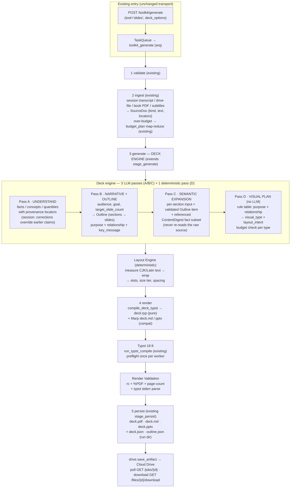

# Content-to-Slides — Semantic Deck Generation on the Toolkit Pipeline

> **Normative design (Phase 1).** Upgrades the existing toolkit `slides` path from
> single-shot JSON → Marp/pptx into a staged semantic pipeline
> (understanding → selection → narrative → outline → slide semantics → visual rules →
> layout → Typst 16:9 → validation) built **on top of the existing toolkit
> infrastructure** — no parallel worker, queue, LLM client, storage, or delivery.

Core principle: deck quality is decided **before rendering** — by content
understanding, selection, narrative, and rule-driven visual planning. Typst is only
the final deterministic rendering layer. The LLM emits constrained semantic JSON at
every stage; it never emits markup, coordinates, or geometry.

---

## 1. Existing Architecture — what we build on

### 1.1 The toolkit lifecycle (already end-to-end)

```
POST /toolkit/generate            apps/api/routers/jobs.py:129
  → TaskQueue.enqueue(TOOLKIT_GENERATE)      packages/core/infrastructure/jobs.py:97
  → worker task toolkit_generate             apps/worker/tasks.py:278
      ├ session_id  → build_transcript()     apps/api/tools/toolkit/session_source.py:34
      ├ paths/file_ids → drive.download / workspace file
      └ ToolKitPipeline.run()                apps/api/tools/toolkit/pipeline.py:96
            1 validate  path jail + size gate                     :128
            2 ingest    extract_document_text + budget_plan       packages/core/infrastructure/ingest.py:163
                        (map-reduce digest over 12k tokens)       apps/api/tools/toolkit/sources.py:127
            3 generate  SYSTEM_PROMPTS[tool] → llm.complete_json  :158
                        jsonschema validate + 1 corrective retry  apps/api/tools/toolkit/outputs.py:120
            4 render    deterministic renderers (model never writes markup)  :202
            5 persist   atomic write; ext branch: pptx → media.build_text_pptx  :207
  → save_artifact → Cloud Drive              packages/core/application/drive_service.py:335
  → GET /jobs/{id} poll; GET /files/{id}/download delivery        apps/api/routers/drive.py:249
```

Today's `slides` tool (`outputs.py:82` `SLIDES_SCHEMA`) is **one LLM call** producing a
flat `{heading, core_idea, support_points[≤6], speaker_notes, citations}` list, rendered
as Marp `.md` + bullet-dump `.pptx`. There is no narrative stage, no per-slide semantic
model, no visual planning, no Typst path for decks.

### 1.2 The Typst stack (already in the worker image)

- `deploy/worker/Dockerfile:28-52` installs Typst **v0.15.1** + fonts:
  **Noto Serif SC** (CJK), Libertinus Serif, DejaVu Sans Mono. The container is
  **offline** — no Typst package registry access, so every visual must be drawn with
  native Typst primitives (`rect`/`line`/`path`/`table`/`stack`).
- `packages/artifact_compiler/typst_compiler.py` — `compile_typst()` (AST → deterministic
  `.typ`, golden-snapshot tested; escaping `esc:58`), `run_typst_compile()` (:250,
  `subprocess.run(["typst","compile",...])`, timeout, `(ok, stderr)` never raises).
  Scoped to publication reports only (`:9` docstring) — the A4 portrait template and the
  section-H1 invariant are report-shaped; a deck template is genuinely new, but the
  **compile wrapper, escaping, and preflight are directly importable**.
- `packages/artifact_compiler/preflight.py` — typst version probe + CJK micro-compile
  font probe; reuse as-is.
- Orchestration exemplar: `plugins/artifact/service.py:222-388` — preflight → pure
  source gen → `run_typst_compile` → `%PDF` magic check → `drive.save_artifact` +
  failure recorded as a sibling error field. The deck pipeline copies this pattern.

### 1.3 Source & provenance assets

| Input | Existing loader | Locator already available |
|---|---|---|
| Chat session | `session_source.build_transcript` ← `memory.load_session_detail` (packages/core/infrastructure/memory.py:436) | `MessageModel.id` (UUID, surfaced in detail) — not yet embedded in transcript; add marker |
| Markdown / text / code | `ingest.extract_text` | `[file:start-end]` line ranges (already the toolkit citation convention) |
| PDF / book | `infrastructure/pdf.py` (PyMuPDF, `[[PAGE:n]]` sentinels) | page number |
| DOCX / XLSX | `ingest.extract_text` (`[[PARA:n]]` markers) | para / sheet-row |
| Subtitles `.srt/.vtt/.lrc` | `media.parse_subtitles` → `SubtitleCue(start_ms,end_ms,text)` (packages/core/infrastructure/media.py:49-127) | cue index / `start_ms` — currently flattened by ingest; deck keeps cues |

Conversation non-linearity (question / answer / correction / confirmation) is handled at
the **Understanding pass** (§3.2 Pass A): the transcript — with per-message id markers —
is distilled into settled facts, where a later user correction overrides an earlier
assistant claim and unresolved questions are dropped.

### 1.4 Reuse Matrix

| Component | Existing Path | Reuse / Extend / New | Reason |
|---|---|---|---|
| Generate API entry | `apps/api/routers/jobs.py:129` + `ToolkitGenerateRequest` (`schemas.py:139`) | **Extend** | Add optional `deck_options` (audience/goal/count); same auth, mode resolution, ownership checks |
| Job type & queue | `TOOLKIT_GENERATE`, `TaskQueue`, `JobStore` (jobs.py) | **Reuse** | Same lifecycle; no new job type — the deck pipeline runs inside the toolkit job |
| Worker task | `apps/worker/tasks.py:278 toolkit_generate` | **Extend** | Pass `deck_options` through; slides tool dispatches to deck engine (code already ships in image) |
| Session reader | `session_source.build_transcript`, `load_session_detail` | **Extend** | Add `[msg:<id>]` line markers for provenance; transcript shape otherwise unchanged |
| File/drive source | `_generate_from_files` + `drive.download` | **Reuse** | Already stages cloud files with extension preserved |
| Text extraction | `ingest.extract_document_text`, `pdf.py`, `media.parse_subtitles` | **Reuse** | All five input formats already parse |
| Token budget / map-reduce | `sources.budget_plan` (`sources.py:127`) | **Reuse** | Books/long docs already digest with citation-preserving `[file:start-end]` |
| LLM client & routing | `ctx["llm"] = OpenAILLM` (`worker/settings.py:162+`), `complete_json` | **Reuse** | All deck passes call the same worker LLM |
| JSON validation + repair retry | `pipeline._complete_json` + `outputs.validate` (Draft7, errors fed back) | **Extend** | Extract the validate→retry→fail block into a shared helper (`generate_structured`), used by every deck pass — same pattern, not a re-implementation |
| 5-stage lifecycle engine | `ToolKitPipeline` (`pipeline.py:59`) | **Extend** | Slides dispatches to the deck engine **inside stage_generate**; hook pairs (`toolkit/before-*`) untouched |
| Renderer dispatch | `outputs.render` (if-chain keyed by ext) | **Extend** | Deck branch emits `deck.pdf` + `deck.md` (Marp compat) + `deck.pptx` (compat) |
| Typst compile | `artifact_compiler.typst_compiler.run_typst_compile` | **Reuse** | Import directly; subprocess wrapper is format-agnostic |
| Typst escaping | `typst_compiler.esc` / `_SPECIALS` | **Reuse** | Deterministic text→typst string escaping |
| Env preflight | `artifact_compiler.preflight.run_preflight` | **Reuse** | typst version + CJK font probe before first compile |
| Report template | `templates/base.typ` (A4, outline, page chrome, H1 invariant) | **New** `deck/templates/slides.typ` | Portrait report chrome is structurally wrong for 16:9 per-slide grids; only the *template* is new, the mechanism (versioned style-only file + stamp) is copied |
| Deck AST → `.typ` emitter | `compile_typst` (report-only) | **New** `deck/typst_deck.py` | Slide layout ≠ manuscript flow; `compile_typst` is hard-wired to sections/H1/report outline and its docstring excludes slides |
| Slide semantic model | `SLIDES_SCHEMA` (flat heading+bullets) | **New** `deck/models.py` (Pydantic) | The whole point of this feature: purpose/relationship/payload per slide; old schema cannot express it |
| Outline intermediate | none | **New** (persisted artifact) | Lifecycle decoupling + future edit-and-regenerate (§2.3) |
| Visual rules / layout engine | `media.build_text_pptx` (bullet dump, no measurement) | **New** `deck/rules.py`, `deck/layout.py` | No layout intelligence exists today |
| Persist / atomic write | `pipeline.stage_persist` (`:207`, ext branch) + `_atomic_write` | **Extend** | Add `pdf`/`json` ext branches next to the existing `pptx` branch |
| Artifact delivery | `artifact_plan` (`session_source.py:84`) + `drive.save_artifact` + `GET /files/{id}/download` + desktop Download button | **Extend (mapping only)** | Add `.pdf`/`.json` → mime entries; transport untouched |
| Agent tool surface | `toolkit/plugins.py` `slides_gen` | **Extend** | New optional params (`count` exists; add audience/goal); no new plugin |
| Skill | `skills/*.skill.md` registry | **None needed** | Pipeline execution lives in toolkit/worker; a skill would only carry agent-facing calling policy (see §7) |
| CJK fonts | worker image (Noto **Serif** SC only) | **Extend (optional)** | Sans headings need `Noto Sans SC` added to `deploy/worker/Dockerfile`; MVP compiles fine with the serif stack |

Every **New** row above is a pure semantic/rendering module inside the existing toolkit
package — no new service, container, queue, API surface, or storage root.

---

## 2. Pipeline Data Flow

### 2.1 End-to-end



### 2.2 Stage boundaries (hard separation of responsibilities)

| Stage | Question it answers | LLM? | Fails how |
|---|---|---|---|
| Understanding | What does the material say? | yes | schema retry ×1 → `GenerationError` |
| Selection/Compression | What is worth presenting? | yes (inside Pass A digest + outline) | same |
| Deck Narrative | Why this order for this audience? | yes (Pass B) | same |
| Outline | Which slides exist? | yes (Pass B) | same |
| Slide Semantics | What does this slide say? | yes (Pass C, per section) | same |
| Visual Plan | How is it shown? | **no — deterministic rules** | budget violation → repair retry of Pass C for that section only |
| Layout | Where does it sit? | **no — measurement** | overflow by construction impossible (§5.3 guard) |
| Render | Compile | no | `(ok, stderr)` → job failure with tail |
| Validation | Is the PDF fit? | no | see §6 |

### 2.3 Lifecycle decoupling & editable intermediates

- **Pass input contract (final):** Pass B/C are strictly forbidden from re-reading or
  re-interpreting the raw source. Pass C's input per section is the validated `Outline`
  items **plus the `ContentDigest` fact subset they reference** (`fact_refs` → digest
  facts, each carrying its own provenance locators). This decouples the lifecycle while
  every slide fact stays grounded and traceable.
- Run directory (under the existing per-run output dir): `deck.json` (meta + digest
  refs), `outline.json`, `slides.json`, `visual_plan.json`, `deck.typ`, `deck.pdf`.
  Every intermediate is plain JSON, re-validated on load.
- **Regeneration seam (reserved, not built in MVP):** a future
  `POST /toolkit/generate {tool:"slides", deck_ref, stage:"expand"|"render"}` loads the
  persisted `outline.json` (optionally user-edited), re-runs Pass C only for sections
  whose outline entry changed (diff on `slide_id` + content hash), and re-renders. The
  file-level change list (§8) keeps outline loading independent of generation so this
  needs only a router branch later.

---

## 3. Core Data Models (`apps/api/tools/toolkit/deck/models.py`)

Pydantic v2, `extra="forbid"` throughout (same discipline as
`artifact_compiler/doc_ast.py`). Enum-typed fields double as the closed vocabularies the
prompts promise; violations surface as validation errors and feed the repair retry.

### 3.1 Source abstraction & provenance (single Source now, Source[] ready)

```python
class SourceKind(str, Enum):
    session = "session"; document = "document"; book = "book"; subtitles = "subtitles"

class ProvenanceRef(BaseModel):          # where a slide fact came from
    model_config = ConfigDict(extra="forbid")
    source_id: str                        # stable id of one SourceDoc
    kind: SourceKind
    message_id: str | None = None         # session turns
    page: int | None = None               # books / PDFs ([[PAGE:n]] markers)
    lines: str | None = None              # "start-end" (documents; existing convention)
    t_ms: int | None = None               # subtitle cue start (parse_subtitles)
    quote: str | None = None              # optional verbatim anchor

class SourceDoc(BaseModel):               # one ingested input (MVP: len(sources)==1)
    source_id: str
    kind: SourceKind
    name: str
    locators: LocatorScheme               # which locator fields this source populates
```

### 3.2 Pass models

```python
Purpose = Literal["PROBLEM", "DEFINITION", "PROCESS", "COMPARISON",
                  "TIMELINE", "ARCHITECTURE", "DATA_INSIGHT", "SUMMARY"]
Relationship = Literal["sequential", "comparative", "hierarchical",
                       "categorical", "quantitative", "singular_takeaway"]

class Fact(BaseModel):                    # Pass A output
    fact_id: str                          # stable, e.g. "f7"; referenced via fact_refs
    statement: str
    provenance: list[ProvenanceRef]       # required — no fact without source
    superseded_by: str | None = None      # conversation corrections: earlier claim loses

class Quantitative(BaseModel):            # only real numbers; CHART may cite these
    quant_id: str                         # e.g. "q3"; CHART points carry quant_ref
    metric: str; value: float; unit: str | None = None
    as_of: str | None = None; provenance: list[ProvenanceRef]

class ContentDigest(BaseModel):           # Pass A: the clean fact base
    facts: list[Fact]; concepts: list[str]; quantities: list[Quantitative]

class SlideOutlineItem(BaseModel):
    slide_id: str                         # stable, e.g. "s3"
    title: str
    purpose: Purpose
    relationship: Relationship
    key_message: str                      # exactly one per slide
    fact_refs: list[str] = []             # ContentDigest fact_ids this slide stands on

class SectionOutline(BaseModel):
    title: str
    purpose: str                          # narrative role of the section
    slides: list[SlideOutlineItem]

class Outline(BaseModel):                 # Pass B output — the editable artifact
    narrative_strategy: Literal["problem_solution", "concept_map", "chronological",
                                "comparative", "top_down"]
    sections: list[SectionOutline]
    # check_outline(outline, target): total CONTENT slides within [target-2, target+2]
    # — target_slide_count counts content slides ONLY (cover / dividers / appendix are
    # excluded by definition); no duplicate slide_id; every fact_ref resolves in the
    # digest; at least one SUMMARY closing slide. The Outline stage is visual-type-pure:
    # it never asserts or validates TEXT_HERO/CARDS/… — form is exclusively Pass D.

# ── Slide Semantic Model (Pass C output) — "what this slide says", zero visuals ──
class ContentPayload(BaseModel):          # shape-agnostic semantic slots
    key_message: str
    items: list[Item] = []                # Item{label, detail, provenance} — CARDS/ARCH nodes
    steps: list[Step] = []                # ordered, ≤6 — FLOWCHART/TIMELINE
    series: list[Series] = []             # Series{name, points:[{x,y,quant_ref}]} — CHART
    columns: list[Column] = []            # named axes + rows — COMPARISON

class Slide(BaseModel):
    slide_id: str                         # must match an outline item (derived, never new)
    title: str
    key_message: str
    purpose: Purpose; relationship: Relationship
    payload: ContentPayload
    speaker_notes: str
    provenance_refs: list[ProvenanceRef]
    # validators enforce the per-purpose budgets of §4.2 AT THE LLM BOUNDARY,
    # so a violation triggers the existing corrective-retry path, not a render-time surprise

# ── Visual Plan (Pass D output) — rule-derived, no LLM, no coordinates ──
class LayoutIntent(BaseModel):
    direction: Literal["horizontal", "vertical"] = "vertical"
    density: Literal["compact", "normal", "spacious"] = "normal"
    emphasis: Literal["primary", "neutral", "muted"] = "neutral"

class VisualPlan(BaseModel):
    slide_id: str
    visual_type: Literal["TEXT_HERO", "CARDS", "FLOWCHART", "TIMELINE",
                         "COMPARISON", "ARCHITECTURE", "CHART"]
    intent: LayoutIntent
    rationale: str                        # which rule fired (debuggable)

# ── Deck (top level) ──
class DeckSpec(BaseModel):
    deck_id: str
    title: str
    target_audience: str
    presentation_goal: str
    target_slide_count: int               # clamp 3..20 (existing convention)
    narrative_strategy: str
    sources: list[SourceDoc]              # MVP: length 1; models already N
    outline: Outline
    slides: list[Slide]
    visual_plan: list[VisualPlan]
```

CHART anti-fabrication: `Series.points[].quant_ref` must reference a
`Quantitative` id from the Pass A digest; `rules.py` refuses CHART (falls back to
COMPARISON table) when `digest.quantities` is empty. Numbers that don't exist in the
source can never reach the chart renderer.

### 3.3 Throughput decisions (frozen 2026-09-14)

- **Single-pass ingestion.** `toolkit_max_input_tokens` is the model's safe single-call
  input (default 40K). Sources at or below it go to Pass A RAW — map-reduce exists only
  for over-budget sources. (The old 12K value made every medium document pay a
  multi-call digest pre-pass.)
- **Pass A + Pass B stay separate (merge evaluated, rejected).** A combined
  planner call must return digest+outline in one JSON — strictly larger and more
  failure-prone than the today-observed Pass A oversized-output failures, and it
  would break errata #2 (exactly 3 semantic LLM passes) and the "Pass B reads the
  digest only" contract. Two calls, each independently validated, converge faster.
- **Pass C is per-slide concurrent** with `effective_concurrency = min(configured,
  provider, worker, slide_count)` (settings `deck_pass_c_concurrency`,
  `deck_provider_concurrency`, `deck_worker_concurrency`), a per-attempt deadline
  (`deck_slide_timeout_s`), and a structural gate: a slide whose purpose/relationship
  promises a graphic (PROCESS/TIMELINE/sequential → steps, ARCHITECTURE/hierarchical →
  tiered items, COMPARISON/comparative → columns) FAILS validation and retries — only
  that one slide — when the payload is empty or of another shape. Silent degradation
  of a structured promise to TEXT_HERO is thereby impossible; TEXT_HERO remains legal
  only where the semantics are genuinely textual.
- **Phase timings** (A/B/C/total) are logged at INFO (`deck timing`) for offline
  P50/P95 harvesting; the 20K–30K-token document target is P50 < 90s.

### 3.4 Dialog contract — intent knobs, routed not dumped (frozen 2026-09-14)

The slides dialog exposes business intent only; the JSON schema, vocabularies and
budgets never surface to the user. Controls are **routed per pass**, not concatenated
into one blob:

| Control | Backend route | Enters the Prompt? | Effect |
| --- | --- | --- | --- |
| Sources (multi-select popover) | cloud-file mode `file_ids[]` | no — raw context | grouped by stem (doc + subtitle sibling); all members feed Pass A ingestion |
| Length `Short` / `Default` | `count` param (6 / 8) | half — numeric bound | injected into Pass B as the ±2 slide budget AND enforced by `check_outline` |
| Format `Detailed Deck` / `Presenter Slides` | `format_mode` | yes — Pass B/C only | `detailed` is the baseline (no directive); `presenter` appends a LOW-text-density FORMAT rule. Pass A never sees it — style must not skew fact extraction |
| Choose language | `language` | yes — Pass A/B/C | LANGUAGE rule: all titles/messages/labels/notes strictly in the chosen language; proper nouns stay original |
| Describe… (free text) | `prompt` → `DeckOptions.user_guidance` | yes — Pass B user prompt only | rendered as `USER GUIDANCE (…never overrides the output contract)`; Pass C stays outline-bound |

`Generate later` closes the dialog without submitting; `Generate now` posts
`{tool, file_ids, prompt, count, language, format_mode}`.

---

## 4. Visual Grammar — deterministic mapping

### 4.1 Priority fallback chain (`deck/rules.py`) — NOT a rigid matrix

Visual type selection is a strict ordered decision, first match wins:

1. **Payload hard constraints** (data shape beats everything):
   - `payload.series` non-empty **and** every point carries a resolvable `quant_ref`
     → **CHART**; series without real `quant_ref` → fabricated data → CHART forbidden,
     degrade per rule 4.
   - `payload.columns` ≥ 2 → **COMPARISON**.
   - `payload.steps` ≥ 3 → `purpose == TIMELINE` ? **TIMELINE** : **FLOWCHART**.
   - `payload.items` structured as tiers (`item.group` set / `hierarchical` with ≥2
     groups) → **ARCHITECTURE**.
2. **Semantic relationship** (from the validated slide, LLM's judgement):
   `sequential` → FLOWCHART · `comparative` → COMPARISON · `hierarchical` →
   ARCHITECTURE · `categorical` → CARDS · `quantitative` → CHART if `digest.quantities`
   non-empty else degrade · `singular_takeaway` → TEXT_HERO.
3. **Purpose** tie-break for anything ambiguous: PROCESS → FLOWCHART · COMPARISON →
   COMPARISON · TIMELINE → TIMELINE · ARCHITECTURE → ARCHITECTURE · DATA_INSIGHT →
   CHART/COMPARISON · PROBLEM / DEFINITION / SUMMARY → TEXT_HERO (if payload is a lone
   key_message) else CARDS.
4. **Safe fallback:** CARDS when `payload.items` is usable, otherwise TEXT_HERO.
   **Never force a drawing**: insufficient or malformed data always degrades to the
   text-safe forms.

**Purity law:** Visual Planning is a **read-only pure function**
`Slide → VisualPlan`. It selects the visual type and derives `layout_intent`; it must
never mutate, supplement, or rewrite the Semantic Model's content. Budget violations
found at this stage are *reported* (error strings) so Pass C can be re-run with
corrective feedback — rules never patch the slide themselves.

### 4.2 Per-type budgets (enforced in `Slide` + `VisualPlan` validators)

| Visual type | Budget |
|---|---|
| TEXT_HERO | key_message 10–30 EN words / ≤60 CJK chars; no payload items |
| CARDS | 2–4 cards; card label ≤6 words, detail ≤25 words |
| FLOWCHART | 3–6 steps; step label ≤8 units, detail ≤18 units (calibrated to the 6-node worst case at the micro tier so layout can never legitimately overflow); single lane (no branching in MVP) |
| TIMELINE | 3–6 events; label ≤6 words; note ≤15 words |
| COMPARISON | ≤4 columns × ≤5 rows; cell ≤10 words |
| ARCHITECTURE | ≤3 tiers × ≤5 nodes; node label ≤4 words |
| CHART | ≤2 series × ≤8 points; every value carries `quant_ref` |

Budget violation = validation error → existing one-shot corrective retry
(`pipeline.py:173-184` pattern, factored into `generate_structured`).

---

## 5. Typst 16:9 Rendering

### 5.1 Template — `deck/templates/slides.typ` (versioned, style-only, like `base.typ`)

```typst
#let SLIDES_TEMPLATE_VERSION = 1
#set page(paper: "16:9", margin: (x: 16mm, y: 12mm))   // 338.67mm × 190.5mm
#set text(font: ("Libertinus Serif", "Noto Serif SC", "DejaVu Sans Mono"),
          lang: "zh", region: "cn")
// slide size tiers: display 34pt / title 26pt / body 16pt / caption 11pt
// theme tokens: deck-primary, deck-accent, deck-muted, card fill/stroke
#let slideTitle(it)   = ...          // kicker + title + key_message bar
#let heroSlide(s)     = ...          // centered display text
#let cardsSlide(s)    = ...          // grid(n) of aligned boxes
#let flowSlide(s)     = ...          // rect nodes + line arrows (native drawing)
#let timelineSlide(s) = ...          // horizontal rule + event ticks
#let compareSlide(s)  = ...          // styled table
#let archSlide(s)     = ...          // stacked tier bands with boxed nodes
#let chartSlide(s)    = ...          // native bars/polyline from quant data
#let sectionSlide(s)  = ...          // divider
#let titleSlide(d)    = ...          // cover: title, subtitle, sources line
```

No external packages (offline image), no mermaid, no typst-pst: FLOWCHART and CHART are
composed from `rect`/`line`/`path`/`table` with the measured slots the layout engine
provides — exactly how the existing report figures stay deterministic.

**FLOWCHART implementation decision:** *Typst native, not Mermaid.*
`mmdc` is **not installed** in the worker image (preflight supports it but
`require_mmdc=False` is used everywhere today); Mermaid would add a Puppeteer/Chromium
layer, a network-dependent toolchain, and non-deterministic SVG sizing — a second
rendering stack to validate. Native Typst keeps one binary, byte-deterministic output,
and works with the CJK font probe already in preflight. (If future decks need branching
graphs with dozens of nodes, revisit by installing `mmdc` behind the existing preflight
flag — out of MVP scope.)

### 5.2 Emitter — `deck/typst_deck.py`

`compile_deck_typst(deck: DeckSpec, layout: DeckLayout, template: str) -> str` — pure,
deterministic, golden-snapshot tested (mirrors `compile_typst` discipline). All model
text goes through the reused `typst_compiler.esc`. Speaker notes are emitted as Typst
`#note`-style hidden blocks? No — notes render as a final appendix page set (visible on
demand) plus they already live in `deck.md`/`deck.pptx` compat outputs.

### 5.3 Layout engine — `deck/layout.py` (deterministic, no LLM)

- Text measurement model: CJK ≈ 1.0 em per char, Latin ≈ 0.5 em avg; per-component
  boxes from the template's fixed size tiers and page constants (single source of truth:
  the same `mm`/`pt` constants are mirrored in `layout.py`).
- Greedy line-breaking with max-lines-per-component derived from budget + density
  (`compact/normal/spacious` from `LayoutIntent` selects line allowances and gaps).
- Slot allocation per visual type: hero = 1 full-width band; cards = 2×N/1×N grid by
  `direction`; flow = lane with equal nodes; arch = tier bands; chart = axes + bars.
- **Semantic preservation (final rule):** the layout engine NEVER trims, ellipsizes or
  otherwise drops text to make things fit, and a `key_message` can never be lost.
  Over-budget content is intercepted at the **Pass C validation boundary** and fed into
  the existing corrective-retry; by the time layout runs, every slide satisfies its type
  budget, so fitting is purely a formatting choice: the emitter uses a Typst
  `layout()`-based size-tier loop (display→title→body→caption) that picks the largest
  tier that fits the slot — content-preserving and deterministic. Geometry still never
  comes from the LLM; only `direction/density/emphasis` intent does (as required). A
  slide that cannot fit even at the smallest tier raises `LayoutOverflow` — a loud
  failure, never silent clipping.

---

## 6. Render Validation

`deck/validate.py` — `RenderReport` (interface reserved for a future visual QA loop):

```python
class RenderReport(BaseModel):
    compiled: bool                 # rc==0 and %PDF magic (existing pattern, service.py:360)
    pages_expected: int            # NORMATIVE: 1 (cover) + content_slides
                                   #   + optional_section_dividers + optional_appendix_pages
                                   #   (both optionals default OFF in MVP)
    pages_actual: int              # pymupdf page count (already a dependency)
    aspect_ok: bool                # first page 16:9 within epsilon
    missing_fonts: list[str]       # stderr scan ("unknown font", preflight probe strings)
    typst_warnings: list[str]      # stderr lines parsed per category
    layout_warnings: list[str]     # from the layout engine (budget trims)
    overflow_suspect: list[str]    # slide_ids flagged by warnings / post-checks
    ok: bool                       # compiled && pages match && aspect_ok && no missing font
```

Checks, cheapest first: (1) `run_typst_compile` rc + magic bytes — existing code;
(2) page-count equality; (3) stderr scan for font-fallback warnings; (4) page-box aspect
via PyMuPDF. True element collision/clipping detection needs box geometry Typst doesn't
export; MVP relies on the layout engine's construction guarantee + the suspect list, and
`overflow_suspect`/`RenderReport` is the seam where a future HTML-overlay or per-slide
image-diff check can attach without touching the pipeline. A non-`ok` report fails the
job with the stderr tail in `jobs.error` (existing `_run` → `mark_failed` path).

PDF compile failure policy mirrors the artifact-compiler sibling rule: the job fails
with the error surfaced in the job result (deck generation is the job's only purpose —
unlike PUBLISH where `pdf_error` lets the manuscript stand).

---

## 7. Skill boundary

No new skill is required: `slides_gen` already exists as a resident agent tool
(`toolkit/plugins.py`, allowlisted at `agent_factory.py:217`). If an authoring-guide
skill (`deck_design.skill.md`) is added later, it only carries calling strategy
(when to prefer deck vs. the old flow, how to set audience/goal params) — pipeline
execution, jobs, LLM calls, Typst, and persistence stay in toolkit/worker as designed
above.

## 8. File-level change list

### New files

| File | Responsibility |
|---|---|
| `apps/api/tools/toolkit/deck/__init__.py` | `run_deck_pipeline(sources, deck_options, llm, run_dir)` entry — same import surface the worker already has |
| `apps/api/tools/toolkit/deck/models.py` | Pydantic models §3 (SourceDoc, ProvenanceRef, ContentDigest, Outline, Slide, VisualPlan, DeckSpec, RenderReport) |
| `apps/api/tools/toolkit/deck/prompts.py` | Pass A/B/C system prompts (closed vocabularies mirror the enums; CHART-forbidden-without-quantities rule stated) |
| `apps/api/tools/toolkit/deck/passes.py` | Pass orchestration: understanding → outline → per-section semantic expansion; uses shared `generate_structured`; persists `deck.json/outline.json/slides.json` to run dir |
| `apps/api/tools/toolkit/deck/rules.py` | §4 decision table + budget enforcement + layout-intent derivation (pure functions, fully unit-tested) |
| `apps/api/tools/toolkit/deck/layout.py` | §5.3 measurement/wrap/slot engine (pure, deterministic) |
| `apps/api/tools/toolkit/deck/typst_deck.py` | §5.2 pure emitter (golden-snapshot tested); imports `esc` from `artifact_compiler.typst_compiler` |
| `apps/api/tools/toolkit/deck/templates/slides.typ` | §5.1 16:9 style-only template with `SLIDES_TEMPLATE_VERSION` stamp |
| `apps/api/tools/toolkit/deck/render.py` | preflight-once cache + `run_typst_compile` + `RenderReport` validation |
| `tests/test_deck_models.py` / `test_deck_rules.py` / `test_deck_layout.py` / `test_deck_typst_golden.py` / `test_deck_e2e.py` | golden + rule-table fuzz + container-gated e2e |

### Modified files

| File | Change |
|---|---|
| `apps/api/schemas.py` | `ToolkitGenerateRequest.deck_options: DeckOptions \| None` (`target_audience`, `presentation_goal`, `target_slide_count` 3–20) |
| `apps/api/routers/jobs.py` | pass `deck_options` into the enqueued payload |
| `apps/worker/tasks.py` | `toolkit_generate` forwards `deck_options`; session transcript now carries `[msg:<id>]` markers into the deck run |
| `apps/api/tools/toolkit/pipeline.py` | `stage_generate`: when `tool == "slides"`, delegate to `deck.run_deck_pipeline` (validate+digest reused); extract validate-retry block into `generate_structured()` shared by old and new paths; `stage_persist` gains `pdf` (typst compile via `asyncio.to_thread`) and `json` ext branches beside `pptx` |
| `apps/api/tools/toolkit/outputs.py` | slides render branch: `deck.md` (Marp, re-rendered from `DeckSpec`), `deck.pptx` compat tuples from payload items; `render` keeps if-chain semantics |
| `apps/api/tools/toolkit/prompts.py` | `SLIDES_SYSTEM` superseded by deck prompts (summary/mindmap untouched) |
| `apps/api/tools/toolkit/sources.py` | `WorkspaceSource` gains `kind` + locator passthrough (`[[PAGE:n]]`, cue timestamps kept, not flattened) |
| `apps/api/tools/toolkit/session_source.py` | `build_transcript` per-message markers; `artifact_plan` maps `.pdf → application/pdf`, `.json → application/json` |
| `apps/api/tools/toolkit/plugins.py` | `slides_gen` description + optional `audience`/`goal` params |
| `deploy/worker/Dockerfile` | (optional, phase 2) add Noto Sans SC for sans slide headings |

Canonical output: the Typst-compiled 16:9 `deck.pdf` is the **only** authoritative
artifact. Marp `.md` and `.pptx` are compatibility exports rendered deterministically
from the same validated `DeckSpec` — one generation flow, two extra renderers, never an
independent pipeline. `speaker_notes` remains a field on the Slide model and inside
`deck.json`, but MVP does not render it into the PDF body. Backward compatibility:
old agent-tool callers and desktop dialogs work unchanged; they simply receive the new
PDF alongside the familiar files. No new endpoints, job types, queues, or storage roots
anywhere.

## 9. MVP validation steps

MVP scope: **single Source** (one session *or* one document/book/subtitle file) →
full semantic pipeline → 16:9 PDF. Source[] stays a model-level capability only.

1. **Unit (host, no container):** rules table fuzz (every purpose×relationship cell +
   degrade paths); model budget validators; layout engine golden fixtures
   (max-budget CJK + Latin decks, verify no overflow trims);
   `compile_deck_typst` byte-golden snapshot.
2. **Container compile probe:** `docker compose exec worker python` — fixture deck →
   `run_typst_compile` → assert `RenderReport.ok` (page count, 16:9 page box, no
   font-fallback stderr, CJK glyphs present via PyMuPDF text extract).
3. **E2E via existing job** (three inputs, one at a time):
   a) a real chat session with at least one user *correction* → verify the digest drops
   the superseded claim and slide `provenance_refs` carry `message_id`s;
   b) a PDF book → verify `[[PAGE:n]]` page locators in provenance and map-reduce
   digest path over the 12k-token budget;
   c) an `.srt` → verify cue `t_ms` locators.
   Each: `POST /toolkit/generate` → poll `GET /jobs/{id}` → `GET /files/{id}/download`
   the PDF; open in the desktop viewer (zero UI work needed).
4. **Editable-intermediate check:** run dir contains schema-reloadable
   `outline.json`/`slides.json`; edit one section title offline and re-run the render
   step from the CLI harness (`tests/_deck_replay_harness.py` — dev script, not a
   shipped endpoint).
5. **Honest failure:** force a bad fixture (fabricated CHART without `quantities`;
   over-budget CARDS) → assert degradation/validation error, not silent pass.

Out of MVP (explicitly deferred): outline-editing UI + regenerate-affected-slides
endpoint, multi-source decks, branching flowcharts, Mermaid route, per-slide image
diffing, stage-level progress percentages (job stays `queued/running/succeeded/failed`).
