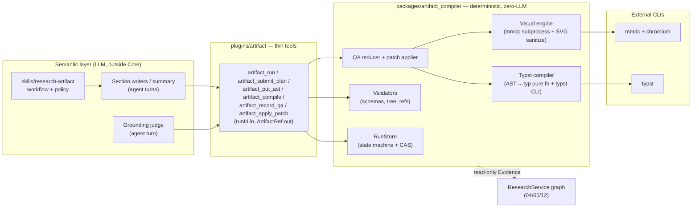

# 19 — Research Artifact Compiler (Publication-Grade PDF Engine)

> **Normative.** Defines the deterministic subsystem that compiles a research artifact
> (evidence → claims → AST → Typst → PDF) with full provenance and three-layer QA.
> Supersedes nothing in `04`/`12`/`13`; it is a **consumer** of them.

## 1. Scope

The pipeline today ends at a Markdown manuscript promoted by PUBLISH (`contract-matrix.md`,
`node_publish`). This subsystem adds the publication-grade path: a **compiler** that turns a
structured Document AST into a typeset `report.pdf` with figures, citations, bookmarks and
machine-verified grounding. It is format-narrow by contract — PDF artifacts only; no
Slides/PPTX/generic document generation (that scope belongs to `doc_slides`).



## 2. Repository mapping (v5.2 → DeepDive)

| v5.2 concept | DeepDive landing | Reuse / new |
|---|---|---|
| `src/types/*.ts` + Zod | `packages/artifact_compiler/{source,plan,doc_ast,visual}.py` (Pydantic v2) | new |
| RunStore (state + optimistic lock) | `packages/artifact_compiler/runstore.py` — portalocker + CAS revision + `.tmp→fsync→os.replace`, mirroring `ResearchService.atomic_update_project` | pattern reused |
| Budget circuit breaker | `plugins/research/llm_budget.RunBudget` semantics; Core only persists the meter it is handed (`manifest.json`) | reused at plugin layer |
| Evidence/Claim provenance | `graph.json` Evidence/Claim nodes, `adjudicate_evidence`, CLAIM_GATE (`12-provenance-model.md`) | upstream, read-only |
| ArtifactRef responses | §04 ResearchArtifact rows + drive `drive_asset_id`/`drive_path` (§14) | reused |
| Scratch workspace | `data/artifact_runs/<runId>/` (new sibling of `research_scratch`) | new dir, same primitives |
| SkillScopeEnforcer | guards the `plugins/artifact` tool set (`packages/agent/skills/registry.py:181`) | reused |
| Async job | arq worker (`apps/worker`) may drive compile runs; CLI/thread driving is equivalent | reused channel |
| mermaid-cli / typst | **entirely new**: bundled in the worker image (mmdc + chromium, ~400 MB accepted cost) | new |

## 3. Inviolable invariants (Python port)

1. **Semantic/deterministic split.** No LLM call may appear inside
   `packages/artifact_compiler`. Core passes tests with no network and no model keys.
2. **One-way provenance.** `SourceSnapshot → Evidence → Section(ClaimRequirement) →
   Claim → Citation`; blocks/assets carry `claimIds`/`evidenceIds` that must resolve both
   directions (`validators.py`).
3. **Write-authority split.** `WriterClaimOutput` (agent-produced) has no
   `grounding_status`/`entailment_score` fields; only the QA reducer, fed by an external
   `GroundingDiagnosis`, promotes them into `Claim` (§9).
4. **Two evidence tiers.** `evidence_requirements` = retrieval hints only;
   `claim_requirements[].evidence_ids` (`.min(1)`) is the authoritative grounding set.
5. **`expected_blocks` are required blocks** — each must appear ≥1×; a `figure` is
   satisfied only by a FigureBlock whose Asset compiled with `compile_status="success"`
   and passed QA.
6. **Local repair, global render.** Regeneration targets a `block_id`/`asset_id`, but
   Typst compilation, snapshot diffing and page QA are always global.
7. **Read-only upstream.** The compiler never mutates the knowledge graph / evidence store.
8. **Canonical vs Derived.** `plan.json`, `claims.json`, `ast/`, `qa/*.json` are canonical
   run records; `report.typ`, `report.pdf`, `assets/*.svg` are derived and rebuildable.
   Only derived bytes get promoted to the drive.
9. **Every engine entrypoint takes a `PrincipalContext`** (owner_id, optional project_id);
   tool/API responses use **ArtifactRef**, never host filesystem paths.
10. **`QA_PASSED`/`QA_FAILED` are transient outcomes, never persisted RunStates.**
    Repair is **patch application** in Core; the LLM that authors the replacement lives in
    the Skill/agent layer.

## 4. Canonical ID topology

Identical to v5.2 (`runId → artifactId/revision → {sourceId→evidenceId, sectionId→
claimReqId→claimId, blockId→citationId, specId→assetId, qaRunId}`); Python field names use
snake_case (`claim_req_id`, `evidence_ids`, …) but the graph is unchanged.

## 5. Run state machine

```text
QUEUED → ENV_PREFLIGHT → EVIDENCE_PROVIDING → PLANNING → WRITING
       → AST_CONTRACT_QA → VISUAL_ENGINE → TYPST_COMPILING → (transient QA verdict)
```

| Persisted state | Kind | Notes |
|---|---|---|
| `QUEUED, ENV_PREFLIGHT, EVIDENCE_PROVIDING, PLANNING, WRITING, AST_CONTRACT_QA, VISUAL_ENGINE, TYPST_COMPILING` | active | stage pointer; every hop CAS-bumped |
| `REPAIR_LOOP` | active | targeted block/asset regen (skill-side LLM), ≤3 attempts, then global re-compile |
| `COMPLETED` | terminal | grounding 100% supported; PDF publishable |
| `NEEDS_REVIEW` | terminal | partial/flagged grounding; PDF publishable **with warnings banner** only |
| `FAILED_BLOCKED` | terminal | attempts exhausted; PDF diagnostic-only, never marked valid |
| `CANCELLED` | terminal | from any state |
| `BUDGET_EXCEEDED` | terminal | from any state (RunBudget power-cut semantics) |

Only `COMPLETED`/`NEEDS_REVIEW` may feed PUBLISH promotion of `report.pdf`.

## 6. Run layout (scratch root `data/artifact_runs/<runId>/`)

Same tree as v5.2 §2 (`manifest.json, snapshot/, evidence.json, claims.json,
conflicts.json, plan.json, ast/, assets/, report.typ, report.pdf, qa/`), with two
DeepDive rules bolted on:

- **Concurrency**: all `*.json` state goes through the RunStore transaction (portalocker
  exclusive lock + monotonic `run_revision` + durable replace, extras-first / run.json-last
  ordering — same crash-safety argument as `atomic_update_project(extra_files=…)`).
- **Exposure**: `report.pdf` (+ `report.typ` source bundle) is registered as a §04
  ResearchArtifact (`DRAFT→VALIDATED` inside the run) and only reaches the drive via the
  existing one-way `promote_to_drive` at PUBLISH. Nothing under `runs/<runId>/` is ever
  handed to a client as a path; tools return `ArtifactRef`.

## 7. Data contracts (Phase 0 — landed as `packages/artifact_compiler/`)

| Module | Key contracts | Hard constraints |
|---|---|---|
| `source.py` | `Locator` | ≥1 of `page/chunk_id/url` (model_validator) |
| | `Evidence` | non-empty `excerpt`, `evidence_type ∈ {fact,statistic,definition,procedure,opinion}` |
| | `Citation` | `evidence_ids` min_length 1 |
| | `ClaimRequirement` | `claim_req_id`, `section_id`, `evidence_ids` min_length 1 |
| | `WriterClaimOutput` / `Claim` | two-class split; `Claim` adds `grounding_status` (default `pending`) + `entailment_score` |
| | `EvidenceConflict` | `evidence_ids` ≥2 |
| `plan.py` | `VisualSpec` | `claim_ids`/`evidence_ids` min 1; `renderer ∈ {mermaid,svg,vega}`; `max_nodes` default 12 |
| | `SectionPlan` | `order` non-negative int; `expected_blocks` required semantics |
| | `GenerationBudget` / `ArtifactPlan` | schema_version=5 defaults |
| `doc_ast.py` | block union | every block binds `block_id`; `callout.body` nests paragraph/list/table |
| `visual.py` | `Asset` | `format` default `svg`; claim/evidence refs min 1 |
| `validators.py` | `validate_section_tree` | single root, acyclic, no orphans, sibling `order` unique & contiguous |
| | `validate_plan_references` | claim-req parents exist; all evidence ids resolve in the EvidenceSet |

## 8. Visual engine (decided: worker-bundled mmdc + chromium)

Rationale (vs Kroki sidecar): Core must stay runnable **offline / standalone / per-dev** —
a sidecar breaks “clone, `npm i`, run tests”. The ~400 MB chromium layer in the worker
image is accepted cost; isolation is enforced in-process instead:

- `asyncio.create_subprocess_exec` on `mmdc` with **timeout kill**, and OS limits:
  POSIX `preexec_fn` (`RLIMIT_AS`/`RLIMIT_CPU`); Windows dev falls back to timeout-only.
- Input cap (`.mmd` source length), output cap (SVG bytes), non-zero-exit capture of
  stderr for the ≤3 syntax-retry loop (retry prompts authored by the Skill, executed
  outside Core).
- **SVG sanitization** in Core (deterministic): strip `<script>`, `on*` handlers,
  `foreignObject`, external `href`/`xlink:href`/`<image>` to non-`data:` URLs.
- Heuristic density gate (`node_count ≤ max_nodes`, avg label length, fan-in/out, aspect
  ratio) → violation ⇒ repair request (split/simplify), not silent pass.

## 9. Typst compilation & three-layer QA

- `compile_ast(document_ast) -> str` is a **pure function**; the `.typ` output is
  golden-snapshot tested (byte-exact). `templates/base.typ` carries PDF metadata, the
  Latin/CJK/Mono/Math font split, widow/orphan control and figure+caption `keep-together`.
- **Layer 1 structural** (`pypdf`): pages > 0, no blank pages, bookmark tree ≡ section
  tree, every citation resolves to a bibliography entry.
- **Layer 2 grounding**: Core never calls a judge. The Skill runs the entailment judge and
  submits a `GroundingDiagnosis` payload; the Core **QA reducer** validates it (schema,
  per-claim coverage), writes `grounding_status`/`entailment_score` into `claims.json`
  (CAS), and records `judge_model`/`judge_prompt_version`/`threshold` in `qa/grounding.json`.
  All-supported ⇒ `COMPLETED`; any `partially_supported/unsupported/contradicted` ⇒
  `NEEDS_REVIEW` + warning-marked artifact.
- **Layer 3 rendered**: sample pages rasterized with the same pinned renderer; overflow /
  near-blank / truncation heuristics; no LLM.
- **Repair controller**: verdict transient; patch (per `block_id`/`asset_id`) applied by
  Core's `apply_patch` under CAS; compile + all three layers re-run globally;
  `attempts ≥ 3 ⇒ FAILED_BLOCKED`.

## 10. Plugin & skill surface

- `plugins/artifact/` — thin tools only (arg validation → PrincipalContext → service →
  `ArtifactRef`/status JSON). No parsing, no rendering, no QA logic here.
- `skills/research-artifact/` — the workflow policy: plan outline, per-section evidence
  packs, parallel writing (p-limit equivalent), judge prompting, repair-regeneration.
  Registered under SkillScopeEnforcer's `allowed_tools`.
- Research-pipeline hook: PUBLISH gains an optional artifact-compiler branch — when a run
  exists for the edition, it promotes the run's `report.pdf` as the manuscript artifact;
  Markdown remains the default, so rollout is per-project, not breaking.

## 11. Phases

| Phase | Deliverable | Gate to next |
|---|---|---|
| 0 | Contracts + validators + states/RunStore + preflight (this commit block) | unit tests green |
| 1 | Typst compiler pure fn + template v1 + mmdc runner + sanitizer + QA reducer + patch applier | AST golden snapshot byte-exact; fixtures-internal tests |
| 2 | `plugins/artifact/` thin tools + service wiring + drive promotion | plugin integration tests, registration OK |
| 3 | `skills/research-artifact/` workflow + repair loop policy | SkillScopeEnforcer compliance; E2E on fixture corpus |
| DoD | pytest fixtures 01–07 (basic / nested-tree / conflict / visual / layout / repair / **invalid-contract negative**) + `test_workflow_purity`-style guard: Core import graph contains no LLM/network clients | full matrix green |

DoD mirrors v5.2 §5: deterministic snapshot, artifact completeness on disk, contract/tree
conformance, full provenance resolution both directions, three-layer QA automated, and
terminal-state compliance (never a hung or looping run).
